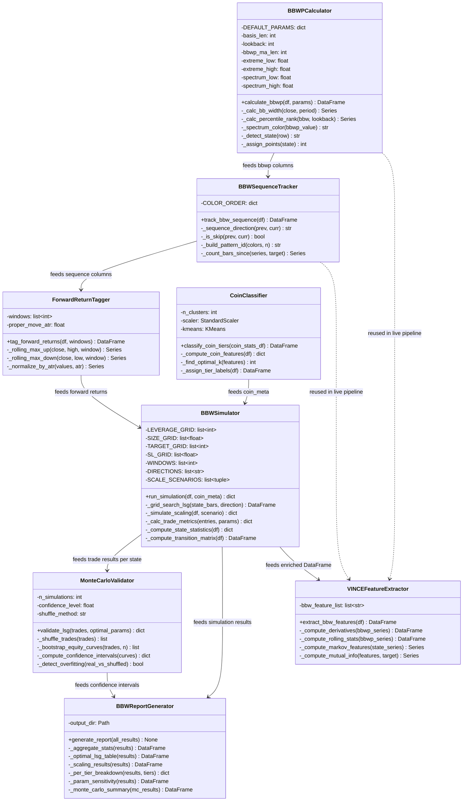
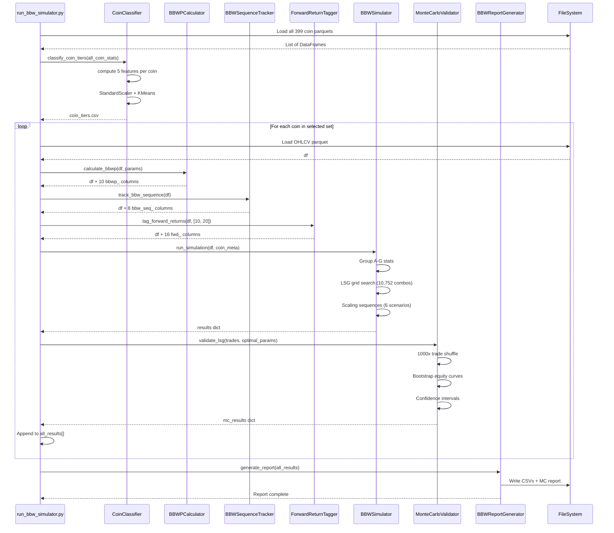
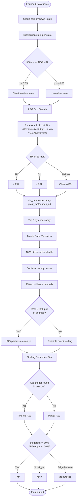
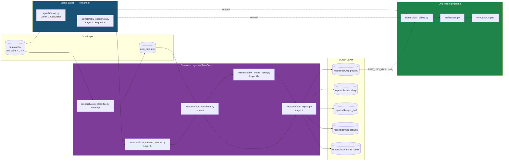
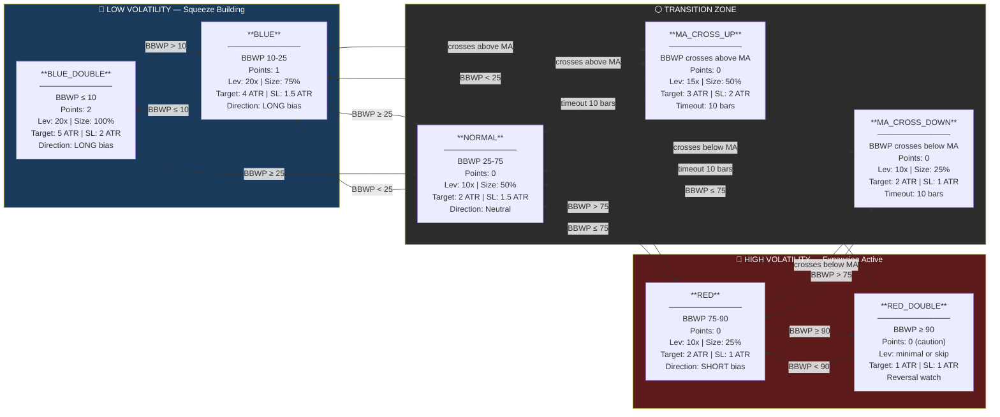
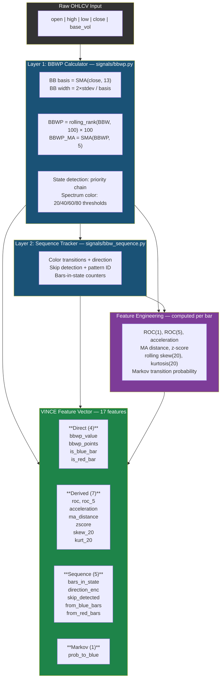

# BBW Simulator — UML Diagrams
**Date:** 2026-02-14
**Project:** `four-pillars-backtester`
**Related:** [[BBW-STATISTICS-RESEARCH]] | [[BBW-SIMULATOR-ARCHITECTURE]]

---

## 1. Class Diagram — Static Structure

---

## 2. Sequence Diagram — Per-Coin Processing Pipeline

---

## 3. Activity Diagram — Simulator Decision Logic

---

## 4. Component Diagram — System Architecture

---

## 5. State Diagram — BBWP State Machine

> **Reading guide:** Each box is a BBWP state. Arrows show transitions with conditions. States on the left (blue) favor long setups with higher leverage. States on the right (red) favor short or caution with reduced size.

### State Transition Legend

| From → To | Condition | Meaning |
|-----------|-----------|---------|
| NORMAL → BLUE | BBWP drops below 25 | Volatility contracting, squeeze forming |
| BLUE → BLUE_DOUBLE | BBWP drops below 10 | Extreme squeeze, strongest entry signal |
| BLUE → MA_CROSS_UP | BBWP crosses above its MA | Volatility starting to expand from low |
| NORMAL → RED | BBWP rises above 75 | Volatility expanding, trend active |
| RED → RED_DOUBLE | BBWP rises above 90 | Extreme expansion, reversal watch |
| MA_CROSS_UP/DOWN → NORMAL | 10 bars timeout | Cross signal expired without follow-through |
| Any RED → NORMAL | BBWP drops below 75 | Expansion fading |
| Any BLUE → NORMAL | BBWP rises above 25 | Squeeze released |

---

## 6. Data Flow Diagram — Feature Engineering for VINCE

### VINCE Feature Legend

| Category | Count | Features | Purpose |
|----------|-------|----------|---------|
| **Direct** | 4 | bbwp_value, bbwp_points, is_blue_bar, is_red_bar | Raw BBWP state at current bar |
| **Derived** | 7 | roc, roc_5, acceleration, ma_distance, zscore, skew_20, kurt_20 | Rate of change, momentum, extremes |
| **Sequence** | 5 | bars_in_state, direction_enc, skip_detected, from_blue_bars, from_red_bars | How BBW is evolving over time |
| **Markov** | 1 | prob_to_blue | Transition probability from current state |
| **Total** | **17** | | BBW-only features. Cross-pillar features (Ripster × BBW, AVWAP × BBW) computed in `ml/features.py` |

> **Note:** These 17 features are BBW's contribution to the VINCE feature matrix. Other pillars (Ripster, AVWAP, Quad Stoch) contribute their own features separately. Cross-pillar interaction features are computed at the ML layer, NOT in the BBW simulator.
