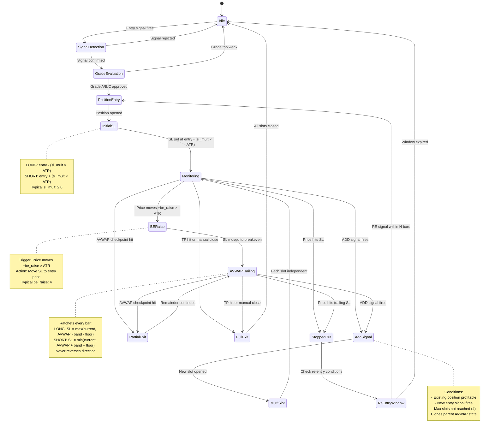
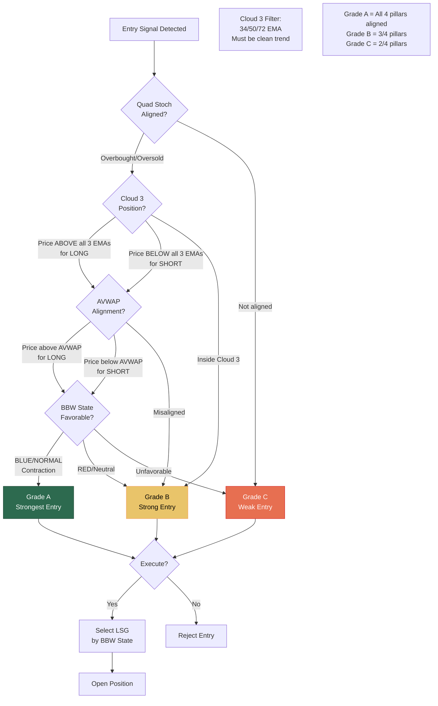
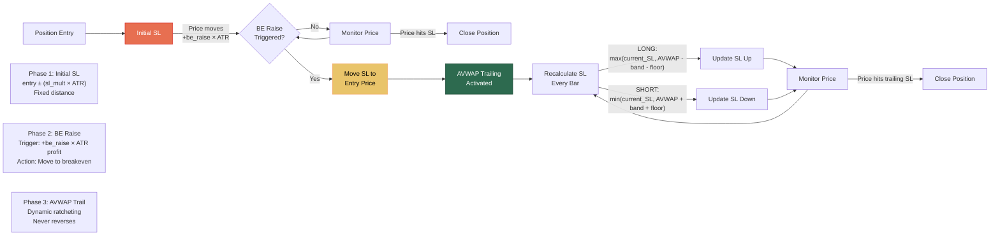
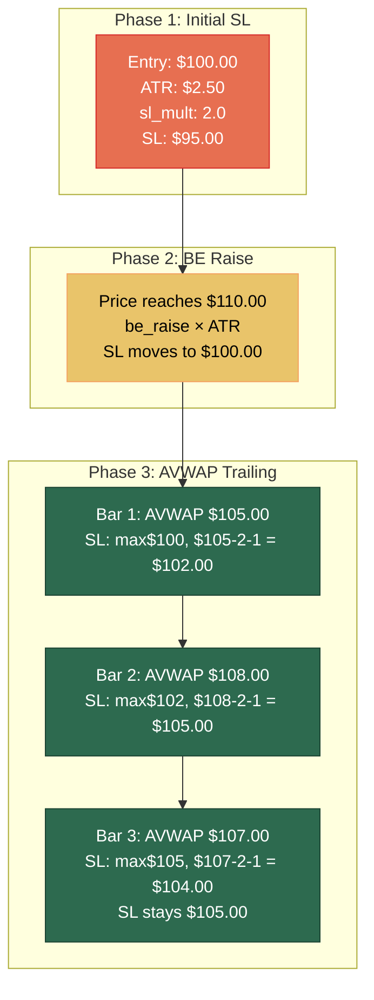
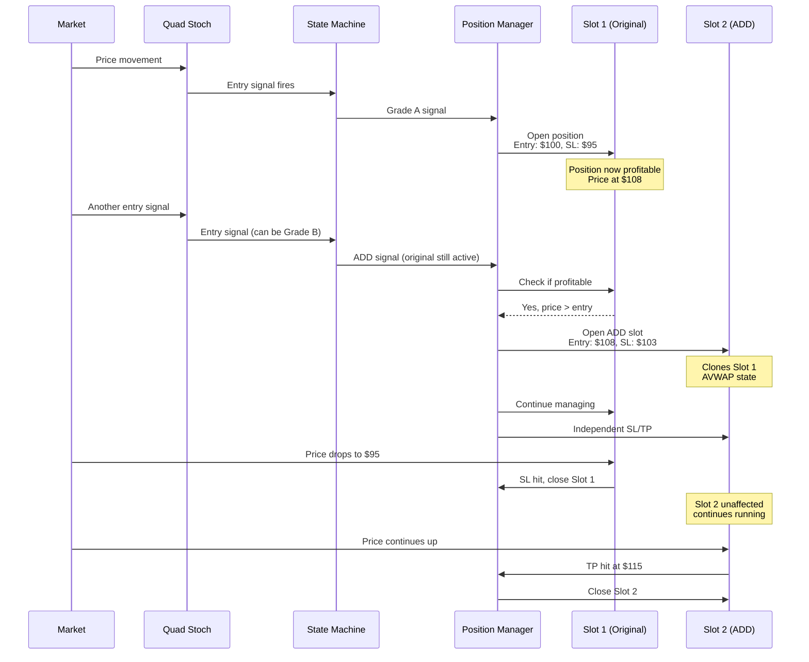
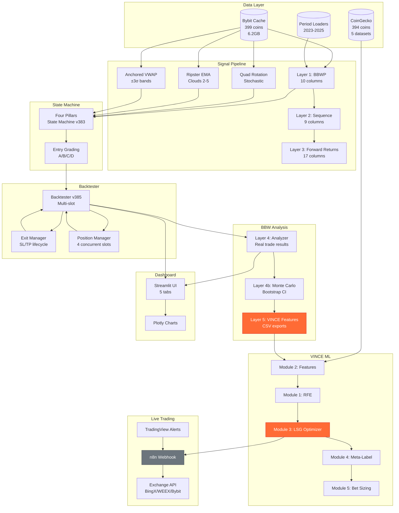
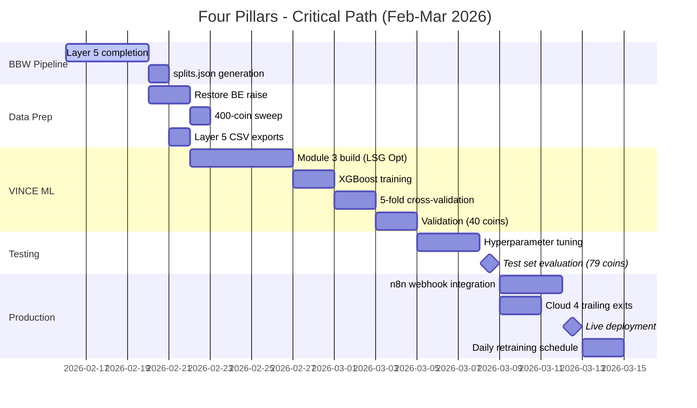
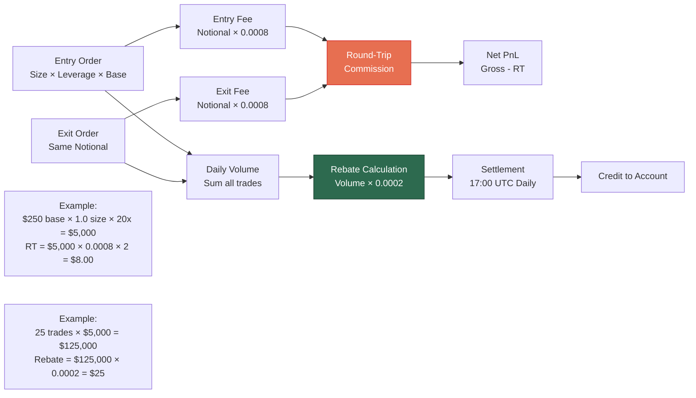
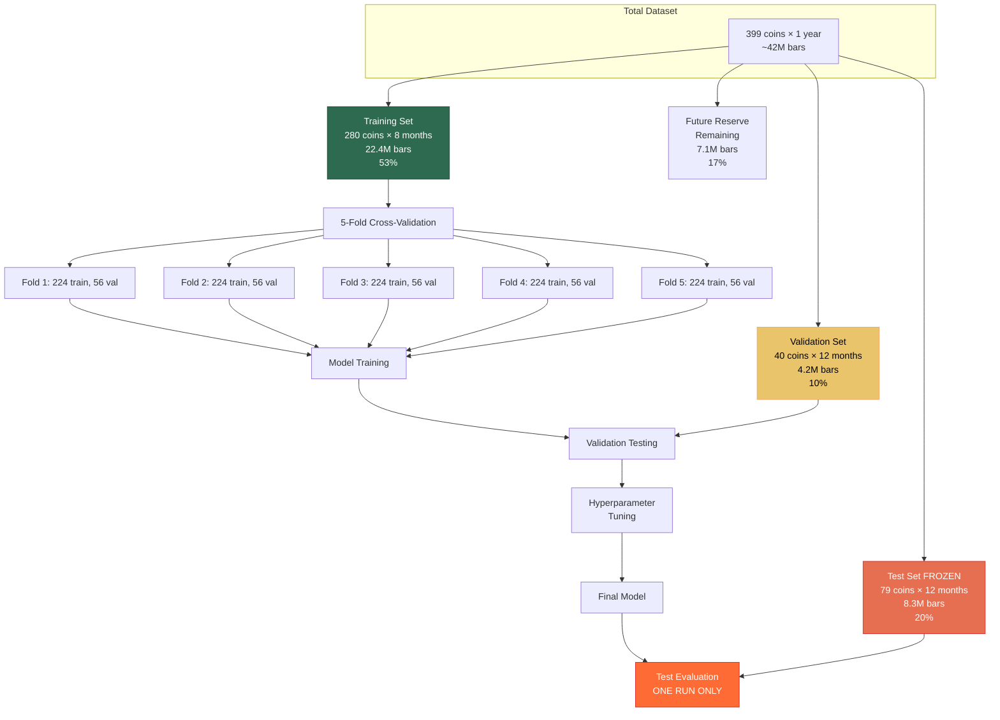

# Four Pillars - UML Flow Diagrams
**Date:** 2026-02-16 15:50 GST  
**Purpose:** Visual system architecture for mobile review  
**Format:** Mermaid diagrams (render in Obsidian)

---

## Diagram 1: Trade Lifecycle State Machine



---

## Diagram 2: Entry Grade Decision Tree



---

## Diagram 3: Stop Loss Lifecycle Flow



---

## Diagram 4: SL Movement Over Time (v3.9 Planned)



---

## Diagram 5: ADD Signal Flow



---

## Diagram 6: System Architecture (Component Diagram)



---

## Diagram 7: Critical Path Timeline



---

## Diagram 8: Commission & Rebate Flow



---

## Diagram 9: Data Split Strategy



---

## Diagram 10: Multi-Slot Position Management

```mermaid
sequenceDiagram
    participant Market
    participant SM as State Machine
    participant PM as Position Manager
    participant S1 as Slot 1
    participant S2 as Slot 2
    participant S3 as Slot 3
    participant S4 as Slot 4
    
    Market->>SM: Entry signal (Grade A)
    SM->>PM: Open position
    PM->>S1: Open Slot 1<br/>Entry: $100, SL: $95
    
    Note over S1: Active, monitoring
    
    Market->>SM: ADD signal
    SM->>PM: Check capacity
    PM->>PM: Slots: 1/4 used
    PM->>S2: Open Slot 2<br/>Entry: $108, SL: $103
    
    Note over S1,S2: Both active,<br/>independent SL/TP
    
    Market->>S1: Price drops to $95
    S1->>PM: SL hit, close Slot 1
    PM->>S1: Close position
    
    Note over S1: Closed (stopped out)
    Note over S2: Still active
    
    Market->>SM: RE-entry signal<br/>(within 10 bars)
    SM->>PM: Open RE-entry
    PM->>S3: Open Slot 3<br/>Entry: $97, SL: $92
    
    Note over S2,S3: Both active
    
    Market->>SM: Another ADD signal
    SM->>PM: Check capacity
    PM->>PM: Slots: 2/4 used
    PM->>S4: Open Slot 4<br/>Entry: $115, SL: $110
    
    Note over S2,S3,S4: 3 active slots<br/>Max: 4 total
    
    Market->>S2: TP hit at $120
    S2->>PM: Close Slot 2
    
    Market->>S3: AVWAP trail hits
    S3->>PM: Close Slot 3
    
    Market->>S4: Still running
    
    Note over S4: Only Slot 4 active<br/>Can open 3 more
```

---

**END OF DIAGRAMS**

All diagrams render in Obsidian with Mermaid plugin.  
Use for workflow visualization and handoff documentation.
