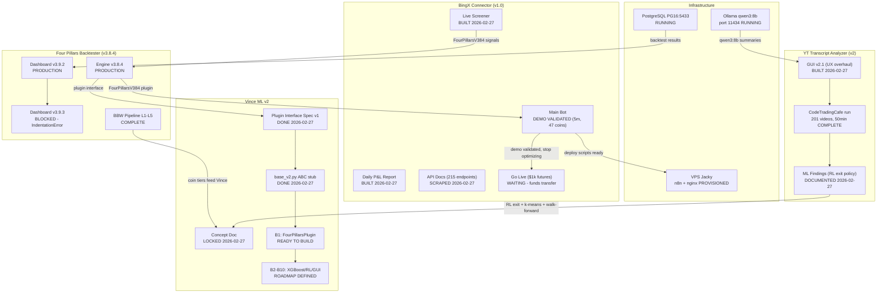

# Plan: Cross-Project Master Overview Diagram

## Context

The vault has 27 UML/diagram files but all are intra-project (internal architecture of a single system).
No file shows the cross-project view: how the 4 active projects relate, which systems are live vs built vs
concept, what the blockers are, and what comes next. This is the missing oversight visual.

Today (2026-02-27) was a high-output day with 6 sessions across 3 projects. Before moving forward,
a master overview diagram is needed to anchor orientation.

---

## What Exists (no need to recreate)

- `PROJECTS/bingx-connector/docs/TRADE-UML-ALL-SCENARIOS.md` — BingX trade lifecycle (internal)
- `PROJECTS/four-pillars-backtester/docs/FOUR-PILLARS-STRATEGY-UML.md` — strategy arch (internal)
- `PROJECTS/four-pillars-backtester/docs/BINGX-CONNECTOR-UML.md` — connector arch (internal)
- `PROJECTS/four-pillars-backtester/docs/vince-ml/VINCE-ML-UML-DIAGRAMS.md` — ML pipeline (internal)

All existing diagrams document how a system works internally. None show the project landscape.

---

## What to Build

**One new file:** `C:\Users\User\Documents\Obsidian Vault\PROJECT-OVERVIEW.md`

Contains:
1. **Master Mermaid graph** — all projects, systems, status, and inter-project connections
2. **Status legend** — color key (PRODUCTION / BUILT / CONCEPT / BLOCKED / WAITING)
3. **Today's output summary** — what was completed 2026-02-27
4. **Active blockers table** — 3 current blockers
5. **Next actions table** — immediate next steps per project

---

## Diagram Design

---

## File Specification

**File:** `C:\Users\User\Documents\Obsidian Vault\PROJECT-OVERVIEW.md`

Sections:
1. Header with last-updated date
2. Mermaid diagram (as above, with status color annotations via classDef)
3. **Status Legend** table (5 statuses)
4. **Today's output** (2026-02-27, 6 sessions, one-liner per session)
5. **Active blockers** (3 rows: Dashboard v3.9.3, BingX go-live, VPS deployment)
6. **Immediate next actions** (3-5 rows: B1 build, screener run, daily report schedule)

---

## Files Modified

- **NEW:** `C:\Users\User\Documents\Obsidian Vault\PROJECT-OVERVIEW.md`
- **Also save plan copy to:** `C:\Users\User\Documents\Obsidian Vault\06-CLAUDE-LOGS\plans\2026-02-27-project-overview-diagram.md`
- **Append row to:** `C:\Users\User\Documents\Obsidian Vault\06-CLAUDE-LOGS\INDEX.md`

No existing files modified.

---

## Verification

1. Open `PROJECT-OVERVIEW.md` in Obsidian — mermaid diagram should render
2. Check all 4 project subgraphs appear with correct status labels
3. Confirm inter-project arrows are accurate against LIVE-SYSTEM-STATUS.md
4. Confirm blockers table matches PRODUCT-BACKLOG.md P0 section
