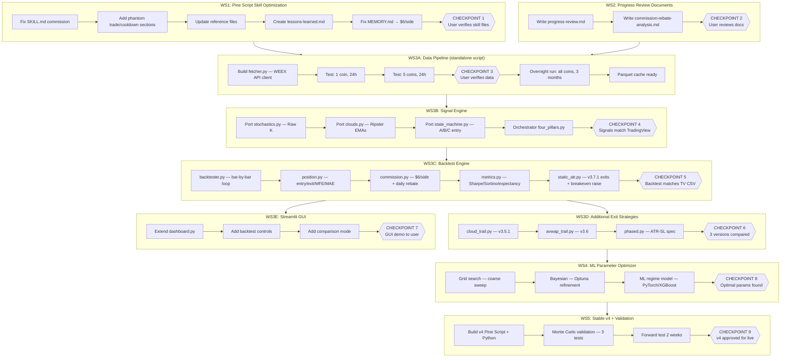

# Four Pillars Trading System — Master Execution Plan
**Date:** 2026-02-07 | **Status:** Ready for execution | **Platform:** Windows + CUDA (no Linux needed)

---

## Flowchart



---

## Context

The Four Pillars strategy (v3.5.1 → v3.6 → v3.7 → v3.7.1) is marginally profitable at $1.81/trade expectancy. **86% of losers saw green before dying** — signal quality is fine, SL/exit timing is the bottleneck.

The core strategy logic will be **ported from Pine Script to Python** and run as a simulated bot on historical 1m data pulled from WEEX. This is NOT a live bot — it replays history bar-by-bar with the exact same state machine, but 1000x faster than TradingView replay.

### Commission Rebate — Changes Everything
- **Raw commission:** 0.06% taker = **$6/side = $12 round trip** (confirmed)
- MEMORY.md was incorrectly corrected to $4 — **revert to $6 in WS1**
- **70% account:** Net $3.60/RT → expectancy **$10.21/trade**
- **50% account:** Net $6.00/RT → expectancy **$7.81/trade**
- Rebates settle daily at 5pm UTC — backtester models exact daily settlement

### Breakeven+ SL Raise — Key Optimization Target
- **$2 on position** ($10k notional = 0.02% move) — ultra-tight
- Also test $5, $10, $20 via optimizer
- 86% of losers → small wins instead of full SL losses
- 1m data critical for simulating when exactly the raise triggers

### Impact Calculation

| Scenario | Net comm | Net/trade | Monthly (100 trades) |
|----------|----------|-----------|----------------------|
| TV backtest (no rebate) | $12.00 | $1.81 | $181 |
| + 70% rebate | $3.60 | $10.21 | $1,021 |
| + Raise SL + 70% rebate | $3.60 | **~$34.40** | **~$3,440** |

### Key Market Dates for Testing
- **Nov 11** — Favorable (bot should profit)
- **Dec 15** — BTC dump (stress test)
- **Jan 15+** — Bearish grind
- **Feb 4** — BTC dump (stress test)

### CUDA Setup (Windows only, no Linux needed)
1. Install latest CUDA Toolkit from nvidia.com (user sees 13.1)
2. `pip install torch --index-url https://download.pytorch.org/whl/cu131` (if available, else latest `cu1XX`)
3. Verify: `python -c "import torch; print(torch.cuda.is_available())"`

---

## WS1: Pine Script Skill Optimization

**Goal:** Consolidate all lessons into `.claude/skills/pinescript/` so future work never repeats past mistakes.

### Files to modify

**`.claude/skills/pinescript/SKILL.md`**:
- Fix line ~15: `commission.percent` → `cash_per_order=6`
- Add section after line 406: "Commission Handling — CRITICAL"
  - `cash_per_order=6`: $6/side = 0.06% taker on $10k notional (20x on $500 cash)
  - WARNING: `commission.percent` applies to cash qty, not notional. With 20x leverage, 0.06% on $500 = $0.30/side (WRONG)
  - Case study: v3.7 used commission.percent=0.06 → phantom trades + commission spiral
- Add section: "Phantom Trade Bug — CRITICAL"
  - `strategy.close_all()` + `strategy.entry()` on same bar = 2 trades
  - Fix: only `strategy.entry()` in opposite direction (auto-reverses)
  - `strategy.cancel()` stale exits before flip (from v3.7.1 lines 389-394)
- Add section: "Cooldown Gate Pattern"
  - `var int entryBar = na` / `bool cooldownOK = na(entryBar) or (bar_index - entryBar >= i_cooldown)`
  - entryBar does NOT reset on exit (persists for cooldown between trades)
- Add WARNING at stochastic section: Raw K (smooth=1) via `stoch_k()` for Four Pillars
- Add `stoch_k()` function from v3.7.1 line 67-70
- Add 5 code review checklist items for the above

**`.claude/skills/pinescript/references/strategy-patterns.md`**:
- Fix commission in Basic Strategy Template (line 14): `cash_per_order, 6`
- Add "Direction Flip Pattern" (cancel + auto-reverse from v3.7.1 lines 388-394)
- Add "B/C Open Fresh Pattern" (from v3.7.1 lines 275-280)
- Add "SL/TP Strategy Comparison" table (static vs cloud trail vs AVWAP vs phased)

**`.claude/skills/pinescript/references/technical-analysis.md`**:
- Fix Ripster Cloud numbering (lines 8-10):
  - Cloud 1: 8/9 (not used), Cloud 2: 5/12, Cloud 3: 34/50, Cloud 4: 72/89, Cloud 5: 180/200
- Add AVWAP stdev=0 warning (bar 1 after anchor → floor with `math.max(stdev, atr)`)
- Add "Trailing SL vs Symmetric SL Tradeoffs" section

**`.claude/skills/pinescript/references/indicator-patterns.md`**:
- Add raw K function `stoch_k()` (from v3.7.1 lines 67-70)
- Fix Cloud numbering to match technical-analysis.md

**New: `.claude/skills/pinescript/references/lessons-learned.md`**:
- Commission blow-up (v3.7): percent on cash qty, not notional
- Phantom trade bug: close_all + entry = 2 trades
- Stochastic K smoothing regression: v3.5 applied SMA, v3.5.1 reverted to raw
- AVWAP stdev=0 on bar 1
- Trail activation delay causing bleed (v3.5.1/v3.6)
- 86% of losers saw green — exit timing is the bottleneck

**Fix `MEMORY.md`**: Revert commission from $4 back to $6/side (0.06%)

### CHECKPOINT 1: User verifies skill files load correctly and content is accurate

---

## WS2: Progress Review Documents

**File 1: `07-BUILD-JOURNAL/2026-02-07-progress-review.md`**
- Version evolution: v3.4.1 → v3.5 → v3.5.1 → v3.6 → v3.7 → v3.7.1 (what each solved/broke)
- Market context: Nov 11 bullish, Dec 15 dump, Jan 15+ bearish, Feb 4 dump
- Version comparison table (SL type, commission, pyramiding, flip method, B/C behavior)
- Core finding: signal quality fine, exit timing is bottleneck
- Next steps roadmap linking to this plan

**File 2: `07-BUILD-JOURNAL/commission-rebate-analysis.md`**
- Full rebate math (70%/50%), breakeven+$2 raise analysis
- Trade category breakdown, combined projections
- What backtester needs to confirm

### CHECKPOINT 2: User reviews and approves documents

---

## WS3A: Data Pipeline (Standalone Overnight Script)

**This is a separate, standalone Python script that runs independently from the terminal.** Claude Code builds it, user runs it overnight to pull data. The backtester (WS3B-C) reads from the cached Parquet files afterward.

### Data Source: WEEX API
- Endpoint: `GET https://api-contract.weex.com/capi/v2/market/historyCandles`
- Params: `symbol`, `granularity=1m`, `startTime`, `endTime`, `limit=100`
- Response: `[timestamp, open, high, low, close, base_vol, quote_vol]`
- Rate limit: 5 IP weight per request

### Data Size (1m candles)
| Scope | Candles | Requests | CSV Size | Parquet Size | Fetch Time (~5 req/s) |
|-------|---------|----------|----------|-------------|----------------------|
| 1 coin, 24h | 1,440 | 15 | 144 KB | 50 KB | 3 seconds |
| 5 coins, 24h | 7,200 | 75 | 720 KB | 250 KB | 15 seconds |
| 5 coins, 1 month | 216,000 | 2,160 | 22 MB | 7.5 MB | 7 minutes |
| 100 coins, 3 months | 12,960,000 | 129,600 | 1.3 GB | 450 MB | ~7 hours |
| 500 coins, 3 months | 64,800,000 | 648,000 | 6.5 GB | 2.25 GB | ~36 hours |

Storage: ~6.5 GB for 500 coins. User has 1,600 GB free. Non-issue.

### Fetching Strategy
- **Serial per coin** (one at a time) — API rate limit is the bottleneck, not CPU
- Fetch all pages for coin A → save Parquet → move to coin B
- **Restartable:** If script crashes at coin 237, it checks cache and skips coins that already have complete data
- Progress logging: prints current coin, progress bar, ETA

### Progressive Testing Phases
1. **Phase 1:** 1 coin, last 24h (~3 seconds) — verify API works
2. **Phase 2:** 5 coins, last 24h (~15 seconds) — verify multi-coin logic
3. **Phase 3:** 5 coins, last 1 month (~7 minutes) — verify pagination + Parquet
4. **Phase 4:** Full overnight run — all coins, 3 months

### Files
```
PROJECTS/four-pillars-backtester/
├── data/
│   ├── fetcher.py               # WEEX API client + Parquet cache + progress logging
│   ├── coingecko.py             # Coin discovery (market cap, trending)
│   └── cache/                   # Parquet files (gitignored)
├── scripts/
│   └── fetch_data.py            # CLI entry point: python fetch_data.py --coins 5 --months 3
├── .env                         # WEEX_API_KEY, COINGECKO_API_KEY (gitignored)
└── config.yaml                  # Coin list, default params (no secrets)
```

### CHECKPOINT 3: User runs Phase 1-3, verifies data is correct before overnight run

---

## WS3B: Signal Engine

**Port the Four Pillars signal logic from Pine Script to Python.** This is the core strategy — it generates A/B/C entry signals on 1m candles using the exact same state machine.

### Source: `02-STRATEGY/Indicators/four_pillars_v3_7_1_strategy.pine`
- Lines 67-76: `stoch_k()` → `signals/stochastics.py` (numpy vectorized)
- Lines 78-99: Ripster clouds → `signals/clouds.py` (EMA calculations)
- Lines 102-192: State machine → `signals/state_machine.py` (bar-by-bar with persistent state)
- Lines 197-227: Cloud 2 re-entry + ADD signals → `signals/four_pillars.py` (orchestrator)

### Key Translation Rules
- Pine Script `var` → Python class instance variables (persist across bars)
- Pine Script `if/else if` chain → Python `if/elif` chain (same mutual exclusion)
- Pine Script `ta.ema()` → numpy/pandas `ewm()` or manual EMA
- Pine Script `ta.lowest()/ta.highest()` → `pd.Series.rolling().min()/max()`
- Pine Script `bar_index` → loop counter in Python

### Files
```
signals/
├── stochastics.py      # stoch_k(k_len) → numpy array of raw K values
├── clouds.py           # ema(series, length), cloud_bull, cloud_top, cloud_bottom
├── state_machine.py    # FourPillarsStateMachine class — bar-by-bar processing
└── four_pillars.py     # orchestrate: compute indicators → run state machine → output signals
```

### CHECKPOINT 4: Run signal engine on MEMEUSDT data, compare signals to TradingView output (same bars should fire same A/B/C signals)

---

## WS3C: Backtest Engine

**The Python bot.** Reads Parquet data bar-by-bar, maintains position state, enters/exits with commission, tracks MFE/MAE. Same logic as if TradingView replay was running, but automated.

### Core Loop
```
for each bar in 1m data:
    1. Check exit conditions on current position (SL hit? TP hit? breakeven raise triggered?)
    2. Check entry signals from state machine (A? B? C? re-entry? flip?)
    3. Apply cooldown gate
    4. If entry: record entry price, set SL/TP, start MFE/MAE tracking
    5. If exit: record P&L, MFE/MAE, commission
    6. At 5pm UTC: credit commission rebate to equity
```

### Breakeven+$2 Raise Logic
```
if position is open AND unrealized_pnl >= $2:
    raise SL to entry_price + $2 (long) or entry_price - $2 (short)
    # SL only ratchets favorable, never moves back
```

### Commission Model
- Raw: $6 deducted on entry, $6 deducted on exit
- Rebate: accumulated per day, credited to equity at 5pm UTC
- Configurable: `rebate_pct=0.70` or `rebate_pct=0.50`

### Files
```
engine/
├── backtester.py       # Main loop, orchestrates signals → exits → entries → metrics
├── position.py         # Position class: entry, exit, SL/TP, MFE/MAE tracking
├── commission.py       # CommissionModel: raw deduction + daily rebate settlement
└── metrics.py          # win_rate, profit_factor, expectancy, sharpe, sortino, mfe_mae_analysis
```

### CHECKPOINT 5: Backtest MEMEUSDT with v3.7.1 params (1.0 SL, 1.5 TP, cooldown=3), compare trade log to TradingView CSV (`07-TEMPLATES/4Pv3.4.1-S_BYBIT_MEMEUSDT.P_2026-02-06_fcc84.csv`). Trades should match within 1-2% tolerance.

---

## WS3D: Additional Exit Strategies

Port the exit logic from v3.5.1 and v3.6 as pluggable modules.

```
exits/
├── static_atr.py       # v3.7.1: fixed SL/TP at entry, breakeven+$X raise
├── cloud_trail.py      # v3.5.1: Cloud 3/4 trail activation, SL follows Cloud 3 ± 1 ATR
├── avwap_trail.py      # v3.6: AVWAP ± max(stdev, ATR), ratchets favorable
└── phased.py           # ATR-SL-MOVEMENT spec: Cloud 2→3→4 phase progression
```

Run all 4 exit strategies on the **same data with same signals** → side-by-side comparison.

### CHECKPOINT 6: User reviews comparison report — which exit strategy performs best per market regime

---

## WS3E: Streamlit GUI

Extend existing `PROJECTS/trading-dashboard/code/dashboard.py` (737 lines, working dark theme, Plotly charts).

Add:
- Coin selector dropdown (from Parquet cache)
- Parameter sliders (ATR, SL mult, TP mult, cooldown, breakeven raise threshold)
- Exit strategy selector (static/cloud trail/AVWAP/phased)
- "Run Backtest" button → shows equity curve, MFE/MAE scatter, trade log
- Comparison mode: overlay 2 exit strategies on same chart
- Rebate toggle: 70% / 50% / none

### CHECKPOINT 7: User demos GUI, provides feedback

---

## WS4: ML Parameter Optimizer

### Parameters to optimize (by impact)
1. **Exit (highest):** SL mult (0.3-4.0), TP mult (0.5-6.0), ATR length (7-30), exit strategy type, **breakeven raise $** (2-50)
2. **Entry (moderate):** cross level (15-40), zone level (20-40), cooldown (0-20), stage lookback (3-30)
3. **Signal (lower):** B/C open fresh (bool), Cloud 2 re-entry (bool)

### Three-stage pipeline
1. **Grid search** — Coarse sweep (~650 combos × N coins). Serial per coin, multiprocessing across CPU cores.
2. **Bayesian** (Optuna) — Refine promising regions. 500-1000 trials/coin. Multi-objective: maximize Sharpe + minimize max drawdown.
3. **ML regime model** (PyTorch/XGBoost on GPU) — Train on grid/Optuna results. Input: market features. Output: optimal params per regime.

### Market regime segmentation
- Bull: pre-Dec 15 (Cloud 3/4 aligned up, BBWP < 50)
- Crash: Dec 15, Feb 4 (BBWP > 80, sharp drop)
- Bear grind: Jan 15+ (Clouds mixed, BBWP 20-80)
- Walk-forward validation: train 80% / test 20%, rolling window

### Data flow
```
Parquet cache → Backtester → Grid/Optuna results (Parquet) → ML model training → Optimal params per regime
```

### CUDA (Windows)
- Install CUDA 13.1 from nvidia.com
- `pip install torch --index-url https://download.pytorch.org/whl/cu131`
- `pip install xgboost optuna cupy-cuda131`
- Verify: `python -c "import torch; print(torch.cuda.is_available())"`

### Files
```
optimizer/
├── grid_search.py      # Parallel grid sweep, results → Parquet
├── bayesian.py         # Optuna integration, multi-objective
└── ml_regime.py        # PyTorch/XGBoost regime model
```

### CHECKPOINT 8: Grid search on initial coin set, Optuna finds better params than v3.7.1 defaults

---

## WS5: Stable v4 Strategy + Monte Carlo Validation

### v4 feeds from optimizer answers
- Static vs trailing exits per regime
- Optimal SL/TP ratio
- Optimal breakeven raise threshold
- Cooldown: fixed vs ATR-adaptive
- B/C value: keep or remove
- MFE-aware exits ("weakness exit" for trades showing reversal signs while green)

### Monte Carlo Validation — Final Gate (10,000 iterations each)
1. **Trade Reshuffling:** Resample trades with replacement → 95% CI for equity/drawdown/Sharpe
2. **Parameter Perturbation:** Add ±10% noise to params → if Sharpe drops >50%, params are fragile
3. **Trade Skip:** Randomly skip 10% of trades → still profitable = survives real execution

New file: `optimizer/monte_carlo.py`

### "Stable" criteria
- Positive expectancy ($2+/trade) across 10+ coins
- Max drawdown < 15%
- Commission-aware (with rebate modeling)
- Consistent across bull/bear/crash regimes
- Walk-forward validated
- Monte Carlo: 95th percentile profitable on all 3 tests
- Forward-tested 2+ weeks paper trading

### Files
- `02-STRATEGY/Indicators/four_pillars_v4_strategy.pine`
- `02-STRATEGY/Indicators/four_pillars_v4.pine` (indicator)

### CHECKPOINT 9: v4 passes all criteria → approved for live trading

---

## Execution Prompt for New Chat

Copy this into a new Claude Code session to begin:

> **Read the plan file at `C:\Users\User\.claude\plans\warm-waddling-wren.md` and execute it starting from WS1. This is the Four Pillars Trading System master plan. Work through each workstream in order, pausing at each CHECKPOINT for my review. Load the pinescript skill before doing WS1. The source Pine Script strategy is at `02-STRATEGY/Indicators/four_pillars_v3_7_1_strategy.pine`. The existing dashboard code to reuse is at `PROJECTS/trading-dashboard/code/dashboard.py`. Start with WS1: Pine Script Skill Optimization.**

---

## Dependencies (requirements.txt)

```
requests>=2.31        # WEEX API calls
pandas>=2.0           # DataFrames
numpy>=1.24           # Numerical computation
pyarrow>=14.0         # Parquet I/O
streamlit>=1.30       # GUI
plotly>=5.18          # Charts
matplotlib>=3.8       # Static charts
optuna>=3.5           # Bayesian optimization
torch>=2.1            # ML model (GPU)
xgboost>=2.0          # Gradient boosting (GPU)
python-dotenv>=1.0    # .env file loading
pyyaml>=6.0           # Config files
```

---

## Key File Paths

| File | Purpose |
|------|---------|
| `.claude/skills/pinescript/SKILL.md` | Main Pine Script skill (WS1 target) |
| `.claude/skills/pinescript/references/*.md` | Reference files (WS1 targets) |
| `02-STRATEGY/Indicators/four_pillars_v3_7_1_strategy.pine` | Source strategy to port |
| `02-STRATEGY/Indicators/four_pillars_v3_5_1_strategy.pine` | v3.5.1 exit logic source |
| `02-STRATEGY/Indicators/four_pillars_v3_6_strategy.pine` | v3.6 exit logic source |
| `07-TEMPLATES/trade_dashboard.ipynb` | MFE/MAE analysis patterns |
| `07-TEMPLATES/4Pv3.4.1-S_BYBIT_MEMEUSDT.P_2026-02-06_fcc84.csv` | Validation data |
| `PROJECTS/trading-dashboard/code/dashboard.py` | Streamlit dark theme to reuse |
| `PROJECTS/four-pillars-backtester/` | New project directory (WS3+) |
| `C:\Users\User\.claude\projects\c--Users-User-Documents-Obsidian-Vault\memory\MEMORY.md` | Project memory (fix commission) |
