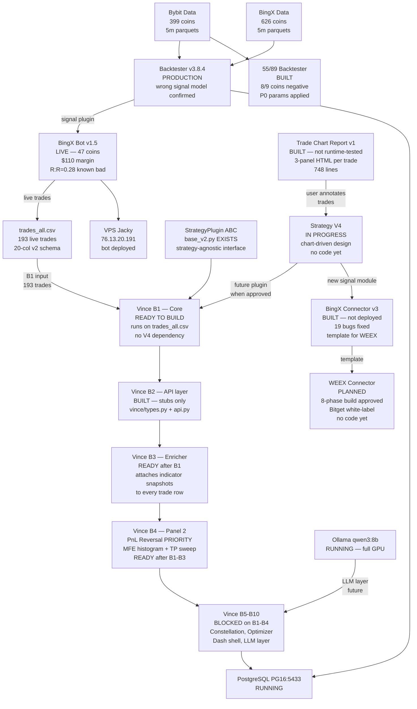

# Project Overview — Master Map
**Last Updated:** 2026-03-12 (session 2 — Vince redesigned strategy-independent, BingX v3, WEEX added)

---

## Inter-Project Flow

---

## Status Snapshot

### Strategy

| Component | Status |
|-----------|--------|
| Backtester v3.8.4 | PRODUCTION — wrong signal model confirmed (R:R=0.28, S4=10% alignment) |
| 55/89 EMA Backtester | BUILT — 8/9 coins negative. COUNTER_TREND 77.4% of losers. P0 fixes applied (sl_mult 4.0, avwap_warmup 20). AXSUSDT validated only. |
| Strategy V4 | IN PROGRESS — chart-driven design. `STRATEGY-V4-DESIGN.md` + `S12-MACRO-CYCLE.md` exist. No code. |
| S12 cloud role | CORRECTED 2026-03-11 — cloud is NOT entry. Context + TP target + SL movement only. |
| Trade Chart Report | BUILT — `bingx-connector-v2/scripts/run_trade_chart_report.py` (748 lines). py_compile PASS, not runtime-tested. |

### BingX Connector

| Component | Status |
|-----------|--------|
| Bot v1.5 (v2 codebase) | LIVE — 47 coins, $110 margin, native trailing. R:R=0.28 (known bad signal). |
| Connector v2 | SUPERSEDED — 19 bugs identified. Do not use as template. |
| Connector v3 | BUILT — all 19 bugs fixed. py_compile PASS. Not yet deployed. Use as template for WEEX. |
| trades_all.csv | 193 trades (v1+v2 merged), 2026-03-03 to 2026-03-11, 20-col v2 schema. Vince B1 input. |

### WEEX Connector

| Component | Status |
|-----------|--------|
| API probe | DONE — NO historical OHLCV. Latest ~1000 candles only. |
| Bitget white-label | CONFIRMED — `/capi/v2/`, `cmt_btcusdt` format, URL patterns match Bitget exactly. |
| Architecture plan | APPROVED — 8-phase. Handoff prompt written. |
| Code | NOT STARTED — use v3 as template. |

### Vince ML v2

| Component | Status |
|-----------|--------|
| Concept doc | LOCKED — VINCE-V2-CONCEPT-v2.md |
| StrategyPlugin ABC | EXISTS — `strategies/base_v2.py`. Strategy-agnostic. |
| B1: Vince core | **READY TO BUILD** — unblocked 2026-03-12. Runs on trades_all.csv. No V4 dependency. |
| B2: API + types | BUILT (2026-03-02) — stubs only, no upstream data |
| B3: Enricher | READY after B1 |
| B4: PnL Reversal ★ | READY after B1-B3 — highest priority panel |
| B5-B10 | Blocked on B1-B4 |

### Infrastructure

| Service | Status |
|---------|--------|
| PostgreSQL PG16:5433 | RUNNING |
| Ollama qwen3:8b | RUNNING — full GPU, RTX 3060 |
| VPS Jacky 76.13.20.191 | RUNNING — bot v1.5 deployed |

---

## Vince — What It Needs to Build B1 Right Now

All of these exist today:

| Dependency | Path | Status |
|------------|------|--------|
| StrategyPlugin ABC | `strategies/base_v2.py` | EXISTS |
| Trade CSV | `PROJECTS/bingx-connector-v2/trades_all.csv` | EXISTS — 193 trades |
| Signal compute | `signals/four_pillars_v383_v2.py` | EXISTS |
| Backtester | `engine/backtester_v384.py` | EXISTS |
| API stubs | `vince/types.py`, `vince/api.py` | EXISTS (B2) |
| Python skill | `C:\Users\User\.claude\skills\python\` | EXISTS |
| Dash skill | `C:\Users\User\.claude\skills\dash\` | EXISTS |

**No blocker. B1 can start in the next session.**

---

## Active Blockers

1. **V4 Signal Model** — chart-driven analysis in progress. No code until user-approved. Does NOT block Vince anymore.
2. **WEEX Connector** — handoff prompt ready. Needs new chat.
3. **Trade chart report runtime test** — first step to unblock V4 pattern discovery.

---

## Next Actions

### P0 — Immediate
1. Runtime-test `run_trade_chart_report.py` — unblocks V4 pattern discovery
2. Start Vince B1 in new Claude Code session — handoff prompt needed

### P1 — This Week
1. Start WEEX connector build (new chat, paste handoff prompt)
2. V4 pattern discussion when 20+ trades annotated
3. 55/89 full portfolio sweep with P0 params

---

## Key Docs

| Doc | Path |
|-----|------|
| Strategy V4 | `02-STRATEGY\STRATEGY-V4-DESIGN.md` |
| S12 Macro Cycle | `02-STRATEGY\S12-MACRO-CYCLE.md` |
| Project Status | `06-CLAUDE-LOGS\PROJECT-STATUS.md` |
| Session Index | `06-CLAUDE-LOGS\INDEX.md` |
| Product Backlog | `PRODUCT-BACKLOG.md` |
| Vince Concept | `PROJECTS\four-pillars-backtester\docs\VINCE-V2-CONCEPT-v2.md` |
| BingX v3 Bug Audit | `PROJECTS\weex-connector\docs\BINGX-V2-BUG-AUDIT.md` |
| WEEX Build Prompt | `06-CLAUDE-LOGS\plans\2026-03-12-weex-connector-build-prompt.md` |
| BingX UML | `PROJECTS\bingx-connector-v2\docs\BINGX-CONNECTOR-UML.md` |
