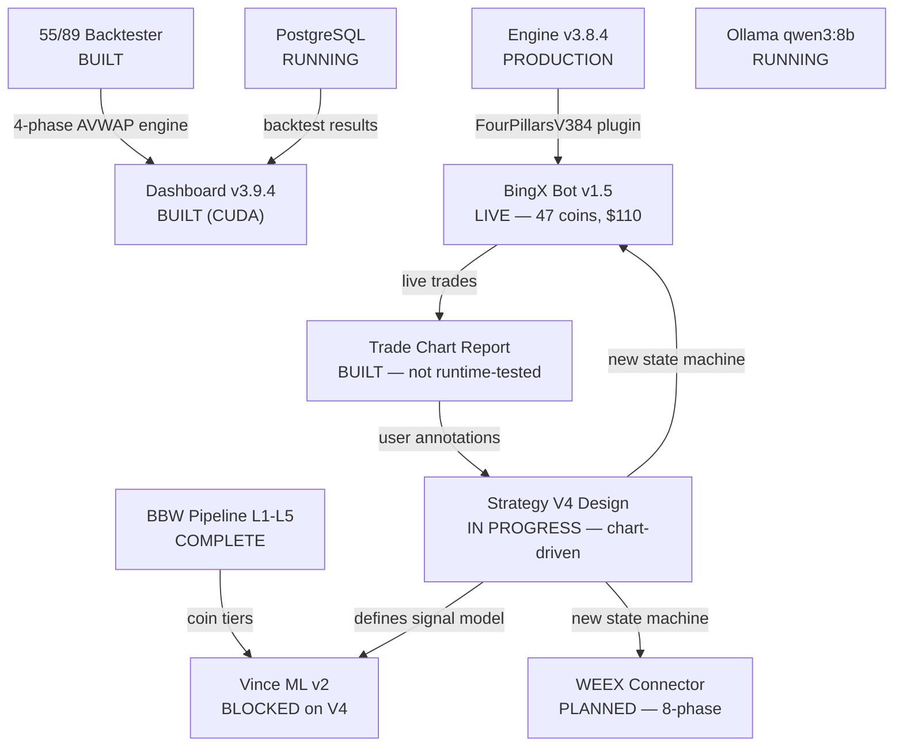

# Project Overview — Master Map
**Last Updated:** 2026-03-12

---

## Inter-Project Flow

---

## Status Snapshot

### Four Pillars Backtester

| System | Status |
|--------|--------|
| Engine v3.8.4 | PRODUCTION |
| 55/89 EMA Backtester | BUILT — 4-phase AVWAP SL/TP. 8/9 coins negative (COUNTER_TREND 77.4%). P0 fixes applied (sl_mult 4.0, avwap_warmup 20). |
| Dashboard v3.9.4 (CUDA) | BUILT — GPU sweep, portfolio mode. Not runtime-validated for CUDA parity. |
| Dashboard v3.9.3 | PRIOR STABLE |
| BBW Pipeline L1-L5 | COMPLETE |
| Trade Chart Report | BUILT — `bingx-connector-v2/scripts/run_trade_chart_report.py` (748 lines). py_compile PASS, not runtime-tested. |

### Strategy V4

| Item | Status |
|------|--------|
| Root cause analysis | DONE — v3.8.4 pile-in explains R:R=0.28 (S4 scored 10% alignment) |
| Strategy docs | `STRATEGY-V4-DESIGN.md` (hybrid stoch model) + `S12-MACRO-CYCLE.md` (5-tier, stoch_60-primary) |
| Cloud role correction | DONE — cloud is NOT entry (corrected 2026-03-11) |
| Chart-driven design workflow | APPROVED — understanding first, no code until user approves |
| V4 code | NOT STARTED — no state_machine_v4.py, no backtester |
| 5 open design decisions | Pending user input (channel gate, divergence, Stoch 55, cascade model, baseline backtest) |

### BingX Connector

| System | Status |
|--------|--------|
| Bot v1.5 (v2 codebase) | **LIVE** — 47 coins, $5 margin, 10x leverage, native trailing. R:R=0.28 (known bad signal model). |
| Dashboard v1.5 | RUNNING |
| Trade Chart Report | BUILT — per-trade HTML with stochastics, EMA 55/89, AVWAP, Four Pillars signals, comment boxes |
| v1/v2 mechanical fixes | 16 patches applied (2026-03-06): allOrders-first exit detection, place-then-cancel BE/SL, configurable be_buffer |

### WEEX Connector

| System | Status |
|--------|--------|
| API probe | DONE — NO historical OHLCV API. Latest ~1000 candles only. |
| Architecture plan | APPROVED — 8-phase build, same thread model as BingX |
| Handoff prompt | WRITTEN — `plans/2026-03-12-weex-connector-build-prompt.md` |
| Code | NOT STARTED |

### Vince ML v2

| System | Status |
|--------|--------|
| Concept Doc | LOCKED 2026-02-27 |
| B1: FourPillarsPlugin | BLOCKED — needs V4 signal model first |
| B2: API + types | BUILT (2026-03-02) — no upstream data |
| B3-B10 | BLOCKED on B1 |

### Infrastructure

| Service | Status |
|---------|--------|
| PostgreSQL PG16:5433 | RUNNING |
| Ollama qwen3:8b | RUNNING — full GPU, RTX 3060 |
| VPS Jacky | PROVISIONED — deploy scripts ready, not yet deployed |

---

## Active Blockers

1. **V4 Signal Model** — THE primary blocker. Current v3.8.4 signal is fundamentally wrong. V4 design in progress via chart-driven analysis. All downstream work (Vince ML, WEEX connector signal, parameter sweeps) blocked until V4 is defined and approved.
2. **WEEX Connector** — Architecture approved, handoff prompt written. Needs new chat to execute 8-phase build.
3. **Vince B1-B10** — Blocked on V4 signal model. B1 defines what ML model learns — can't start until V4 entry/exit rules are locked.

---

## Next Actions

### P0 — Immediate

1. Runtime-test `run_trade_chart_report.py` on today's bot trades
2. User reviews trade charts, annotates what they see on stochastics/EMA/entries
3. Accumulate annotated trades for V4 pattern discovery

### P1 — This Week

1. Start WEEX connector build (new chat with handoff prompt)
2. Joint V4 pattern discussion when enough annotated trades exist
3. Full 55/89 portfolio sweep with P0-fixed params (sl_mult=4.0, avwap_warmup=20)

---

## Key Docs

- [Strategy V4 Design](02-STRATEGY/STRATEGY-V4-DESIGN.md)
- [S12 Macro Cycle](02-STRATEGY/S12-MACRO-CYCLE.md)
- [Project Status](06-CLAUDE-LOGS/PROJECT-STATUS.md)
- [Session Log Index](06-CLAUDE-LOGS/INDEX.md)
- [Product Backlog](PRODUCT-BACKLOG.md)
- [Live System Status](LIVE-SYSTEM-STATUS.md)
- [Vince v2 Concept](PROJECTS/four-pillars-backtester/docs/VINCE-V2-CONCEPT-v2.md)
- [BingX Connector UML](PROJECTS/bingx-connector-v2/docs/BINGX-CONNECTOR-UML.md)
- [WEEX Connector Build Prompt](06-CLAUDE-LOGS/plans/2026-03-12-weex-connector-build-prompt.md)
