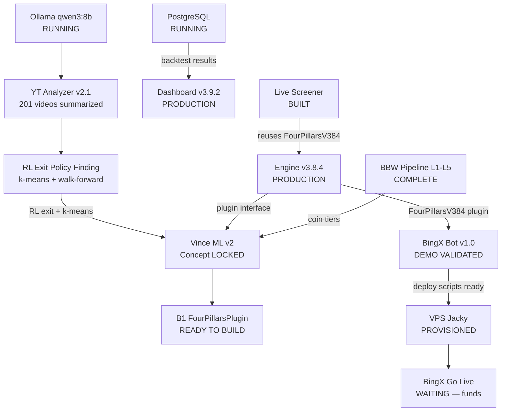

# Project Overview — Master Map
**Last Updated:** 2026-02-27

---

## Inter-Project Flow

---

## Status Snapshot

### Four Pillars Backtester

| System | Status |
| ------ | ------ |
| Engine v3.8.4 | PRODUCTION |
| Dashboard v3.9.3 | PRODUCTION |
| BBW Pipeline L1-L5 | COMPLETE |

### Vince ML v2

| System | Status |
| ------ | ------ |
| Concept Doc | LOCKED 2026-02-27 |
| Plugin Interface Spec v1 | DONE 2026-02-27 |
| base_v2.py ABC stub | DONE 2026-02-27 |
| B1: FourPillarsPlugin | READY TO BUILD |
| B2–B10: XGBoost / RL / GUI | ROADMAP DEFINED |

### BingX Connector

| System | Status |
| ------ | ------ |
| Main Bot v1.0 | DEMO VALIDATED — 5m, 47 coins |
| Live Screener | BUILT — not yet running |
| Daily P&L Report | BUILT — not yet scheduled |
| API Reference (215 endpoints) | SCRAPED |
| Go Live ($1k futures) | WAITING — transfer funds |

### YT Transcript Analyzer

| System | Status |
| ------ | ------ |
| GUI v2.1 (UX overhaul) | BUILT 2026-02-27 |
| CodeTradingCafe run | COMPLETE — 201 videos |
| ML Findings (RL exit policy) | DOCUMENTED |

### Infrastructure

| Service | Status |
| ------- | ------ |
| PostgreSQL PG16:5433 | RUNNING |
| Ollama qwen3:8b | RUNNING — full GPU, RTX 3060 |
| VPS Jacky (n8n + nginx) | PROVISIONED — deploy scripts ready |

---

## Active Blockers

1. **BingX Go Live** — Waiting on funds transfer to BingX futures wallet.
2. **B2-B10 Vince Build** — Gated on B1 FourPillarsPlugin completing first.

---

## Next Actions

### P0 — Immediate

1. Build B1 — FourPillarsPlugin
   `C:\Users\User\.claude\plans\async-watching-balloon.md`
2. Start BingX live screener
   `python "PROJECTS\bingx-connector\screener\bingx_screener.py"`
3. Schedule daily P&L report — Task Scheduler at 21:00
   `PROJECTS\bingx-connector\scripts\daily_report.py`

### P1 — This Week

1. Transfer $1k to BingX futures wallet → deploy to VPS → go live
2. Fix Dashboard v3.9.3 (IndentationError line 1972)

---

## Today's Output — 2026-02-27

Six sessions, three projects:

- **BingX API Scraper** — Playwright scraper + 215-endpoint reference doc
- **Trade Analysis** — 31 trades, -$379 PnL; VST API oddities confirmed; demo parked
- **YT Analyzer v2** — Timestamps, LLM summaries via qwen3:8b, clickable links, TOC
- **YT Analyzer v2.1 UX** — Cancel button, live log, resume, ETA, settings panel
- **BingX Automation** — Live screener (47 coins, Telegram) + daily P&L report
- **Vince ML** — Concept locked (10 edits), plugin spec v1, base_v2.py stub, RL exit finding

---

## Key Docs

- [Vince v2 Concept](PROJECTS/four-pillars-backtester/docs/VINCE-V2-CONCEPT-v2.md)
- [Plugin Interface Spec v1](PROJECTS/four-pillars-backtester/docs/VINCE-PLUGIN-INTERFACE-SPEC-v1.md)
- [BingX Trade UML](PROJECTS/bingx-connector/docs/TRADE-UML-ALL-SCENARIOS.md)
- [Vince ML UML](PROJECTS/four-pillars-backtester/docs/vince-ml/VINCE-ML-UML-DIAGRAMS.md)
- [Four Pillars Strategy UML](PROJECTS/four-pillars-backtester/docs/FOUR-PILLARS-STRATEGY-UML.md)
- [Live System Status](LIVE-SYSTEM-STATUS.md)
- [Product Backlog](PRODUCT-BACKLOG.md)
- [Session Log Index](06-CLAUDE-LOGS/INDEX.md)
