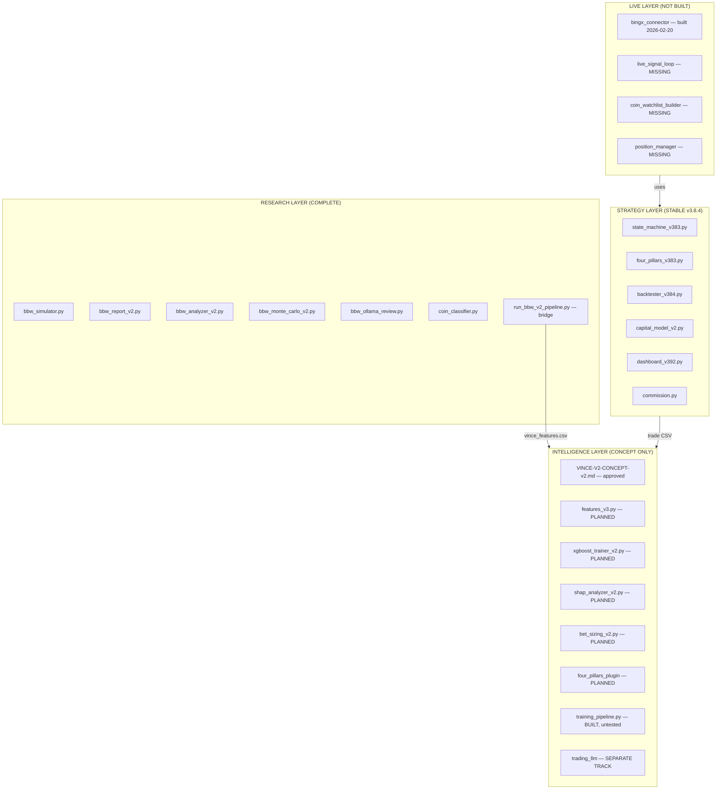
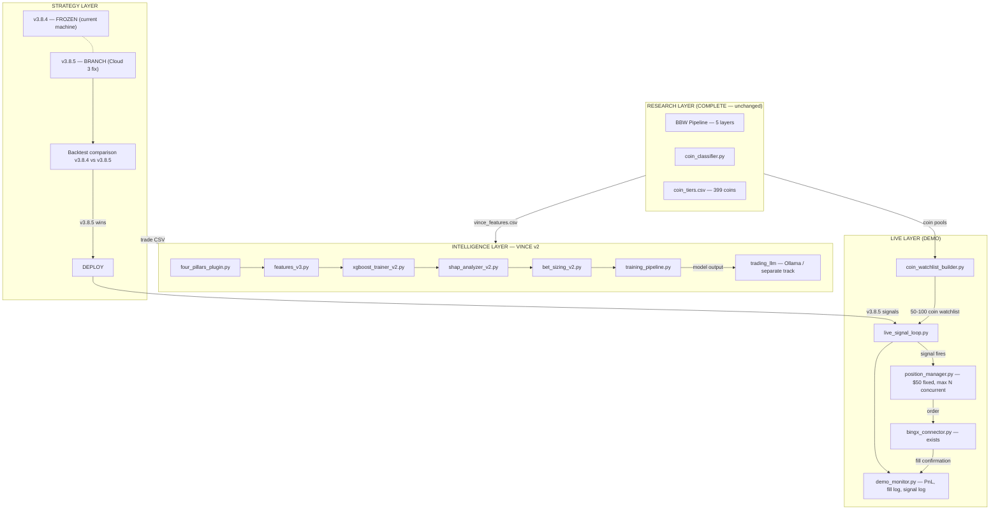

# PROJECT BUILD PLAN v2
**Created:** 2026-02-23  
**Author:** Claude (desktop session)  
**Status:** PLAN — awaiting approval before any code is written  

---

## Context

Two parallel tracks running simultaneously:

- **Track A** — Fix Cloud 3 logic, backtest v3.8.5, deploy demo on BingX
- **Track B** — VINCE ML build (plugin architecture, feature fixes, training pipeline)

The current machine (v3.8.4) is NOT touched during Track A work.

---

## Architecture: Current State



---

## Architecture: Target State



---

## Track A — Cloud 3 Fix + BingX Demo

### A1 — Cloud 3 Logic Spec (document, no code)
**What:** Write a one-page spec documenting exactly how Cloud 3 behaves in the corrected state machine.  
**Rules:**
- Cloud 3 state is logged at entry (bullish / bearish / neutral) but does NOT block entry
- Post-entry: Cloud 3 is monitored each candle
- Cloud 3 persistently bearish on a long after N candles = divergence flag (tighten stop or early TP)
- Cloud 3 flipping bullish after bearish entry = confirmation (normal expected path)
- No hard exits based on Cloud 3 alone — it informs, does not decide  

**Output:** `docs/CLOUD3-LOGIC-SPEC-v1.md`  
**Blocker:** User approval of this spec before A2 starts

---

### A2 — state_machine_v385.py (new branch)
**What:** Copy v383, remove Cloud 3 as a pre-entry gate, add Cloud 3 as a post-entry monitor field.  
**File:** `signals/state_machine_v385.py`  
**Changes from v383:**
- Entry condition: remove `cloud3_bull` requirement from long/short gate
- Add `cloud3_entry_state` field to trade record (log at entry, don't gate)
- Add `cloud3_divergence_flag` logic (post-entry monitoring, N candles configurable)
- All other logic identical to v383  
**Test:** `tests/test_state_machine_v385.py`

---

### A3 — four_pillars_v385.py
**What:** Signal file for v3.8.5. Passes cloud3 entry state through to state machine without blocking.  
**File:** `signals/four_pillars_v385.py`  
**Changes from v383:** Cloud 3 field passed as metadata, not as entry filter  
**Test:** `tests/test_four_pillars_v385.py`

---

### A4 — Backtest comparison v3.8.4 vs v3.8.5
**What:** Run both engines on same coin pool, same date range, same capital settings. Compare:
- Win rate
- Trade count (expect v3.8.5 to take more trades)
- Profit factor
- Max drawdown
- Avg PnL per trade  

**Script:** `scripts/compare_v384_v385.py`  
**Output:** `results/comparison_v384_v385/` — CSV + dashboard view  
**Decision gate:** If v3.8.5 win rate >= v3.8.4 AND profit factor >= v3.8.4 → proceed to A5  
**Fallback:** If v3.8.5 underperforms → diagnose before proceeding

---

### A5 — Coin Watchlist Builder
**What:** Dynamic watchlist generator for BingX live trading.  
**File:** `scripts/coin_watchlist_builder.py`  
**Logic:**
1. Pull all BingX USDT perpetual pairs (BingX API, public endpoint)
2. Filter: min 24h volume >= $1M (ensures fills on $50 orders)
3. Cross-reference with `results/coin_tiers.csv` — prefer Tier A coins
4. Optional: BBW compression filter (coins with low current BBW = pre-expansion)
5. Output: ranked watchlist, max 100 coins, saved to `data/watchlist_bingx.json`
6. Refresh schedule: daily at session start  

**Max watchlist size:** 100 coins (performance ceiling for single-machine scan)  
**Output file:** `C:\Users\User\Documents\Obsidian Vault\PROJECTS\four-pillars-backtester\data\watchlist_bingx.json`

---

### A6 — Live Signal Loop
**What:** Continuously polls OHLCV for watchlist coins, computes Four Pillars v3.8.5 signals, fires on valid signal.  
**File:** `scripts/live_signal_loop.py`  
**Behaviour:**
- Runs on 5m candle close (matches backtest timeframe)
- Loads watchlist from `data/watchlist_bingx.json`
- For each coin: fetch last N candles, compute signals
- If signal fires: pass to position_manager
- Every signal taken — no additional filtering at loop level
- Logs every signal (fired + not fired) with timestamp to `data/live_signal_log.csv`  

**Rate limiting:** Stagger API calls across coins to avoid BingX rate limits  
**Error handling:** Per-coin try/except — one coin failing does not stop the loop

---

### A7 — Position Manager
**What:** Receives signal from live loop, manages order execution and sizing.  
**File:** `scripts/position_manager.py`  
**Rules:**
- Fixed $50 USDT per trade (demo)
- Max concurrent positions: TBD by user (suggest 5-10 for demo)
- If max positions reached: queue or skip (user decides — needs answer)
- Uses BingX connector for order placement
- Tracks open positions, logs fills to `data/live_position_log.csv`
- No TP/SL logic at this layer — uses same ATR-based exits as backtest

---

### A8 — Demo Monitor
**What:** Lightweight terminal or web view showing live demo status.  
**File:** `scripts/demo_monitor.py`  
**Shows:**
- Open positions (coin, direction, entry price, current PnL)
- Today's closed trades (PnL, win/loss)
- Running win rate and total PnL
- Signal log (last 20 signals fired)
- Watchlist status (N coins monitored)

---

## Track B — VINCE v2 Build

### B1 — Approve VINCE-V2-CONCEPT-v2.md
**What:** User reads and approves concept doc before any code starts.  
**File:** `C:\Users\User\Documents\Obsidian Vault\PROJECTS\four-pillars-backtester\docs\VINCE-V2-CONCEPT-v2.md`  
**Blocker:** Nothing in Track B starts until this is approved

---

### B2 — Fix known ML bugs (4 files)
**What:** Fix all documented bugs in VERSION-MASTER.md before building on top.

| File | Bug | Fix |
|------|-----|-----|
| `ml/features_v3.py` | dt_series.iloc on DatetimeIndex, np.isnan on int | pd.Series wrap, pd.isna() |
| `ml/xgboost_trainer_v2.py` | use_label_encoder removed, no GPU params | Remove param, add device=cuda |
| `ml/shap_analyzer_v2.py` | No empty array guard, binary shap list | Add guards |
| `ml/bet_sizing_v2.py` | Silent zero on avg_loss=0 | Log warning |

---

### B3 — Four Pillars Plugin
**What:** First strategy plugin implementing the plugin interface from VINCE-V2-CONCEPT-v2.md.  
**File:** `strategies/four_pillars_plugin.py`  
**Implements:**
- `compute_signals(ohlcv_df)` → DataFrame
- `parameter_space()` → dict
- `trade_schema()` → dict
- `run_backtest(params, start, end, symbols)` → path
- `strategy_document` → path to Four Pillars strategy doc  

**Test:** `tests/test_four_pillars_plugin.py`

---

### B4 — Training Pipeline integration
**What:** Wire fixed ML components + plugin into end-to-end training run.  
**Script:** `scripts/train_vince_v2.py`  
**Steps:**
1. Load coin pool
2. Run plugin backtest → trade CSV
3. features_v3: extract features
4. Triple barrier labelling
5. Purged CV split
6. XGBoost train
7. SHAP analysis
8. Bet sizing calibration
9. Save model + artifacts to `models/vince_v2/`

---

### B5 — Trading LLM (SEPARATE TRACK)
**What:** Fine-tuned domain-specific trading model via Ollama. Separate scoping session required.  
**Status:** Deferred. Collect DeepSeek-R1 response first (parallel to B1-B4).  
**Blocker:** Dedicated scoping session before any build starts.

---

## Build Sequence

```
NOW
 │
 ├── A1: Cloud 3 spec → user approval
 │    └── A2: state_machine_v385
 │         └── A3: four_pillars_v385
 │              └── A4: backtest comparison
 │                   └── [gate: v3.8.5 confirmed better]
 │                        ├── A5: coin watchlist builder
 │                        ├── A6: live signal loop
 │                        ├── A7: position manager
 │                        └── A8: demo monitor
 │                             └── DEMO LIVE
 │
 └── B1: approve VINCE-V2-CONCEPT-v2.md
      └── B2: fix ML bugs (4 files)
           └── B3: four pillars plugin
                └── B4: training pipeline v2
                     └── VINCE FIRST TRAINING RUN
                          └── B5: trading LLM (deferred, separate session)
```

---

## Open Questions (need answers before build starts)

1. **A7 — Max concurrent positions on demo?** Suggest 5-10. Your call.
2. **A7 — If max positions reached:** skip the signal or queue it?
3. **A4 — Backtest date range for comparison:** use same as last sweep (2024-2025 period) or longer?
4. **B1 — VINCE concept doc approval:** read `docs/VINCE-V2-CONCEPT-v2.md` and confirm.

---

## Files This Plan Creates or References

| File | Status | Track |
|------|--------|-------|
| `docs/CLOUD3-LOGIC-SPEC-v1.md` | TO CREATE | A1 |
| `signals/state_machine_v385.py` | TO CREATE | A2 |
| `signals/four_pillars_v385.py` | TO CREATE | A3 |
| `scripts/compare_v384_v385.py` | TO CREATE | A4 |
| `scripts/coin_watchlist_builder.py` | TO CREATE | A5 |
| `scripts/live_signal_loop.py` | TO CREATE | A6 |
| `scripts/position_manager.py` | TO CREATE | A7 |
| `scripts/demo_monitor.py` | TO CREATE | A8 |
| `ml/features_v3.py` | EXISTS (buggy) | B2 |
| `ml/xgboost_trainer_v2.py` | EXISTS (buggy) | B2 |
| `ml/shap_analyzer_v2.py` | EXISTS (buggy) | B2 |
| `ml/bet_sizing_v2.py` | EXISTS (buggy) | B2 |
| `strategies/four_pillars_plugin.py` | TO CREATE | B3 |
| `scripts/train_vince_v2.py` | TO CREATE | B4 |
| `PROJECTS\four-pillars-backtester\PROJECT-BUILD-PLAN-v2.md` | THIS FILE | — |
