# Four Pillars — Chronological Build Flow
> Updated: 2026-02-14 13:00 GST

```mermaid
flowchart TD
    %% ========== STYLING ==========
    classDef done fill:#2d6a4f,stroke:#1b4332,color:#fff
    classDef progress fill:#e9c46a,stroke:#f4a261,color:#000
    classDef blocked fill:#e76f51,stroke:#d62828,color:#fff
    classDef notstarted fill:#6c757d,stroke:#495057,color:#fff
    classDef deferred fill:#457b9d,stroke:#1d3557,color:#fff
    classDef active fill:#ff6b35,stroke:#d62828,color:#fff

    %% ========== PHASE 1: DATA INFRASTRUCTURE — COMPLETE ==========
    subgraph P1["PHASE 1 — DATA INFRASTRUCTURE ✅"]
        direction TB
        BYBIT_CACHE["Bybit Cache<br/>399 coins · 6.2 GB<br/>Nov 2024 – Feb 2026"]:::done
        COINGECKO["CoinGecko Pipeline<br/>5 datasets · 792 API calls"]:::done
        PERIOD_2023["Bybit 2023-2024<br/>166 completed + 43 no_data<br/>209/209 eligible · DONE"]:::done
        PERIOD_2024["Bybit 2024-2025<br/>257 completed + 19 no_data<br/>276/276 eligible · DONE"]:::done
        PERIOD_LOADER["period_loader.py<br/>Exists · needs test with backtester"]:::progress

        BYBIT_CACHE --> PERIOD_2023
        BYBIT_CACHE --> PERIOD_2024
        PERIOD_2023 --> PERIOD_LOADER
        PERIOD_2024 --> PERIOD_LOADER
    end

    %% ========== PHASE 2: SIGNALS ==========
    subgraph P2["PHASE 2 — SIGNAL LAYER"]
        direction TB
        FOUR_PILLARS["four_pillars_v383.py<br/>Signal generator"]:::done
        STATE_MACHINE["state_machine_v383.py<br/>Trade state management"]:::done
        BBWP_PINE["BBWP Pine Script v2<br/>233 lines"]:::done
        BBWP_PYTHON["signals/bbwp.py<br/>Python port<br/>DEFERRED → afternoon"]:::deferred

        FOUR_PILLARS --> STATE_MACHINE
        BBWP_PINE -.-> BBWP_PYTHON
        BBWP_PYTHON -.->|unblocks 3 fields| FOUR_PILLARS
    end

    %% ========== CORE BUILD 2: TEST & VALIDATE — NOW ==========
    subgraph CB2["⚡ CORE BUILD 2 — TEST & VALIDATE ⚡"]
        direction TB
        T1["Step 1: Run test_v385.py<br/>Validate backtester builds/runs"]:::active
        T2["Step 2: Run test_dashboard_v3.py<br/>Validate Streamlit imports + render"]:::active
        T3["Step 3: Run test_vince_ml.py<br/>Validate model instantiation + forward pass"]:::active
        T4["Step 4: Fix failures<br/>Patch imports, missing methods, schema mismatches"]:::active
        T5["Step 5: Smoke test dashboard<br/>streamlit run dashboard_v3.py<br/>RIVERUSDT single coin backtest"]:::active
        T6["Step 6: Single coin parquet<br/>backtester_v385 → RIVERUSDT trades.parquet<br/>Validates Layer 1 output schema"]:::active
        T7["Step 7: period_loader test<br/>Concatenate cache + periods for 1 coin<br/>Verify 3-year DataFrame"]:::active

        T1 --> T4
        T2 --> T4
        T3 --> T4
        T4 --> T5
        T5 --> T6
        T6 --> T7
    end

    %% ========== PHASE 3: ENGINE ==========
    subgraph P3["PHASE 3 — BACKTESTER ENGINE"]
        direction TB
        SPEC_B["SPEC-B-BACKTESTER-V385.md<br/>264 lines"]:::done
        BT_V385["backtester_v385.py<br/>13.5 KB · code exists<br/>NEEDS TESTING"]:::progress
        TRADE_PARQUET["Per-trade parquet<br/>Layer 1 · 11 entry + 14 lifecycle"]:::blocked
        BAR_PARQUET["Per-bar parquet<br/>Layer 2 · --save-bars flag"]:::blocked

        SPEC_B --> BT_V385
        BT_V385 --> TRADE_PARQUET
        BT_V385 --> BAR_PARQUET
    end

    %% ========== PHASE 4: ML ==========
    subgraph P4["PHASE 4 — VINCE ML"]
        direction TB
        SPEC_C["SPEC-C-VINCE-ML.md<br/>299 lines"]:::done
        COIN_FEATURES["ml/coin_features.py<br/>Code exists · NEEDS TESTING"]:::progress
        VINCE_MODEL["ml/vince_model.py<br/>Code exists · NEEDS TESTING"]:::progress
        TRAINING["ml/training_pipeline.py<br/>Code exists · NEEDS TESTING"]:::progress
        XGB_AUDIT["ml/xgboost_auditor.py<br/>Code exists · NEEDS TESTING"]:::progress
        CG_JOIN["CoinGecko → features join<br/>Data exists · join not built"]:::notstarted

        SPEC_C --> COIN_FEATURES
        SPEC_C --> VINCE_MODEL
        SPEC_C --> TRAINING
        SPEC_C --> XGB_AUDIT
        COIN_FEATURES --> CG_JOIN
    end

    %% ========== PHASE 5: ML TRAINING ==========
    subgraph P5["PHASE 5 — ML TRAINING"]
        direction TB
        ML_P1["Phase 1: Tabular MLP<br/>25 features per trade<br/>RTX 3060 · Minutes"]:::blocked
        ML_P2["Phase 2: LSTM/Transformer<br/>50-bar sequences<br/>RTX 3060 · Hours"]:::notstarted
        CAPTUM["Captum + TensorBoard"]:::notstarted

        ML_P1 --> ML_P2
        ML_P2 --> CAPTUM
    end

    %% ========== PHASE 6: DASHBOARD ==========
    subgraph P6["PHASE 6 — DASHBOARD V3"]
        direction TB
        SPEC_A["SPEC-A-DASHBOARD-V3.md<br/>442 lines"]:::done
        DASH_V3["dashboard_v3.py<br/>6-tab Streamlit · code exists<br/>NEEDS TESTING"]:::progress
        SWEEP["399-coin sweep<br/>Persistence + resume"]:::blocked

        SPEC_A --> DASH_V3
        DASH_V3 --> SWEEP
    end

    %% ========== PHASE 7: LIVE ==========
    subgraph P7["PHASE 7 — LIVE INTEGRATION"]
        direction TB
        N8N_WEBHOOK["n8n Webhook"]:::notstarted
        LIVE_SCORING["Entry scoring"]:::notstarted
        ADAPTIVE_EXIT["Adaptive exit"]:::notstarted

        N8N_WEBHOOK --> LIVE_SCORING --> ADAPTIVE_EXIT
    end

    %% ========== CROSS-PHASE DEPENDENCIES ==========
    BYBIT_CACHE -->|feeds| FOUR_PILLARS
    COINGECKO -->|market data| CG_JOIN
    PERIOD_LOADER -->|3-year data| BT_V385
    STATE_MACHINE -->|signals| BT_V385

    T1 -->|validates| BT_V385
    T2 -->|validates| DASH_V3
    T3 -->|validates| VINCE_MODEL
    T6 -->|produces| TRADE_PARQUET
    T7 -->|validates| PERIOD_LOADER

    TRADE_PARQUET -->|Layer 1| ML_P1
    BAR_PARQUET -->|Layer 2| ML_P2
    TRADE_PARQUET -->|results| DASH_V3
    ML_P2 -->|proven model| N8N_WEBHOOK
    BBWP_PYTHON -.->|unblocks fields| BT_V385
    BBWP_PYTHON -.->|unblocks fields| COIN_FEATURES
```

## Legend

| Color | Meaning |
|-------|---------|
| 🟢 Green | Complete |
| 🟡 Gold | Code exists, needs testing |
| 🟠 Orange | **ACTIVE NOW — Core Build 2** |
| 🔴 Red | Blocked (waiting on dependency) |
| ⚫ Grey | Not Started |
| 🔵 Blue | Deferred |
| Dashed arrows | Optional/deferred dependency |

## Core Build 2 — Sequential Steps

| Step | Command | Pass Criteria | Blocker If Fails |
|------|---------|---------------|------------------|
| 1 | `python scripts/test_v385.py` | No import errors, basic backtest completes | Fix backtester_v385.py |
| 2 | `python scripts/test_dashboard_v3.py` | Streamlit imports resolve, render functions callable | Fix dashboard_v3.py |
| 3 | `python scripts/test_vince_ml.py` | Model instantiates, forward pass returns 3 heads | Fix vince_model.py |
| 4 | Fix any failures from 1-3 | All 3 green | — |
| 5 | `streamlit run scripts/dashboard_v3.py` | UI loads, RIVERUSDT backtest runs in Tab 1 | Fix runtime errors |
| 6 | Single coin parquet export | `results/trades_RIVERUSDT_5m.parquet` exists with correct schema | Fix parquet export in v385 |
| 7 | `python -c "from data.period_loader import ..."` + test 1 coin | 3-year DataFrame for BTCUSDT loads | Fix period_loader.py |

## After Core Build 2
- **Afternoon**: BBWP Python port (standalone, unblocks 3 deferred fields)
- **Then**: 399-coin sweep via dashboard → generates full Layer 1 parquet set
- **Then**: ML Phase 1 training on trade parquets

## Critical Path
**~~Data~~** ✅ → **Core Build 2** ⚡ → Sweep → Trade Parquet → ML Phase 1 → ML Phase 2 → Live
