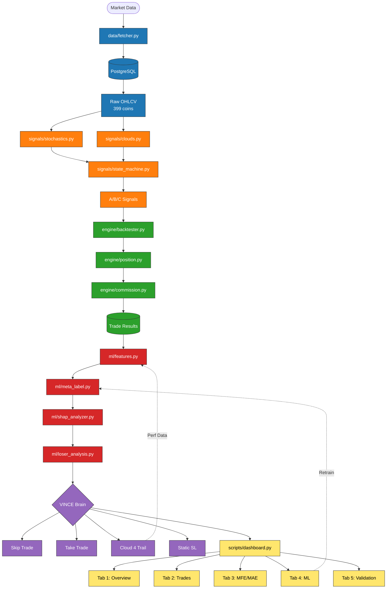
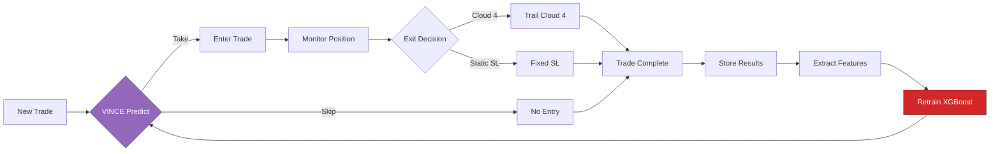

# VINCE Architecture Flow



---

## Daily VINCE Training Schedule

```mermaid
gantt
    title VINCE Automated Learning Cycle
    dateFormat HH:mm
    axisFormat %H:%M
    
    section Data Collection
    Fetch new data (last 24h)    :fetch, 17:00, 5m
    
    section Processing
    Incremental backtest          :backtest, after fetch, 10m
    Extract features              :features, after backtest, 3m
    
    section ML Training
    XGBoost retrain (GPU)         :xgboost, after features, 2m
    Update SHAP values            :shap, after xgboost, 1m
    
    section Validation
    Save checkpoint               :save, after shap, 1m
    Update dashboard metrics      :dash, after save, 1m
    
    section Ready
    VINCE ready for next day      :milestone, after dash, 0m
```



---

## File Structure

```
four-pillars-backtester/
├── data/
│   ├── fetcher.py          # Bybit + WEEX API
│   ├── db.py               # PostgreSQL connection
│   └── cache/              # 399 coins, 1.74 GB
│
├── signals/
│   ├── stochastics.py      # 9/14/40/60 K values
│   ├── clouds.py           # Ripster 2/3/4
│   ├── state_machine.py    # A/B/C grading
│   └── four_pillars.py     # Orchestrator
│
├── engine/
│   ├── backtester.py       # Bar-by-bar loop
│   ├── position.py         # MFE/MAE tracking
│   ├── commission.py       # 0.08% + rebate
│   └── exit_manager.py     # BE strategies
│
├── ml/
│   ├── features.py         # 14 features
│   ├── meta_label.py       # XGBoost (GPU)
│   ├── shap_analyzer.py    # Explainability
│   └── loser_analysis.py   # Sweeney A/B/C/D
│
├── scripts/
│   ├── dashboard.py        # Streamlit 5-tab
│   ├── vince_daily_train.py # Automated training
│   └── visualize_flow.py   # This generates diagrams
│
└── staging/
    └── dashboard.py        # 5-tab ML version (deploy this)
```

---

## VINCE Learning Loop



---

## How to Use

### View in Obsidian
Open this file in Obsidian - Mermaid diagrams render automatically.

### Generate Interactive Version
```powershell
cd "C:\Users\User\Documents\Obsidian Vault\PROJECTS\four-pillars-backtester"
python scripts\visualize_flow.py
```
Opens browser with clickable Sankey diagram at `data/output/vince_flow.html`

### Deploy Dashboard
```powershell
# Copy staging files to production
Copy-Item staging\dashboard.py scripts\dashboard.py -Force
streamlit run scripts\dashboard.py
```
