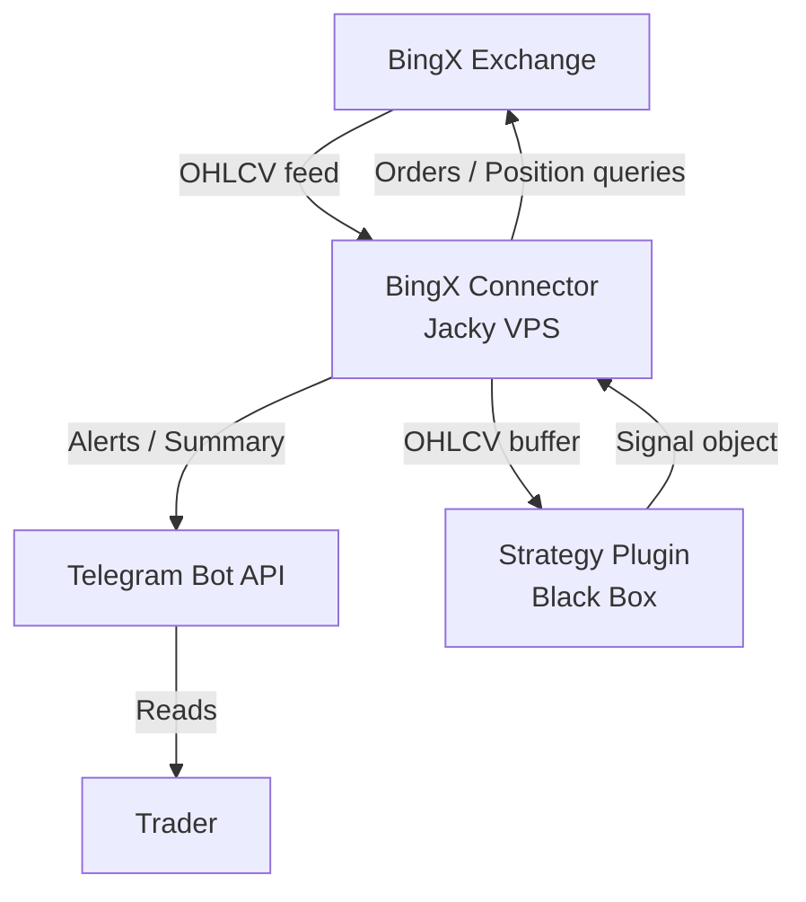
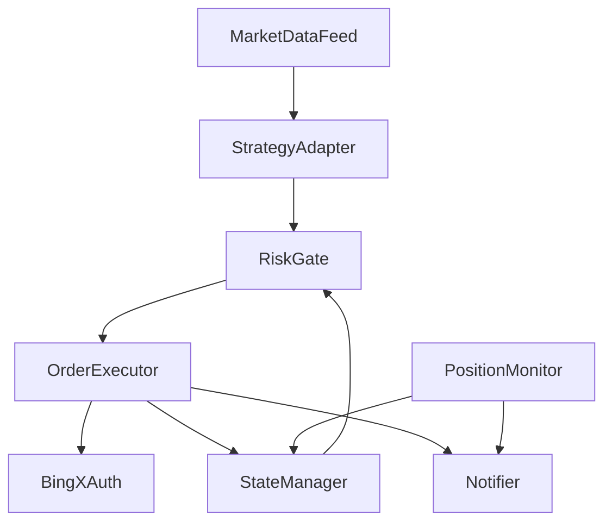
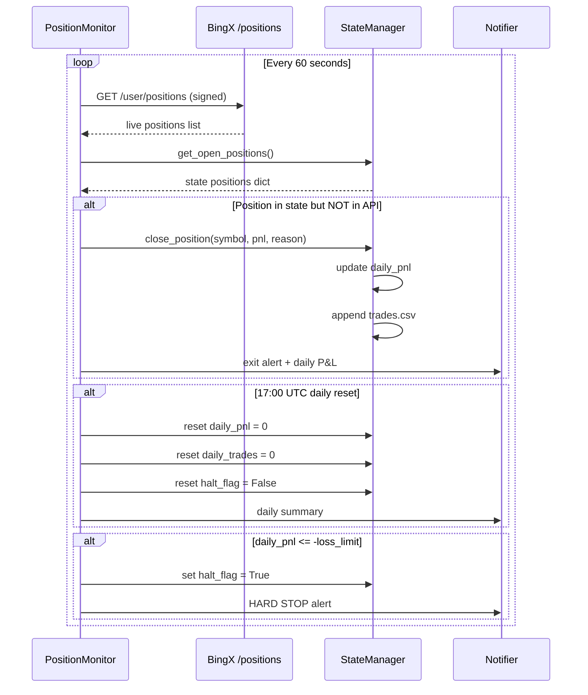
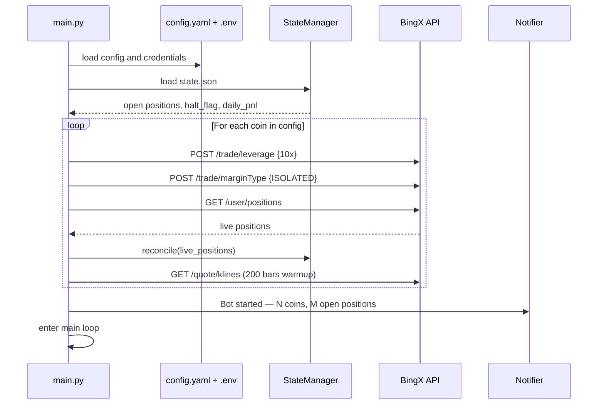
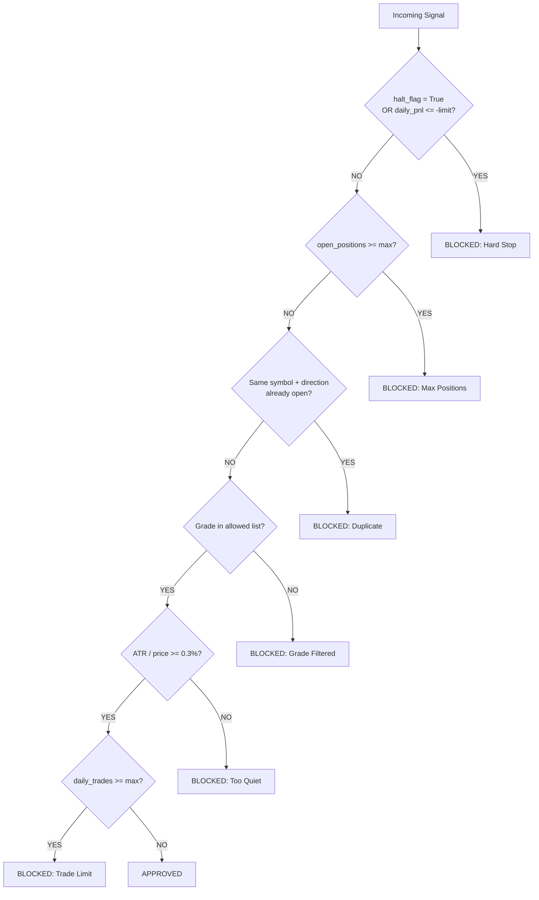
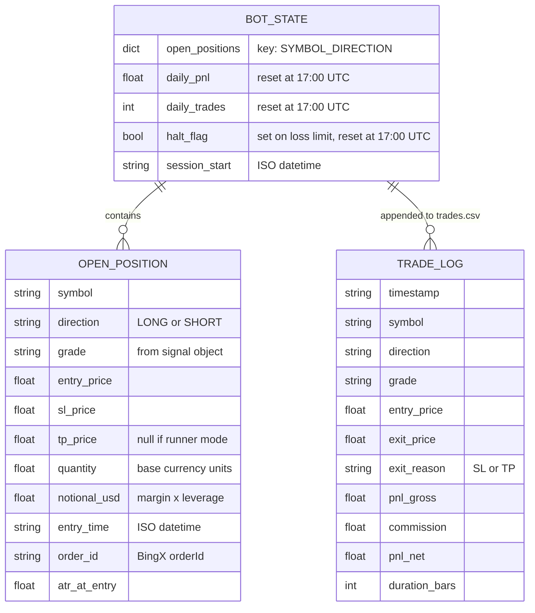
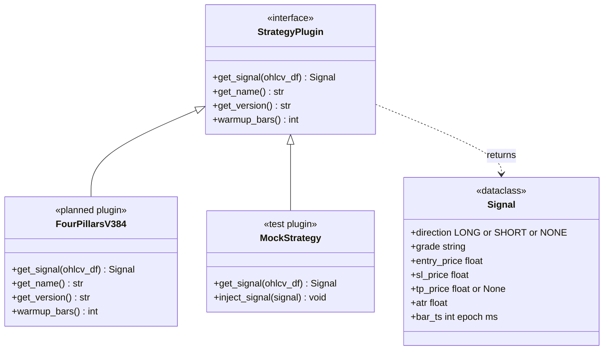

# BingX Execution Connector — System Architecture UML
**Version:** 2.0  
**Date:** 2026-02-20  
**Scope:** Execution infrastructure only. Strategy is a sandboxed interface.

---

## 1. SYSTEM CONTEXT



**BingX Exchange**
1. Perpetual Futures REST API
2. Base URL: `https://open-api.bingx.com`
3. Demo URL: `https://open-api-vst.bingx.com`

**Strategy Plugin (Black Box)**
1. Receives OHLCV DataFrame
2. Returns one Signal object per call
3. Connector knows nothing about internals

**Trader**
1. Monitors Telegram alerts
2. Approves parameter changes
3. Manual override only

---

## 2. CONNECTOR COMPONENTS



**MarketDataFeed** — `data_fetcher.py`
1. Polls BingX klines endpoint every 30 seconds
2. Maintains rolling OHLCV buffer per coin (200 bars)
3. Compares last bar timestamp to detect new closed bar
4. Only fires downstream on confirmed new bar — never mid-bar

**StrategyAdapter** — `signal_engine.py`
1. Loads strategy plugin by name from config
2. Calls `plugin.get_signal(ohlcv_df)`
3. Receives Signal object or NONE
4. Passes to RiskGate if Signal is not NONE

**RiskGate** — `risk_gate.py`
1. Reads daily P&L, halt_flag, open position count from StateManager
2. Runs 6 ordered checks (see Section 7)
3. Returns APPROVED or BLOCKED with reason
4. Never communicates with exchange

**OrderExecutor** — `executor.py`
1. Fetches current mark price for quantity calculation
2. Calculates quantity: `notional_usd / mark_price`
3. Rounds to symbol step size
4. Builds BingX order payload with SL and TP attached
5. HMAC signs via BingXAuth
6. POSTs to BingX `/trade/order`

**PositionMonitor** — `position_monitor.py`
1. Polls BingX `/user/positions` every 60 seconds
2. Diffs API result against StateManager open positions
3. Detects closed positions (SL or TP hit server-side)
4. Calculates realized P&L
5. Triggers daily reset logic at 17:00 UTC

**StateManager** — `state_manager.py`
1. Reads and writes `state.json` (live state)
2. Appends to `trades.csv` (history, never overwritten)
3. Tracks: open positions, daily P&L, daily trade count, halt_flag
4. Loaded on startup for crash recovery

**Notifier** — `notifier.py`
1. Single function: `send(message)` to Telegram bot
2. Called by Executor (entry/error) and Monitor (exit/daily summary)
3. No business logic

**BingXAuth** — `bingx_auth.py`
1. Injects `timestamp` (unix ms) into params
2. Sorts all params alphabetically
3. Builds query string
4. Signs with HMAC-SHA256 using secret key
5. Appends `&signature={hexdigest}` to URL
6. Adds `X-BX-APIKEY` header

---

## 3. MAIN TRADING LOOP — SINGLE BAR

```mermaid
sequenceDiagram
    participant LOOP as MainLoop
    participant FEED as MarketDataFeed
    participant API_K as BingX /klines
    participant ADAPT as StrategyAdapter
    participant STRAT as StrategyPlugin
    participant GATE as RiskGate
    participant STATE as StateManager
    participant EXEC as OrderExecutor
    participant API_P as BingX /price
    participant API_O as BingX /order
    participant NOTIFY as Notifier

    LOOP->>FEED: tick() every 30s
    FEED->>API_K: GET klines(symbol, 5m, limit=200)
    API_K-->>FEED: OHLCV array
    FEED->>FEED: new bar? compare timestamp

    alt New bar confirmed
        FEED->>ADAPT: on_new_bar(symbol, ohlcv_df)
        ADAPT->>STRAT: get_signal(ohlcv_df)
        STRAT-->>ADAPT: Signal{LONG, A, sl, tp, atr}

        ADAPT->>GATE: evaluate(signal, symbol)
        GATE->>STATE: get_state()
        STATE-->>GATE: {daily_pnl, halt_flag, open_positions}

        alt All risk checks pass
            GATE-->>ADAPT: APPROVED
            ADAPT->>EXEC: execute(signal, symbol)
            EXEC->>API_P: GET /quote/price (public)
            API_P-->>EXEC: mark_price
            EXEC->>EXEC: qty = notional / mark_price
            EXEC->>EXEC: build payload + attach SL + TP
            EXEC->>API_O: POST /trade/order (signed)
            API_O-->>EXEC: {orderId, status}
            EXEC->>STATE: record_open_position()
            EXEC->>NOTIFY: entry alert
        else Risk check blocked
            GATE-->>ADAPT: BLOCKED + reason
        end
    end
```

---

## 4. POSITION MONITOR LOOP



---

## 5. STARTUP SEQUENCE



---

## 6. RISK GATE — DECISION FLOW



**Check 1 — Hard Stop**
1. Read `halt_flag` from StateManager first (survives crash/restart)
2. Also check `daily_pnl <= -daily_loss_limit_usd`
3. Either condition blocks all new entries for the rest of the day

**Check 2 — Max Positions**
1. Count all open positions in StateManager
2. Blocked if count >= `risk.max_positions` (default: 3)

**Check 3 — Duplicate Position**
1. Key: `{symbol}_{direction}` e.g. `RIVER-USDT_LONG`
2. Block if that key already exists in open positions

**Check 4 — Grade Filter**
1. Read allowed grades from **strategy plugin config**, not connector config
2. Signal grade must be in plugin's allowed list

**Check 5 — ATR Threshold**
1. `atr / entry_price >= min_atr_ratio`
2. Blocks trades on instruments not moving enough to cover commission

**Check 6 — Daily Trade Limit**
1. Blocks runaway loop bugs
2. Resets at 17:00 UTC with daily P&L counter

---

## 7. STATE DATA MODEL



---

## 8. STRATEGY PLUGIN INTERFACE CONTRACT



**Signal contract — what the connector receives:**
1. `direction` — LONG, SHORT, or NONE. NONE = no action.
2. `grade` — plugin-defined string. Connector passes to RiskGate; interpretation stays in strategy config.
3. `entry_price` — mark price at signal bar (float)
4. `sl_price` — absolute stop loss price (float, always present)
5. `tp_price` — absolute take profit price, or None for runner mode
6. `atr` — ATR value at signal bar, used for ATR threshold check in RiskGate
7. `bar_ts` — epoch ms of the signal bar (for deduplication)

**Note:** `FourPillarsV384` does not yet exist as a plugin class. It must be created as pre-work before connector deployment. The backtester's `compute_signals()` is the underlying implementation but it is not wrapped as a plugin yet.

**Note:** `warmup_bars()` does not yet exist anywhere in the codebase. It must be implemented in `FourPillarsV384` before the connector can safely call `get_signal()`. Return value must be `max(stoch_k4, cloud4_slow)` = `max(60, 89)` = `89`. The connector uses this to skip calling the plugin until the OHLCV buffer has at least 89 closed bars.

---

## 9. CONNECTOR CONFIG SCHEMA

```yaml
connector:
  poll_interval_sec: 30
  position_check_sec: 60
  timeframe: "5m"
  ohlcv_buffer_bars: 200
  demo_mode: true               # true = VST, false = live

coins:
  - "RIVER-USDT"
  - "GUN-USDT"
  - "AXS-USDT"

strategy:
  plugin: "four_pillars_v384"   # plugin file name, swappable

risk:
  max_positions: 3
  max_daily_trades: 20
  daily_loss_limit_usd: 75.0
  min_atr_ratio: 0.003

position:
  margin_usd: 50.0
  leverage: 10
  margin_mode: "ISOLATED"
  sl_working_type: "MARK_PRICE"
  tp_working_type: "MARK_PRICE"

notification:
  daily_summary_utc_hour: 17
```

**Config rules:**
1. No strategy-internal parameters here (no grades, no stoch levels, no ATR multipliers)
2. `allowed_grades` lives in the strategy plugin config, not here
3. `.env` holds: `BINGX_API_KEY`, `BINGX_SECRET_KEY`, `TELEGRAM_BOT_TOKEN`, `TELEGRAM_CHAT_ID`
4. Never commit `.env` to git

---

## 10. BINGX API REFERENCE

| Endpoint | Method | Auth | Purpose |
|---|---|---|---|
| `/openApi/swap/v2/quote/klines` | GET | **Public** | Fetch OHLCV candles |
| `/openApi/swap/v2/quote/price` | GET | **Public** | Get mark price |
| `/openApi/swap/v2/quote/contracts` | GET | **Public** | Step size / min qty |
| `/openApi/swap/v2/trade/order` | POST | Signed | Place order + SL/TP |
| `/openApi/swap/v2/user/positions` | GET | Signed | Open positions |
| `/openApi/swap/v2/trade/leverage` | POST | Signed | Set leverage per coin |
| `/openApi/swap/v2/trade/marginType` | POST | Signed | Set ISOLATED per coin |
| `/openApi/swap/v2/user/balance` | GET | Signed | Account balance |

**Auth rules:**
1. Header: `X-BX-APIKEY: {api_key}`
2. Signature: HMAC-SHA256, appended as `&signature={hex}` to query string
3. All params sorted alphabetically before signing
4. Timestamp injected as `timestamp={unix_ms}`
5. No passphrase (unlike WEEX)
6. Symbol format: `BTC-USDT` (dash, not underscore)

---

## 11. FILE STRUCTURE — JACKY VPS

```
/home/ubuntu/bingx-bot/
├── main.py
├── bingx_auth.py
├── data_fetcher.py
├── signal_engine.py
├── risk_gate.py
├── executor.py
├── position_monitor.py
├── state_manager.py
├── notifier.py
├── plugins/
│   ├── __init__.py
│   ├── four_pillars_v384.py    ← TO BE BUILT
│   └── mock_strategy.py        ← FOR TESTING
├── config.yaml
├── .env                        ← NEVER COMMITTED
├── state.json
├── trades.csv
├── bot.log
└── tests/
    ├── test_risk_gate.py
    ├── test_executor.py
    ├── test_auth.py
    └── test_plugin_contract.py
```

---

*Tags: #architecture #uml #bingx-connector #live-trading #2026-02-20*
