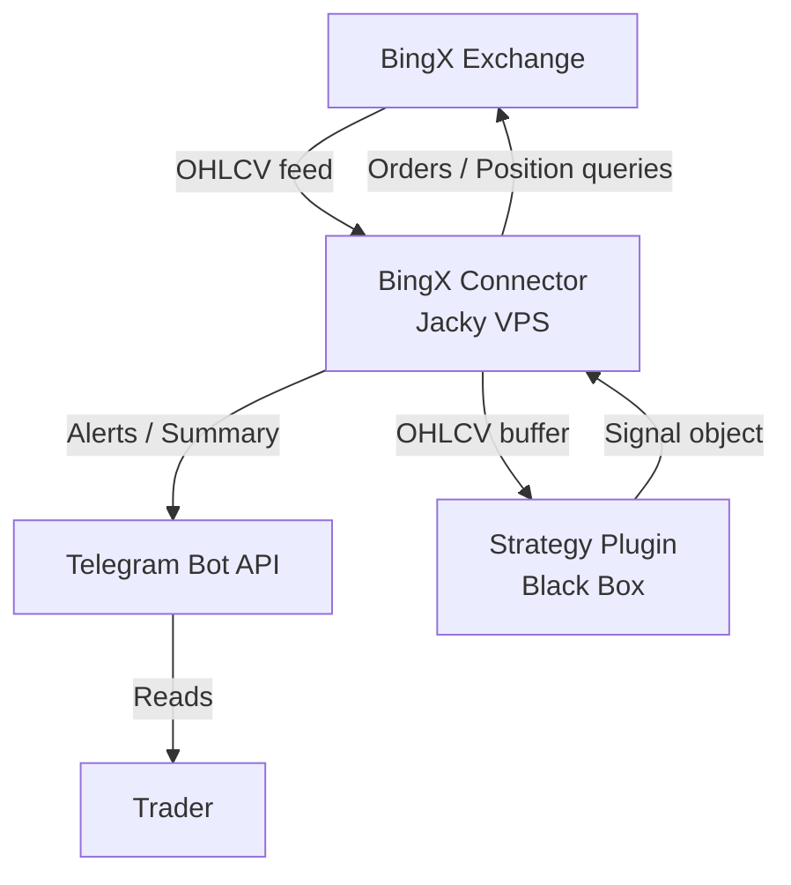
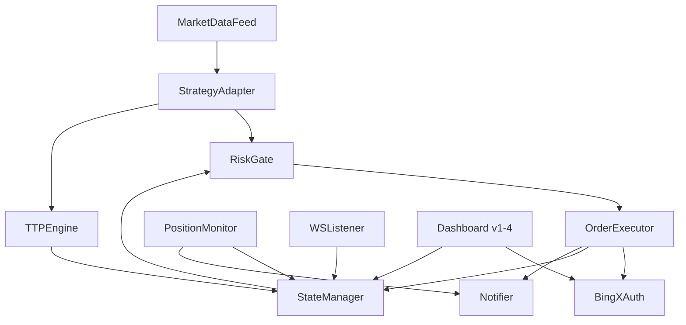
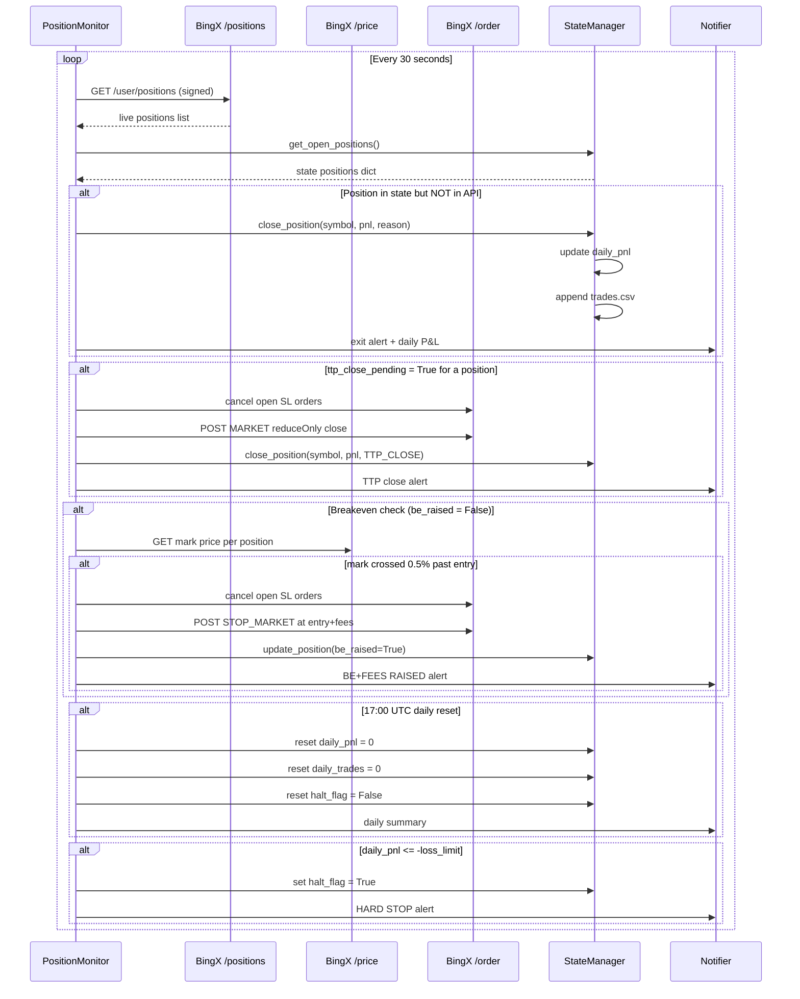
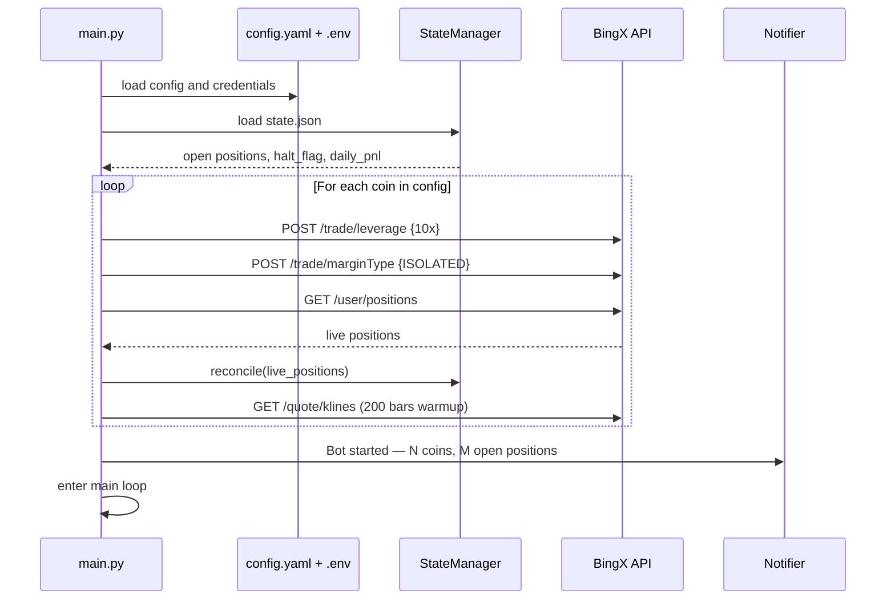
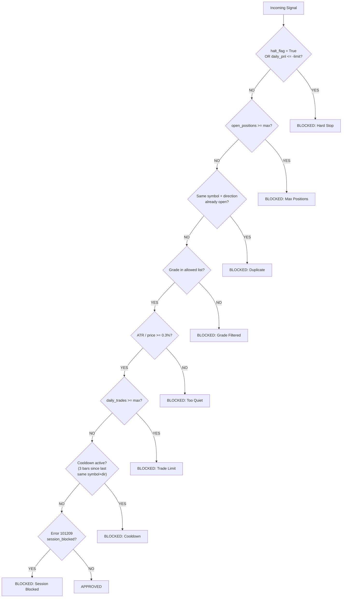
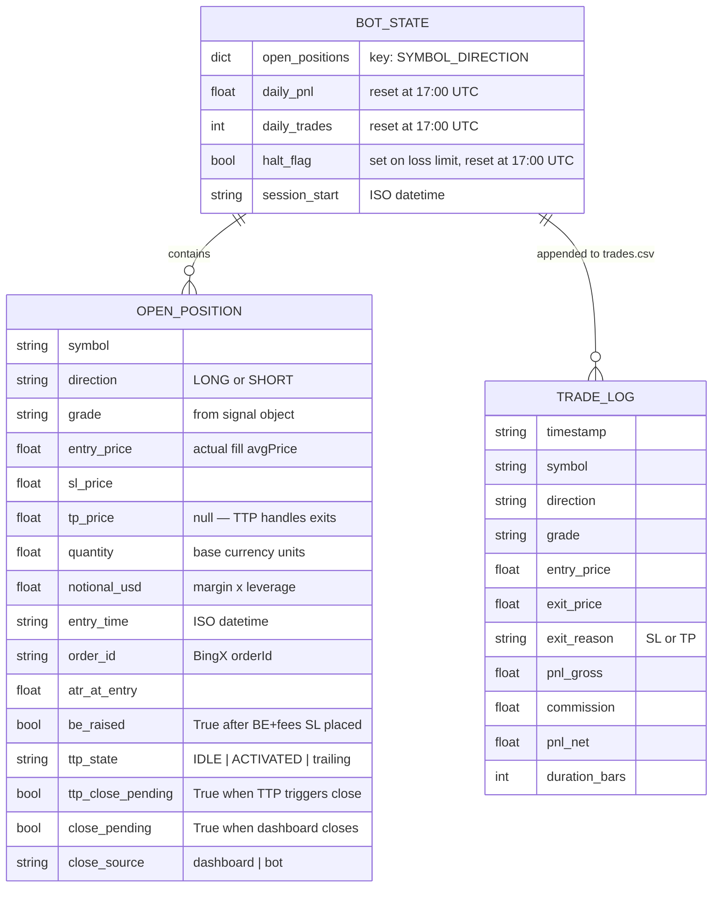
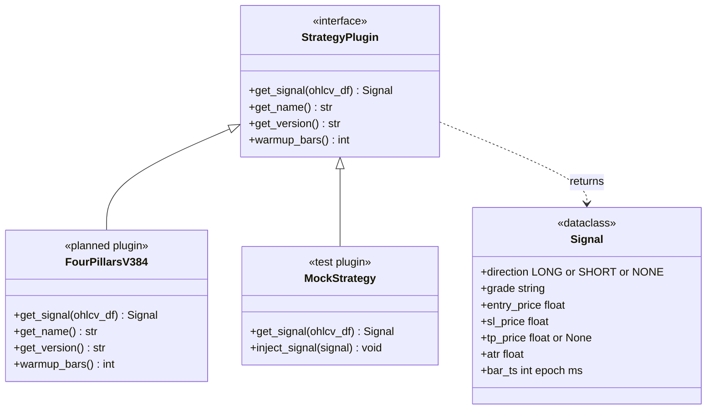

# BingX Execution Connector — System Architecture UML
**Version:** 3.0
**Date:** 2026-03-03
**Scope:** Execution infrastructure only. Strategy is a sandboxed interface.

---

## 1. SYSTEM CONTEXT



**BingX Exchange**
1. Perpetual Futures REST API
2. Base URL: `https://open-api.bingx.com`
3. Demo URL: `https://open-api-vst.bingx.com`

**Strategy Plugin (Black Box)**
1. Receives OHLCV DataFrame
2. Returns one Signal object per call
3. Connector knows nothing about internals

**Trader**
1. Monitors Telegram alerts
2. Approves parameter changes
3. Manual override only

---

## 2. CONNECTOR COMPONENTS



**MarketDataFeed** — `data_fetcher.py`
1. Polls BingX klines endpoint every 45 seconds
2. Maintains rolling OHLCV buffer per coin (201 bars)
3. Compares last bar timestamp to detect new closed bar
4. Only fires downstream on confirmed new bar — never mid-bar
5. Retry with exponential backoff (3 attempts, 1s/2s/4s + jitter)

**StrategyAdapter** — `signal_engine.py`
1. Loads strategy plugin by name from config
2. Calls `plugin.get_signal(ohlcv_df)`
3. Receives Signal object or NONE
4. Passes to RiskGate if Signal is not NONE
5. Evaluates TTP engine on each tick for open positions (1m OHLC)

**TTPEngine** — `ttp_engine.py`
1. Trailing take-profit evaluator (0.5% activation, 0.2% trail distance)
2. Tracks per-position state: IDLE -> ACTIVATED -> trailing
3. Sets `ttp_close_pending` flag in state.json when trail reversal detected
4. Evaluated in market_loop (signal_engine.py), close orders execute in monitor_loop

**RiskGate** — `risk_gate.py`
1. Reads daily P&L, halt_flag, open position count from StateManager
2. Runs 8 ordered checks (see Section 6)
3. Returns APPROVED or BLOCKED with reason
4. Never communicates with exchange

**OrderExecutor** — `executor.py`
1. Fetches current mark price for quantity calculation
2. Uses actual fill price (avgPrice from order response), not mark_price
3. Calculates quantity: `notional_usd / mark_price`, rounds to step size
4. Builds BingX order payload with SL attached (TP=null, TTP handles exits)
5. SL direction validated before order (LONG sl < mark, SHORT sl > mark)
6. HMAC signs via BingXAuth, POSTs to BingX `/trade/order`

**PositionMonitor** — `position_monitor.py`
1. Polls BingX `/user/positions` every 30 seconds
2. Diffs API result against StateManager open positions
3. Detects closed positions (SL hit server-side, or TTP close_pending)
4. Executes TTP market close orders (reduceOnly) when ttp_close_pending=True
5. Breakeven raise: fetches live mark price, moves SL to entry+fees when mark crosses 0.5%
6. Calculates realized P&L, triggers daily reset at 17:00 UTC

**StateManager** — `state_manager.py`
1. Reads and writes `state.json` (live state)
2. Appends to `trades.csv` (history, never overwritten)
3. Tracks: open positions, daily P&L, daily trade count, halt_flag, ttp state
4. `update_position(key, updates)` for partial field updates (be_raised, ttp_state)
5. Loaded on startup for crash recovery

**WSListener** — `ws_listener.py`
1. Daemon thread: WebSocket connection for ORDER_TRADE_UPDATE events
2. listenKey lifecycle (obtain/renew/close)
3. Parses fill events, pushes to fill_queue for monitor consumption
4. MAX_RECONNECT=10, exponential backoff, dead flag file on permanent failure

**Notifier** — `notifier.py`
1. Single function: `send(message)` to Telegram bot
2. Called by Executor (entry/error) and Monitor (exit/BE raise/daily summary)
3. HTML formatting with `<b>` headers, UTC+4 timestamps

**BingXAuth** — `bingx_auth.py`
1. Injects `timestamp` (unix ms) into params
2. Sorts all params alphabetically
3. Builds query string, signs with HMAC-SHA256
4. Appends `&signature={hexdigest}` to URL
5. Adds `X-BX-APIKEY` header, recvWindow included

**Dashboard** — `bingx-live-dashboard-v1-4.py`
1. Dash 4.0.0 app on port 8051, 6 tabs, 16+ callbacks
2. Live Trades: positions grid, Raise BE / Move SL / Close Market actions
3. Bot Terminal: Start/Stop toggle, Activity Log feed (5s poll)
4. Strategy Parameters: config display, TTP controls
5. History / Analytics / Coin Summary tabs
6. Reads state.json + trades.csv + bot-status.json, writes orders via BingX API

---

## 3. MAIN TRADING LOOP — SINGLE BAR

```mermaid
sequenceDiagram
    participant LOOP as MainLoop
    participant FEED as MarketDataFeed
    participant API_K as BingX /klines
    participant ADAPT as StrategyAdapter
    participant STRAT as StrategyPlugin
    participant GATE as RiskGate
    participant STATE as StateManager
    participant EXEC as OrderExecutor
    participant API_P as BingX /price
    participant API_O as BingX /order
    participant NOTIFY as Notifier

    LOOP->>FEED: tick() every 30s
    FEED->>API_K: GET klines(symbol, 5m, limit=200)
    API_K-->>FEED: OHLCV array
    FEED->>FEED: new bar? compare timestamp

    alt New bar confirmed
        FEED->>ADAPT: on_new_bar(symbol, ohlcv_df)
        ADAPT->>STRAT: get_signal(ohlcv_df)
        STRAT-->>ADAPT: Signal{LONG, A, sl, tp, atr}

        ADAPT->>GATE: evaluate(signal, symbol)
        GATE->>STATE: get_state()
        STATE-->>GATE: {daily_pnl, halt_flag, open_positions}

        alt All risk checks pass
            GATE-->>ADAPT: APPROVED
            ADAPT->>EXEC: execute(signal, symbol)
            EXEC->>API_P: GET /quote/price (public)
            API_P-->>EXEC: mark_price
            EXEC->>EXEC: qty = notional / mark_price
            EXEC->>EXEC: build payload + attach SL + TP
            EXEC->>API_O: POST /trade/order (signed)
            API_O-->>EXEC: {orderId, status}
            EXEC->>STATE: record_open_position()
            EXEC->>NOTIFY: entry alert
        else Risk check blocked
            GATE-->>ADAPT: BLOCKED + reason
        end
    end
```

---

## 4. POSITION MONITOR LOOP



---

## 5. STARTUP SEQUENCE



---

## 6. RISK GATE — DECISION FLOW



**Check 1 — Hard Stop**
1. Read `halt_flag` from StateManager first (survives crash/restart)
2. Also check `daily_pnl <= -daily_loss_limit_usd`
3. Either condition blocks all new entries for the rest of the day

**Check 2 — Max Positions**
1. Count all open positions in StateManager
2. Blocked if count >= `risk.max_positions` (default: 15)

**Check 3 — Duplicate Position**
1. Key: `{symbol}_{direction}` e.g. `RIVER-USDT_LONG`
2. Block if that key already exists in open positions

**Check 4 — Grade Filter**
1. Read allowed grades from **strategy plugin config**, not connector config
2. Signal grade must be in plugin's allowed list (A+B, no C)

**Check 5 — ATR Threshold**
1. `atr / entry_price >= min_atr_ratio`
2. Blocks trades on instruments not moving enough to cover commission

**Check 6 — Daily Trade Limit**
1. Blocks runaway loop bugs
2. Resets at 17:00 UTC with daily P&L counter

**Check 7 — Cooldown**
1. 3 bars (15min on 5m) between re-entries on same symbol+direction
2. Prevents rapid re-entry after stop-out

**Check 8 — Session Blocked**
1. Error 101209 handling (max position value exceeded)
2. Retries with halved qty, sets session_blocked if still fails

---

## 7. STATE DATA MODEL



---

## 8. STRATEGY PLUGIN INTERFACE CONTRACT



**Signal contract — what the connector receives:**
1. `direction` — LONG, SHORT, or NONE. NONE = no action.
2. `grade` — plugin-defined string. Connector passes to RiskGate; interpretation stays in strategy config.
3. `entry_price` — mark price at signal bar (float)
4. `sl_price` — absolute stop loss price (float, always present)
5. `tp_price` — absolute take profit price, or None for runner mode
6. `atr` — ATR value at signal bar, used for ATR threshold check in RiskGate
7. `bar_ts` — epoch ms of the signal bar (for deduplication)

**Note:** `FourPillarsV384` plugin is implemented at `plugins/four_pillars_v384.py`. It wraps the backtester's `compute_signals()` and returns Signal objects. The connector is live on the BingX live API with 47 coins.

---

## 9. CONNECTOR CONFIG SCHEMA

```yaml
connector:
  poll_interval_sec: 45
  position_check_sec: 30
  timeframe: "5m"
  ohlcv_buffer_bars: 201
  demo_mode: false              # true = VST, false = live

coins:                          # 47 coins (14 high-Exp + 33 low-DD)
  - "SKR-USDT"
  - "RIVER-USDT"
  # ... (47 total)

strategy:
  plugin: "four_pillars_v384"

four_pillars:
  allow_a: true
  allow_b: true
  allow_c: false
  sl_atr_mult: 2.0
  tp_atr_mult: null             # TTP handles exits
  require_stage2: true
  rot_level: 80

risk:
  max_positions: 15
  max_daily_trades: 200
  daily_loss_limit_usd: 15.0
  min_atr_ratio: 0.003
  cooldown_bars: 3
  bar_duration_sec: 300

position:
  margin_usd: 5.0
  leverage: 10
  margin_mode: "ISOLATED"
  sl_working_type: "MARK_PRICE"
  tp_working_type: "MARK_PRICE"
  trailing_activation_atr_mult: null  # disabled — TTP is sole trailing mechanism
  trailing_rate: null
  ttp_enabled: true
  ttp_act: 0.005                # 0.5% activation
  ttp_dist: 0.002               # 0.2% trail distance
  be_auto: true

notification:
  daily_summary_utc_hour: 17
```

**Config rules:**
1. Strategy-internal parameters live in `four_pillars:` block, not `risk:` or `position:`
2. `tp_atr_mult: null` because TTP engine handles trailing exits
3. `.env` holds: `BINGX_API_KEY`, `BINGX_SECRET_KEY`, `TELEGRAM_BOT_TOKEN`, `TELEGRAM_CHAT_ID`
4. Never commit `.env` to git

---

## 10. BINGX API REFERENCE

| Endpoint | Method | Auth | Purpose |
|---|---|---|---|
| `/openApi/swap/v2/quote/klines` | GET | **Public** | Fetch OHLCV candles |
| `/openApi/swap/v2/quote/price` | GET | **Public** | Get mark price |
| `/openApi/swap/v2/quote/contracts` | GET | **Public** | Step size / min qty |
| `/openApi/swap/v2/trade/order` | POST | Signed | Place order + SL/TP |
| `/openApi/swap/v2/user/positions` | GET | Signed | Open positions |
| `/openApi/swap/v2/trade/leverage` | POST | Signed | Set leverage per coin |
| `/openApi/swap/v2/trade/marginType` | POST | Signed | Set ISOLATED per coin |
| `/openApi/swap/v2/user/balance` | GET | Signed | Account balance |

**Auth rules:**
1. Header: `X-BX-APIKEY: {api_key}`
2. Signature: HMAC-SHA256, appended as `&signature={hex}` to query string
3. All params sorted alphabetically before signing
4. Timestamp injected as `timestamp={unix_ms}`
5. No passphrase (unlike WEEX)
6. Symbol format: `BTC-USDT` (dash, not underscore)

---

## 11. FILE STRUCTURE

```
C:\Users\User\Documents\Obsidian Vault\PROJECTS\bingx-connector\
├── main.py                      # Bot entry point (3 daemon threads)
├── bingx_auth.py                # HMAC-SHA256 signing
├── data_fetcher.py              # Klines polling (45s)
├── signal_engine.py             # Strategy adapter + TTP evaluation
├── ttp_engine.py                # Trailing take-profit engine
├── risk_gate.py                 # 8-check gate
├── executor.py                  # Order placement + SL
├── position_monitor.py          # Position polling (30s) + BE raise + TTP close
├── state_manager.py             # state.json + trades.csv
├── ws_listener.py               # WebSocket ORDER_TRADE_UPDATE listener
├── notifier.py                  # Telegram alerts (HTML, UTC+4)
├── plugins/
│   ├── __init__.py
│   ├── four_pillars_v384.py     # Live strategy plugin
│   └── mock_strategy.py         # Test plugin
├── config.yaml                  # All config
├── .env                         # NEVER COMMITTED
├── state.json                   # Live state (open positions, daily P&L)
├── trades.csv                   # Trade history (append-only)
├── bot.pid                      # PID file for dashboard process management
├── bot-status.json              # Activity feed for dashboard
├── bingx-live-dashboard-v1-4.py # Dash 4.0 dashboard (port 8051)
├── assets/
│   └── dashboard.css            # Dark theme CSS overrides
├── screener/
│   └── bingx_screener.py        # Headless signal screener (47 coins)
├── scripts/
│   ├── build_dashboard_v1_4.py          # v1-3 -> v1-4
│   ├── build_dashboard_v1_4_patch1.py   # CB-T3 fix
│   ├── build_dashboard_v1_4_patch2.py   # Dedup + toggle + OFFLINE
│   ├── build_dashboard_v1_4_patch3.py   # TTP columns
│   ├── build_dashboard_v1_4_patch4.py   # Close Market button
│   ├── build_ttp_integration.py         # TTP engine build
│   ├── daily_report.py                  # Telegram daily P&L report
│   ├── reconcile_pnl.py                 # Bot vs BingX P&L comparison
│   └── run_bot.ps1                      # Auto-start wrapper
├── logs/                        # Dated log files
└── tests/                       # 67/67 passing
    ├── test_risk_gate.py
    ├── test_executor.py
    ├── test_auth.py
    ├── test_plugin_contract.py
    ├── test_position_monitor.py
    └── test_ttp_engine.py
```

---

*Tags: #architecture #uml #bingx-connector #live-trading #2026-03-03*
