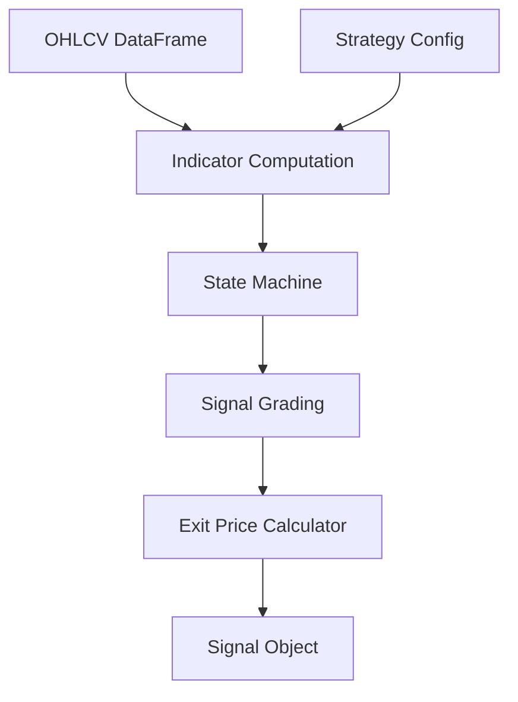
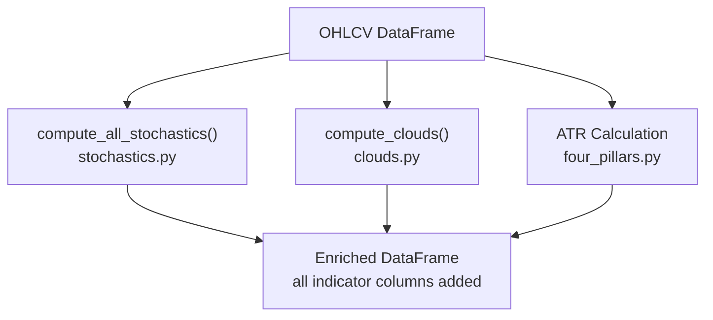
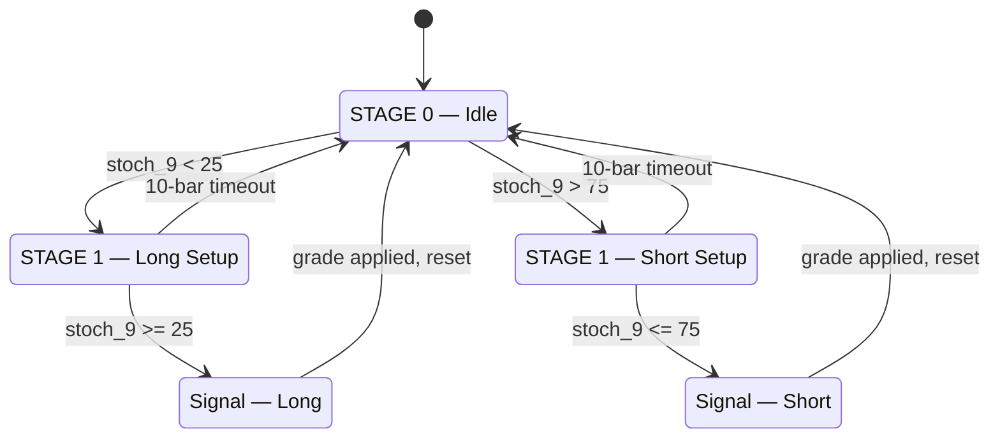
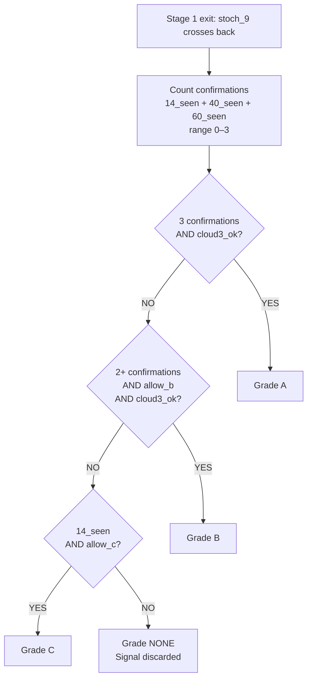
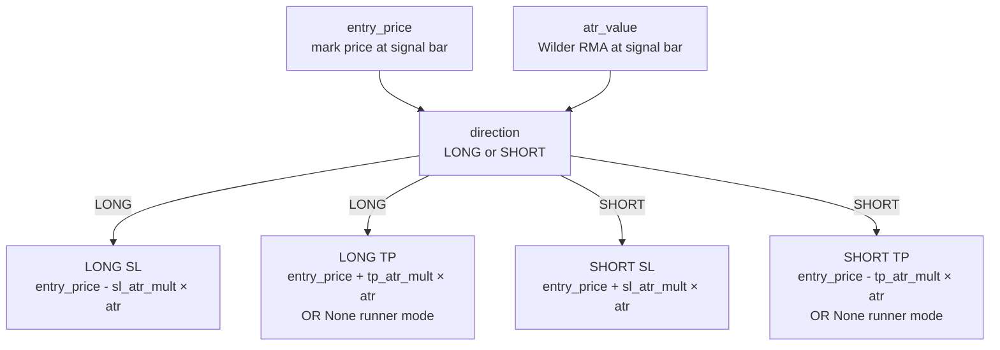
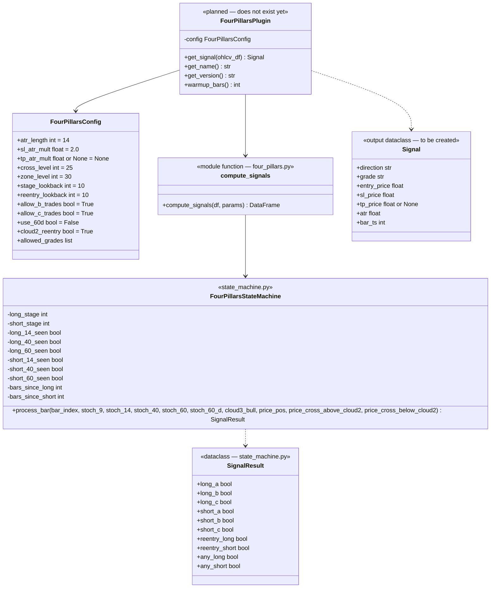
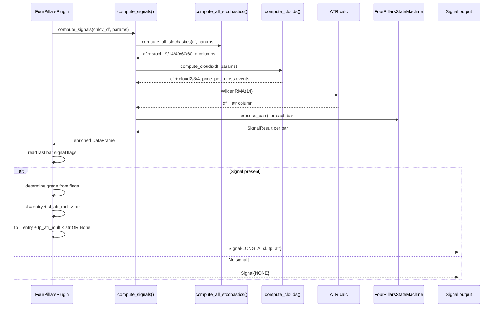
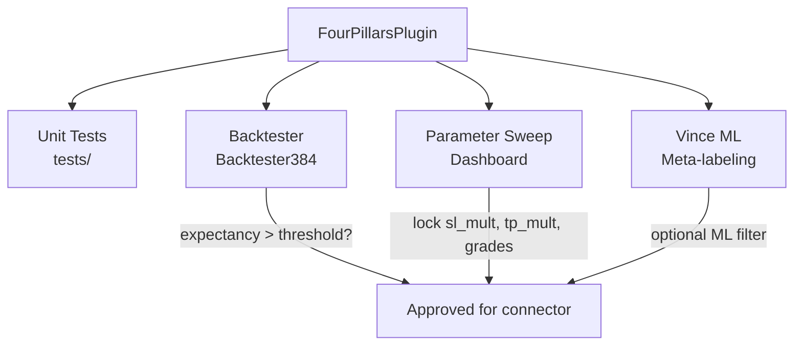
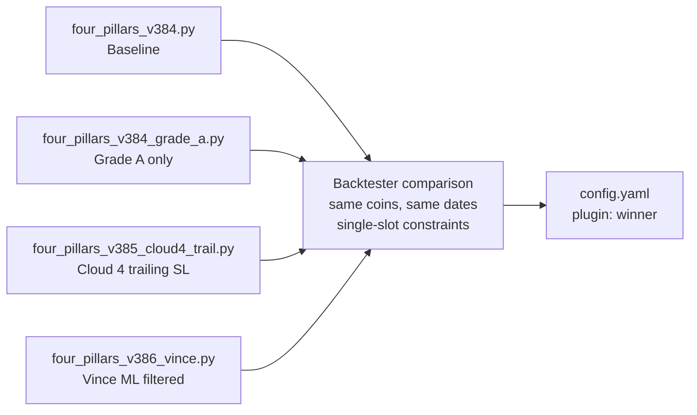
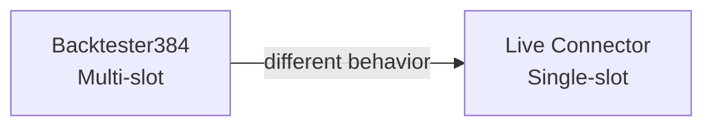

# Four Pillars — Strategy Architecture UML
**Version:** 2.0  
**Date:** 2026-02-20  
**Scope:** Signal generation pipeline only. No exchange. No execution.  
**Boundary:** Outputs a Signal object. What happens to it is the Connector's problem.

---

## DESIGN PRINCIPLE

```
┌──────────────────────────────────────────┐
│           STRATEGY SANDBOX               │
│  Input:  OHLCV DataFrame                 │
│  Output: Signal{direction, grade, sl, tp}│
│                                          │
│  No knowledge of:                        │
│  - Exchange or API                       │
│  - Account balance or sizing             │
│  - Risk limits or daily P&L              │
│  - Whether signal is acted on            │
└──────────────────────────────────────────┘
```

---

## 1. STRATEGY SYSTEM CONTEXT



**OHLCV DataFrame — required columns:**
1. `timestamp` — epoch ms
2. `open`, `high`, `low`, `close` — float
3. `volume` (base currency)

**Strategy Config — key parameters:**
1. `atr_length` — ATR period (default: 14)
2. `sl_atr_mult` — SL distance in ATR units (default: 2.0 — see BUG-C08)
3. `tp_atr_mult` — TP distance, or None for runner mode
4. `cross_level` — stoch_9 trigger threshold (default: 25)
5. `zone_level` — stoch_14/40 confirmation threshold (default: 30)
6. `stage_lookback` — max bars in Stage 1 window (default: 10)
7. `allow_b_trades`, `allow_c_trades` — grade filters
8. `cloud2_reentry` — enable Cloud 2 re-entry signals

**Signal Object — outputs:**
1. `direction` — LONG, SHORT, or NONE
2. `grade` — A, B, C, or NONE
3. `entry_price` — mark price at signal bar
4. `sl_price` — absolute stop level (calculated internally)
5. `tp_price` — absolute TP level, or None if runner mode
6. `atr` — ATR value at signal bar
7. `bar_ts` — epoch ms of signal bar

---

## 2. INDICATOR COMPUTATION LAYER



**compute_all_stochastics() — stochastics.py**
1. `stoch_9` — raw K, 9-bar lookback, entry trigger
2. `stoch_14` — raw K, 14-bar lookback, primary confirmation
3. `stoch_40` — raw K, 40-bar lookback, divergence detection
4. `stoch_60` — raw K, 60-bar lookback, macro filter
5. `stoch_60_d` — SMA(stoch_60, 10), optional D-line, disabled by default
6. All values: `100 × (close - lowest_low) / (highest_high - lowest_low)`, no smoothing

**compute_clouds() — clouds.py**
1. `Cloud 2` — EMA(5) / EMA(12), re-entry trigger only
2. `Cloud 3` — EMA(34) / EMA(50), directional filter, always enforced
3. `Cloud 4` — EMA(72) / EMA(89), planned for trailing exit, not in signal computation
4. `price_pos` — +1 above Cloud 3, 0 inside, -1 below
5. `price_cross_above_cloud2` / `price_cross_below_cloud2` — re-entry detection

**ATR — four_pillars.py**
1. True Range: `max(H-L, |H-prevC|, |L-prevC|)`
2. Wilder's RMA smoothing (not EMA)
3. Period: 14 (configurable via `atr_length`)
4. Minimum warmup bars required: 89 (Cloud 4 ema89 is the longest lookback)

---

## 3. STATE MACHINE



**STAGE 0 — Idle**
1. Monitors `stoch_9` every bar
2. Entry condition for Long: `stoch_9 < cross_level (25)` — level check, not crossover
3. Entry condition for Short: `stoch_9 > 75 (100 - cross_level)`
4. On trigger: records `stage1_bar = bar_index`, resets confirmation flags
5. Records confirmation flags immediately on the trigger bar itself

**STAGE 1 — Setup Window (Long example)**
1. Window: `bar_index - stage1_bar <= stage_lookback (10)`
2. Each bar: accumulate confirmations
   - `long_14_seen = True` if `stoch_14 < zone_level (30)`
   - `long_40_seen = True` if `stoch_40 < zone_level (30)`
   - `long_60_seen = True` if `stoch_60 < cross_level (25)`
3. Exit trigger: `stoch_9 >= 25` — grade and fire signal
4. Timeout: return to Stage 0 with no signal

**Cold-start risk (BUG-S01):**
If bot restarts mid-trend with stoch_9 already below 25, Stage 1 fires on bar 1 with zero real momentum confirmation. Add warmup discard logic in the live plugin.

---

## 4. SIGNAL GRADING



**Grade A**
1. All 3 confirmations seen (stoch_14, stoch_40, stoch_60)
2. Cloud 3 direction filter satisfied (`cloud3_ok`)
3. D-line check satisfied if `use_60d=True`

**Grade B**
1. 2 of 3 confirmations seen
2. Cloud 3 direction filter satisfied
3. `allow_b_trades=True` required

**Grade C**
1. stoch_14 seen only
2. `allow_c_trades=True` required
3. LONG Grade C: requires `price_pos == +1` (strictly above Cloud 3)
4. SHORT Grade C: requires `price_pos == -1` (strictly below Cloud 3)
5. Note: Grade C does NOT use `cloud3_ok` flag but IS more restrictive — price must be strictly outside cloud, not just inside/above

**Re-Entry (separate parallel path — not part of A/B/C grading)**
1. Runs every bar independently of state machine stage
2. Fires if: `price_cross_above_cloud2 AND 0 < bars_since_long <= 10 AND no other long signal this bar`
3. Counter `bars_since_long` resets to 0 whenever any long signal fires
4. Re-entry does NOT go through Stage 0/1 logic

**cloud3_ok definition:**
- Long: `price_pos >= 0` (price at or above Cloud 3 bottom)
- Short: `price_pos <= 0` (price at or below Cloud 3 top)

---

## 5. EXIT PRICE CALCULATION



**Initial SL/TP (at signal time)**
1. Calculated directly from `entry_price ± sl_atr_mult × atr`
2. NOT routed through ExitManager — that is a separate bar-by-bar updater
3. Default `sl_atr_mult`: 2.0 (verify before deployment — see BUG-C08)
4. `tp_atr_mult=None` means no fixed TP — position runs until SL or manual close

**ExitManager (bar-by-bar dynamic, NOT at signal time)**
1. Lives in `engine/exit_manager.py`
2. Only activates when `mfe_atr >= mfe_trigger`
3. Four methods: `be_only`, `be_plus_fees`, `be_plus_fees_trail_tp`, `be_trail_tp`
4. Belongs to backtester/position slot layer — not the signal pipeline
5. In live connector: SL/TP are set at entry on exchange (server-side). ExitManager logic would require cancel-and-replace orders — not implemented in V1.

---

## 6. CLASS DIAGRAM — STRATEGY INTERNALS



---

## 7. FULL PIPELINE SEQUENCE



---

## 8. INDEPENDENT TEST PATHS



**Unit Tests — no exchange needed**
1. `test_state_machine.py` — inject known stoch sequences, verify grade output
2. `test_signals.py` — feed known OHLCV, verify signal fires at correct bar
3. `test_cloud_filter.py` — verify Cloud 3 blocks counter-trend, Grade C bypasses correctly

**Backtester — historical CSV only**
1. `Backtester384.run(df)` — full P&L, MFE/MAE, grade breakdown
2. Run with `max_positions=1, enable_adds=False, enable_reentry=False` for live-comparable results
3. Approval threshold: expectancy > $1.00/trade at live notional

**Parameter Sweep — Dashboard**
1. Sweep `sl_mult`, `tp_mult`, `grade_filter` across target coins
2. Compare runner (tp=None) vs fixed TP variants
3. Output: locked FourPillarsConfig values

**Vince ML — optional filter layer**
1. Takes completed trade records from backtester
2. Trains on signal quality features
3. Predicts which signals to act on (meta-label)
4. Sits between signal engine and connector as an optional layer

---

## 9. STRATEGY VARIANTS — SILO TESTING PLAN

Each variant is a separate plugin file. Tested in backtester independently. Connector config points to the winner.



**four_pillars_v384.py — Baseline**
1. ATR SL (sl_mult=2.0) + ATR TP (tp_mult configurable)
2. Grades A+B+C enabled
3. Status: backtester exists, plugin wrapper does not yet exist

**four_pillars_v384_grade_a.py — Grade A only**
1. Same as baseline, `allowed_grades = ["A"]`
2. Expected: fewer trades, higher per-trade quality
3. Status: config change only, no new code

**four_pillars_v385_cloud4_trail.py — Cloud 4 trailing SL**
1. No fixed TP — position runs until Cloud 4 trail triggered
2. Expected: captures trending moves (RIVER sweep showed ~8x improvement)
3. Status: planned, Cloud 4 trail logic not yet implemented in backtester

**four_pillars_v386_vince.py — Vince ML filtered**
1. Baseline + Vince ML confidence score filter
2. Only trades where ML confidence > threshold
3. Status: Vince ML not yet trained

**Metrics compared per variant:**
1. Net P&L after rebate
2. Expectancy per trade ($/trade)
3. Profit Factor
4. Max Drawdown %
5. Trade count (sample size)
6. Win rate (secondary — system runs 17–25%)

---

## 10. PRE-DEPLOYMENT DECISIONS REQUIRED

| Decision | Method | Output |
|---|---|---|
| sl_atr_mult value | Check actual backtest params used (NOT assumed) | FourPillarsConfig.sl_atr_mult |
| tp_atr_mult or runner | Compare sweep results TP=2.0 vs tp=None | FourPillarsConfig.tp_atr_mult |
| Grade filter | Compare A-only vs A+B expectancy on 3 coins | FourPillarsConfig.allowed_grades |
| BE raise trigger | BE sweep on target coins | FourPillarsConfig.be_trigger_atr |
| Which coins | Dashboard sweep, expectancy > $1/trade single-slot | config.yaml coins list |
| Cloud 4 trail ready | v3.8.5 implementation + backtest validation | New plugin file |

---

## 11. BACKTESTER vs LIVE DIVERGENCE

The backtester and connector are NOT equivalent systems. Backtest results must be re-run under live-equivalent constraints before using them as approval criteria.



**Backtester (default config)**
1. Up to 4 concurrent positions per symbol
2. ADD signals — AVWAP pullback adds to existing position
3. RE-entry — limit order after SL hit
4. Scale-out — partial close at AVWAP +2σ checkpoints
5. `sl_mult=2.0` default

**Live Connector V1**
1. 1 position per symbol+direction (duplicate check in RiskGate)
2. No ADD logic
3. No RE-entry limit orders
4. No scale-out — single SL+TP set at entry
5. SL/TP managed server-side on BingX

**Required before live:** Re-run all target coin backtests with:
```python
max_positions=1
enable_adds=False
enable_reentry=False
```
Use those results for live expectancy approval, not the multi-slot numbers.

---

*Tags: #architecture #uml #four-pillars #strategy #silo-testing #2026-02-20*
