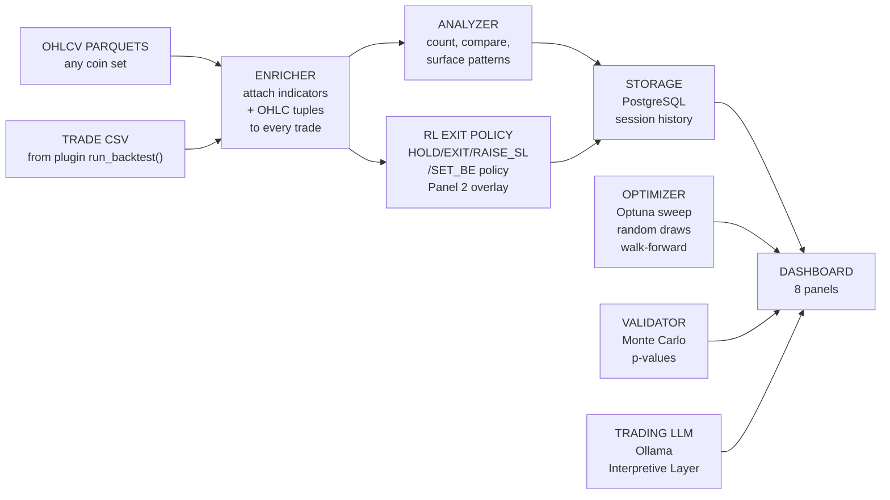
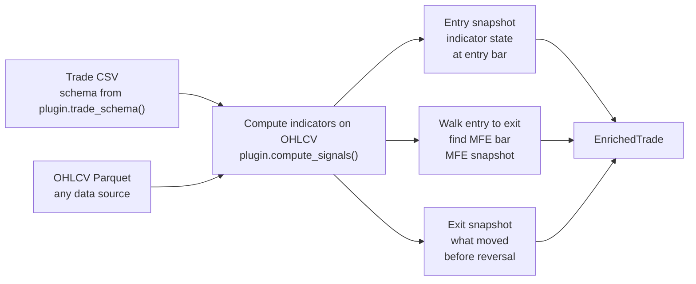
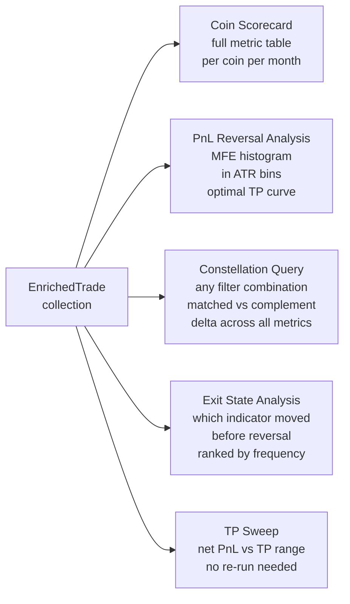
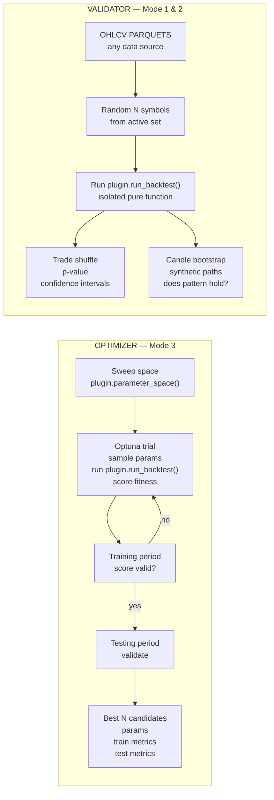
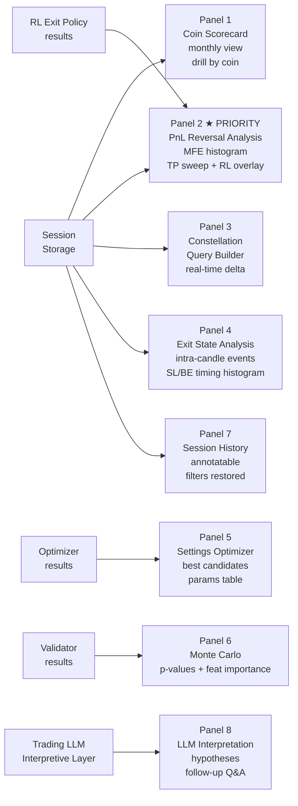

## Build Status (updated 2026-02-28)

| Block | Component | Status |
|-------|-----------|--------|
| B1 | FourPillarsPlugin (`strategies/four_pillars_plugin.py`) | READY TO BUILD — spec in `BUILD-VINCE-B1-PLUGIN.md` |
| B2 | API layer + types (`vince/types.py`, `vince/api.py`) | READY after B1 — research done, spec in `BUILD-VINCE-B2-API.md` |
| B3 | Enricher (`vince/enricher.py`) | BLOCKED — 8 decisions pending, see `BUILD-VINCE-B3-ENRICHER.md` |
| B4 | PnL Reversal panel (`vince/pages/pnl_reversal.py`) | BLOCKED on B1->B2->B3, spec in `BUILD-VINCE-B4-PNL-REVERSAL.md` |
| B5 | Query engine (`vince/query_engine.py`) | BLOCKED on B1->B2->B3, spec in `BUILD-VINCE-B5-QUERY-ENGINE.md` |
| B6 | Dash shell (`vince/app.py`, `vince/layout.py`) | BLOCKED on B1->B5, spec in `BUILD-VINCE-B6-DASH-SHELL.md` |
| — | `vince/` directory | DOES NOT EXIST — zero code written as of 2026-02-28 |

Concept sections below are LOCKED. No further changes to concept content.

---

# Vince v2 — Trade Research Engine
**Status:** CONCEPT v2 — APPROVED FOR BUILD (2026-02-27)
**Date:** 2026-02-23 (updated 2026-02-27 — ML findings + RL + random sampling + intra-candle timing)
**Supersedes:** VINCE-V2-CONCEPT.md (v1 — 14 known issues)

---

## What Changed from v1

14 issues corrected. See audit log: `06-CLAUDE-LOGS/2026-02-20-vince-scope.md`

Summary of changes:
1. Strategy coupling removed — indicator framework comes from plugin, not Vince core
2. Fixed Constants section removed — moves to plugin
3. Hardcoded sweep params removed — moves to plugin `parameter_space()`
4. Constellation Query Dimensions reframed — come from plugin at runtime, not Vince
5. K4 Regime Buckets generalized — macro signal buckets, K4 is Four Pillars example
6. Win rate dominance replaced — full metric table with profit factor, MFE, MAE, etc.
7. Autonomy statement clarified — optimizer is autonomous, user action required to apply
8. CSV coupling removed — any trade CSV with schema defined by plugin
9. Auto-discovery significance added — effect size + user-set minimum N threshold
10. Hardcoded "399 coins" and "data/cache/" replaced with generic labels
11. Editorial comment removed — "price action is for amateurs"
12. LSG renamed to PnL Reversal Analysis — LSG is Four Pillars plugin alias
13. What Already Exists separated — Vince core vs Four Pillars plugin (example)
14. dashboard_v391.py removed — not a Vince component
15. Panel 2 (PnL Reversal Analysis) elevated as highest-priority build artifact —
    research finding (2026-02-27): random entry + ATR stops = 160% return. Exit
    optimization contributes more alpha than entry filtering. [video 4BaMwwJeKEA]
16. RL Exit Policy Optimizer added as new component — sits between Enricher and
    Dashboard. Enhances Panel 2 without touching entries or reducing trade count.
    Research source: [oW4hgB1vIoY], [BznJQMi35sQ]. See "RL Exit Policy Optimizer" below.
17. Random dataset sampling added to Mode 2 and Mode 3 — random 1-3 month time
    windows + random coin subsets per training run. Forces generalization across regimes.
18. RL action space expanded: {HOLD, EXIT, RAISE_SL, SET_BE}. Enricher expanded to
    capture OHLC tuples at critical bars for intra-candle event classification.

Two-layer architecture added: Quantitative (always available) + Interpretive LLM (Ollama, triggered after sweep).

---

## Perspective

Vince is a strategy-agnostic trade research engine. It connects to a strategy plugin, runs the backtester with different settings, counts how many times each indicator constellation appeared and how many times it resulted in a win, surfaces the patterns you have not seen, and surfaces what settings are worth investigating.

The strategy plugin defines the indicator framework, the sweepable parameters, and the trade schema. Vince provides the analysis infrastructure. Any strategy that implements the plugin interface works with Vince without modification.

---

## What Vince Answers

1. **Why does this coin keep losing?** — full metric breakdown, constellation at entry, what differs from profitable coins. Data answers this. Not a guess.
2. **What does the PnL Reversal anatomy look like?** — for trades that saw positive PnL before reversal: how much (in ATR), how long until reversal, when was the optimal exit. (In the Four Pillars plugin this is called LSG — Losers Seeing Green. The analysis is the same regardless of strategy.)
3. **What settings actually work?** — run the backtester with different parameter combinations, find what improves performance without destroying volume.

---

## What Vince Is NOT

- NOT a trade filter. Vince never reduces trade count. Volume = rebate. Rebate is non-negotiable.
- NOT a classifier (no TAKE/SKIP decisions — that is Vicky's job, separate persona).
- NOT coupled to any single strategy. Works on any trade CSV whose schema is defined by the active plugin.
- NOT a chart tool. No price candles. Indicator numbers only.
- NOT fully autonomous. The optimizer runs computations autonomously. Vince surfaces patterns. The user decides what to do with them. No setting changes are applied without user action.

---

## Plugin Interface

Every strategy that works with Vince must implement the plugin interface. The interface separates strategy logic from analysis infrastructure.

### Computational Interface

```python
class StrategyPlugin(ABC):

    def compute_signals(self, ohlcv_df: pd.DataFrame) -> pd.DataFrame:
        """Attach all indicator signals to OHLCV data. Returns enriched DataFrame."""
        ...

    def parameter_space(self) -> dict:
        """Return sweepable parameter names with bounds and types.

        Example return:
        {
            "tp_mult":          {"type": "float", "low": 0.5, "high": 5.0},
            "sl_mult":          {"type": "float", "low": 0.5, "high": 3.0},
            "cross_level":      {"type": "int",   "low": 20,  "high": 80},
            "allow_b":          {"type": "bool"},
            "allow_c":          {"type": "bool"},
        }
        """
        ...

    def trade_schema(self) -> dict:
        """Return column definitions for the trade CSV this plugin produces.

        Example return:
        {
            "entry_bar":    "int   — bar index of entry",
            "exit_bar":     "int   — bar index of exit",
            "pnl":          "float — gross PnL in USD",
            "commission":   "float — total commission in USD",
            "direction":    "str   — LONG or SHORT",
            "symbol":       "str   — ticker symbol (e.g. BTCUSDT)",
            "grade":        "str   — entry grade (Four Pillars plugin specific)",
            ...
        }
        NOTE: Indicator snapshot columns (k1_at_entry, k2_at_entry, etc.) are NOT
        part of the trade CSV. They are attached by the Enricher using compute_signals().
        trade_schema() defines backtester output only.
        """
        ...

    def run_backtest(
        self, params: dict, start: str, end: str, symbols: list
    ) -> Path:
        """Run backtest with given params. Return path to trade CSV."""
        ...

    @property
    def strategy_document(self) -> Path:
        """Path to strategy markdown document.
        Used by the Interpretive LLM layer to ground its analysis.
        Must be markdown. If not markdown, convert and confirm with user before accepting.
        """
        ...
```

---

## Two-Layer Architecture

```
Layer 1 — Quantitative
  Counts, compares, measures.
  Always available. No LLM required.
  Modes 1, 2, 3 all run on Layer 1.

Layer 2 — Interpretive (optional)
  Trading LLM via Ollama.
  Available after any analysis completes. Activated by user choice.
  Reads strategy document + quantitative results.
  Generates hypotheses grounded in strategy logic.
  User interacts: follow-up questions, drill-ins, research directions.
```

### Operating Modes

| Mode | LLM Required | Description |
|------|-------------|-------------|
| Quantitative-only | No | Full analysis, all three modes, no LLM loaded |
| Quantitative + Interpretive | Yes | Full analysis + strategy-grounded hypothesis layer |

### LLM Trigger Flow

```
1. Sweep or analysis runs and completes (Layer 1)
2. User activates Interpretive layer
3. LLM loads via Ollama, reads strategy document + quantitative results
4. LLM generates interpretation: patterns observed, hypotheses, suggested research directions
5. User reads interpretation
6. User interacts: follow-up questions, drill into specific patterns
```

### Trading LLM

- Fine-tuned trading domain expert. Not a general model with a prompt wrapper.
- Trained on: technical analysis, indicator mathematics, divergences, regression channels, market structure, backtesting concepts, strategy logic analysis.
- Does NOT need strategy-specific training — needs trading domain training. Reads any strategy document from first principles.
- Runs locally via Ollama. Candidate models: DeepSeek-R1 (reasoning chain visible), Qwen2.5.
- Chinese-origin models require explicit context — trading domain terminology defined in prompt, not assumed.
- Shared asset: serves Vince, Vicky, Andy, and all future personas.
- SEPARATE build track. SEPARATE scoping session needed before build.

---

## Three Operating Modes

```
Mode 1 — User Query
User sets a filter (any combination of indicator state, grade, direction, etc.)
Vince counts: how many trades matched, full metric table, what differs from complement
Shows the complement alongside: trades NOT matching, their metrics
Delta = the signal

Mode 2 — Auto-Discovery
Pre-step 1 — XGBoost feature importance: run XGBoost on the enriched trade dataset
(label = win/loss). Ranks indicator dimensions by predictive signal. High-signal
dimensions swept first. Ranked list shown as Mode 2 setup screen. Research validation:
stochastics consistently rank #1 across all channel ML studies. [tNFnACpzxVw, 3aWw8tQhsT4]

Pre-step 2 — Unsupervised clustering: k-means on entry-state feature vectors. Each
cluster = a naturally occurring constellation type. Cluster labels become Mode 2 query
dimensions. Eliminates dimensional explosion from grid search.

Held-out partition: time-based 80/20 split enforced before Mode 2 runs. Discovery on
first 80% of date range. Mode 1 constellation queries validate against held-out 20%.
Partition point stored with every session. Prevents overfitting patterns to discovery data.

Random dataset sampling: Mode 2 runs on K independent random draws before surfacing
any pattern. Each draw = random 1-3 month time window + random N-coin subset from the
full universe. A pattern is surfaced only if it appears consistently across at least M of
K draws (user-set threshold). Random seed stored with session — draws are reproducible.

Main sweep: Vince sweeps constellation dimensions on the discovery partition.
Significance gate: permutation baseline — shuffle trade outcome labels, run the same sweep,
record the empirical null distribution of deltas. Only surface patterns where the real
delta exceeds the 95th percentile of the permuted distribution. Uses the same trade shuffle
infrastructure as the Monte Carlo validator. User-set effect size and minimum N thresholds
apply on top of this gate, not instead of it.

Reflexivity caution: N shown prominently on all discovered patterns. High-N patterns
(widely tradeable) carry an explicit flag: "High-N pattern. If publicly known, edge may
be front-run. Prefer low-N coin/regime-specific patterns for durable alpha." [9Y3yaoi9rUQ]

Surfaces top N patterns the user has not looked at.
"When macro signal is 25-45 falling AND volatility below 25th pct at entry — you have not seen this yet"

Mode 3 — Settings Optimizer
Vince runs the backtester with different parameter combinations (Optuna)
Training period → score → testing period → validate
Best N candidates stored with params, training metrics, testing metrics
Session resumable — interrupted optimization continues from last trial
Vince surfaces results. User decides whether to apply changes.

Walk-forward methodology: Mode 3 supports rolling window validation in addition to
single train/test split. Rolling mode: slide the training window forward by N days,
re-optimize, validate on the next N days. Best N candidates = intersection of
high-scoring runs across all windows, not just the best single split. Research finding
(2026-02-27): single-split optimization overfits to the training period regime. [9Y3yaoi9rUQ]

Random dataset sampling in Mode 3: each Optuna trial evaluates parameters on a fresh
random draw (random 1-3 month window + random coin subset) rather than the same fixed
training window every trial. Forces the optimizer to find parameters that work across
diverse regimes. Testing period is always a held-out draw with no overlap to any training
draw. Both walk-forward and random sampling modes are supported — user selects which to use.

Fitness function — Calmar ratio with rebate, trade count floor:

    if trade_count < baseline_trade_count * 0.95:
        return -inf  # hard rejection: volume floor non-negotiable

    net_pnl_with_rebate = gross_pnl - commissions + rebate_income
    score = net_pnl_with_rebate / max_drawdown_dollars

    # max_drawdown_dollars = peak-to-trough drawdown on the training period equity curve
    # baseline = default parameter run on the same training period, same symbols

Rationale: Calmar penalises drawdown naturally without requiring tuned weights. Rebate in
the numerator satisfies the rebate constraint. Trade count floor is a hard rejection before
scoring begins, not a soft penalty. Win rate is not in the formula.
```

---

## RL Exit Policy Optimizer

**Status:** Architecture addition (2026-02-27). Sits between Enricher and Dashboard.
Enhances Panel 2 without changing entries or reducing trade count. Research source:
[oW4hgB1vIoY] (full RL trading bot), [BznJQMi35sQ] (short), [4BaMwwJeKEA] (exits > entries).

### What it does

Trains a reinforcement learning agent on historical enriched trade data to learn WHEN to
take management actions (exit, raise SL, set BE) given the current state of indicators
after entry. The agent does not make entry decisions — entries come from the strategy
plugin unchanged.

### Action space

| Action | Description | Valid when |
|--------|-------------|-----------|
| HOLD | Do nothing at this bar | Always |
| EXIT | Close position at next candle open | Always |
| RAISE_SL | Move SL up to lock in partial profit | PnL > user-set threshold |
| SET_BE | Move SL to break-even entry price | PnL > commission cost |

### State vector

The state vector is constructed from `plugin.compute_signals()` output at the current bar.
The generic features (bars_since_entry through be_already_set) are strategy-agnostic.
Indicator features (k1–k4, cloud, bbw below) are **Four Pillars plugin examples** — a
different plugin provides different indicator columns in the same slots.

```
[bars_since_entry,        # how long into the trade
 current_pnl_atr,         # current unrealized PnL in ATR units
 k1_now, k2_now,          # (Four Pillars example) short-term stochastic state
 k3_now, k4_now,          # (Four Pillars example) medium + macro stochastic state
 cloud_state_now,         # (Four Pillars example) cloud bull/bear/inside
 bbw_now,                 # (Four Pillars example) volatility level
 candle_body_pct,         # (close - open) / ATR — direction of forming bar
 price_vs_entry_atr,      # mark price distance from entry in ATR
 sl_distance_atr,         # SL distance from mark price in ATR (shrinks as SL raised)
 be_already_set]          # bool — BE already applied this trade
```

At build time, the RL agent's indicator features are populated dynamically from whichever
columns `plugin.compute_signals()` returns — not hardcoded to k1/k2/k3/k4.

### Training methodology

- Environment: trade lifecycle (entry bar to final exit bar)
- Episode: one enriched trade
- Reward: net_pnl_at_exit minus commission (deducted only when EXIT is chosen)
- Train on enriched trade data (same 80% partition as Mode 2)
- Test on held-out 20% of date range
- Also tested across K random dataset draws (same sampling as Mode 2/3) for robustness
- Methodology TBD (scoping session required): Q-learning, PPO, or rule-extraction approach

### Intra-candle event classification

In the 5m backtester, SL/TP hits occur intra-candle (at the high/low of the bar), not
always at close. The RL agent uses `candle_body_pct` to understand the forming bar's
direction. Exit State Analysis (Panel 4) classifies each management event:
- Was the SL hit intra-candle (price crossed SL via high/low) or at close?
- % of BE raises where price reversed before reaching the next TP zone
- Histogram: bars-since-entry distribution for SL raise, BE set, and final exit

### Dashboard integration

RL policy output overlays on Panel 2 (HIGHEST BUILD PRIORITY) as an additional curve:
- Original Panel 2: fixed-TP sweep (static curves, historical best-TP multiple)
- RL overlay: state-conditional management policy outcome per trade
- Comparison: TP sweep baseline vs RL policy — how much alpha does dynamic management add?

### Enricher expansion required

Enricher must capture OHLC tuple at each critical bar in addition to close-based
indicator state: `entry_ohlc`, `mfe_ohlc`, `exit_ohlc`. These enable intra-candle
event classification in Panel 4 Exit State Analysis.

### Constraint satisfaction

- Does NOT reduce trade count (entries unchanged)
- Does NOT change signal logic (plugin `compute_signals()` unchanged)
- Does NOT require LLM (Layer 1 component)
- Layer 2 LLM (Panel 8) interprets the learned policy: "The agent learned to exit when
  K1 crosses below 60 AND BBW is contracting"
- RL Exit Policy is NOT Mode 3 (Settings Optimizer). Mode 3 sweeps entry parameters.
  RL Exit Policy learns exit/management timing. Independent components.

---

## Performance Metrics

Every analysis surface in Vince shows this metric table. Win rate is one input, not the conclusion.

| Metric | Definition |
|--------|-----------|
| Win rate | % trades with gross PnL > 0 |
| Profit factor | gross profit / gross loss |
| Avg net PnL | mean(pnl - commission) per trade |
| Avg MFE (ATR) | mean maximum favorable excursion in ATR units |
| Avg MAE (ATR) | mean maximum adverse excursion in ATR units |
| PnL reversal rate | % of losing trades that reached positive gross PnL before final exit (plugin alias: LSG%) |
| MFE/MAE ratio | avg MFE / avg MAE — directional quality |
| Trade count | sample size — always shown, never hidden |

Delta = metric_matched - metric_complement. Shown for all metrics, not just win rate.

Effect size threshold and minimum N threshold are user-set. Auto-discovery only surfaces patterns where both thresholds are met.

---

## Process Flow

### Overview



---

### Stage 1 — Enricher

Takes a trade CSV (schema from plugin) + OHLCV parquets. For every trade, looks up what the indicators were doing at three moments: entry bar, MFE bar, exit bar.



---

### Stage 2 — Analyzer

Takes all enriched trades. Runs five types of analysis.



---

### Stage 3 — Optimizer and Validator

Two independent paths. Both feed into the dashboard.



---

### Stage 4 — Dashboard Panels



---

## Constellation Query Dimensions

These dimensions are EXAMPLES based on the Four Pillars plugin. The actual dimensions available at runtime come from two sources: `plugin.trade_schema()` (trade-level fields — grade, direction, outcome) and `plugin.compute_signals()` (indicator state at entry/MFE/exit bars). The Enricher is the join point — it matches trade records from trade_schema() with indicator snapshots from compute_signals() via bar index, making both available as query dimensions at analysis time. A different plugin provides different dimensions.

**Four Pillars plugin — example dimensions:**

### Static (values AT entry bar)
- K1 / K2 / K3 / K4 value range (slider 0–100)
- Cloud2 state: bull / bear / any
- Cloud3 state: bull / bear / any
- Price position vs C3: above / inside / below / any

### Dynamic (behavior AT entry bar)
- K1 / K2 / K3 / K4 direction: rising / falling / any (vs N bars prior)
- K1 speed: fast / slow / any (pts per bar)
- K2 + K3 both crossing 50: yes / no / any
- All 4 rising simultaneously: yes / no / any
- ATR state: expanding / contracting / any

### Volatility (BBW — signals/bbwp.py)
- BBW level at entry: custom slider
- BBW direction: expanding / contracting / any
- BBW over last hour: expanding / contracting

### Trade Filters
- Grade: A / B / C / D / R / any combination (Four Pillars plugin specific)
- Direction: LONG / SHORT / both
- Entry type: fresh / ADD / RE / any

### Outcome Filters
- All / TP wins / SL losses / saw positive PnL before loss
- MFE threshold: > 0.5 / > 1.0 / > 2.0 ATR

### Regime Filters (future scope — architecture must allow)
- Month, weekday, session (Asian / London / NY)
- Macro signal direction bucket (defined per plugin)

---

## Macro Signal Regime Buckets

The strategy plugin defines what the macro signal is. For the Four Pillars plugin, K4 (60-period stochastic) is the macro signal. Other plugins may use a different indicator.

**Four Pillars example (K4 buckets):**
- K4 < 25 — oversold zone
- K4 25–45 — recovering, direction not confirmed
- K4 45–55 — ranging, macro ambiguous
- K4 55–75 — in momentum
- K4 > 75 — extended, potential reversal risk

K4 direction within each bucket matters separately. K4=30 rising is a different context from K4=30 falling.

**These are hypotheses. The boundaries are intuited and must be validated from data before use.**

Pre-build step before regime features are frozen:
1. Plot win rate vs continuous macro signal value (rolling mean over sorted values) — natural
   inflection points will be visible
2. Fit a supervised decision tree (macro_signal_value → trade_outcome) to 3–4 splits
3. Use the empirical split points as the bucket boundaries
4. Replace intuited values (25/45/55/75 for K4) with data-derived ones
5. Document the derivation date and dataset used — bucket definitions are not universal and
   will shift if the coin universe or time window changes materially

Vince stores the bucket definition with the session so results are reproducible.

---

## What Already Exists

### Vince Core (reuse, do not recreate)

| File | Purpose |
|------|---------|
| `engine/backtester_v384.py` | Trade CSV generator — called via plugin.run_backtest() |
| `engine/position_v384.py` | Trade384 dataclass |
| `engine/commission.py` | Commission model |
| `signals/bbwp.py` | BBW percentile — Layer 1 complete, 67/67 tests |
| `strategies/base_v2.py` | Strategy plugin ABC (Vince v2 interface — replaces base.py which is v1 classifier, kept as archive) |
| `data/normalizer.py` | Universal OHLCV CSV-to-parquet |
| `utils/capital_model_v2.py` | Capital model — pool-based, daily rebate settlement (scope TBD: used inside plugin.run_backtest(); direct Vince access needed only if portfolio-level analysis is in scope) |

### Four Pillars Plugin (example strategy — not Vince core)

| File | Purpose |
|------|---------|
| `strategies/four_pillars.py` | FourPillarsPlugin — implements plugin interface **(to be created — primary build task, see spec Section 7)** |
| `signals/four_pillars_v383_v2.py` | Signal pipeline — called by plugin.compute_signals() |
| `signals/stochastics.py` | Raw K computation |
| `signals/clouds.py` | EMA cloud computation |
| `signals/state_machine_v383.py` | Entry signal state machine |
| `engine/avwap.py` | AVWAP tracker |

---

## GUI — Dash Application

**Framework:** Plotly Dash. Replaces the existing Streamlit dashboard (`scripts/dashboard_v392.py`). Dash is chosen for:

- Scoped callback model — only affected components update on filter change
- Multi-page app support — each panel is a separate module
- Full CSS control via `assets/style.css`
- No full-script-rerun on every user interaction

**Run command:** `python vince/app.py`

**Layout:**

- Sidebar navigation — lists all panels by name, highlights active panel
- Persistent context bar — active coin set, date range, active plugin shown at top
- Main content area — active panel renders here

**Panel interaction model:**

- Every filter change triggers a scoped Dash callback — only the affected output components update
- Each panel is a separate Python module under `vince/pages/` (max 300 lines per file)
- No monolith — splitting enforced by architecture, not convention
- "Run Query" button on constellation panel — not live-on-drag (avoids excessive backtest calls)

**8 core panels:**

| # | Name | What it answers |
|---|------|----------------|
| 1 | Coin Scorecard | Why does this coin keep losing? Monthly metric table, equity curve, drill by coin |
| 2 | PnL Reversal Analysis ★ PRIORITY | What does the reversal anatomy look like? MFE histogram in ATR bins, TP sweep curve |
| 3 | Constellation Query | When indicator X was in state Y, what happened? Filter builder, matched vs complement delta |
| 4 | Exit State Analysis | What moved before the reversal? Indicator change ranking, intra-candle timing histograms |
| 5 | Trade Browser | Show me the individual trades. Sortable/filterable table, entry/exit details |
| 6 | Settings Optimizer | What parameters actually work? Optuna results, best N candidates, train vs test metrics |
| 7 | Validation | Is the edge real? Monte Carlo p-values, walk-forward efficiency, feature importance |
| 8 | Session History | What did I find last time? All sessions, annotatable, filters restorable |

Future panels (skeleton only, built when component is ready):

- Panel 2 overlay: RL Exit Policy (separate scoping session required before build)
- Panel 9: LLM Interpretation (separate scoping session required before build)

---

## Architecture — Module Boundaries

Three layers. Each layer calls only the layer below. No upward dependencies.

```
GUI layer — vince/pages/*.py, vince/app.py, vince/layout.py
    calls: API layer only. Never imports from engine/ or signals/ directly.

API layer — vince/api.py
    clean Python functions. No Dash imports.
    callable by GUI callbacks AND future agent (same API, no changes needed when agent is added).
    calls: engine, enricher, query engine, optimizer.

Engine + Analysis layer — vince/enricher.py, vince/query_engine.py, vince/discovery.py,
                           vince/optimizer.py, engine/*, signals/*
```

**Separation rule:** If a panel file imports from `engine/` or `signals/`, that code belongs in `vince/api.py` instead. Panel files import only from `vince.api` and `vince.types`.

**Why the API layer exists:** When an AI agent is added (future iteration), it calls `vince.api` directly — the same functions the GUI uses. No GUI code changes needed. The agent is a client of the API.

**`vince/api.py` — functions (v1 scope):**

```python
def run_enricher(symbols: list, params: dict) -> EnrichedTradeSet: ...
def query_constellation(filters: ConstellationFilter) -> MetricTable: ...
def get_coin_scorecard(symbol: str) -> CoinScorecardResult: ...
def get_panel2_data(symbol: str, timeframe: str) -> PnLReversalResult: ...
def run_optimizer(config: OptimizerConfig) -> OptimizerResult: ...
def save_session(session: SessionRecord) -> None: ...
def get_session_history() -> list: ...
```

**`vince/types.py` — dataclasses:**

```python
@dataclass class ConstellationFilter: ...
@dataclass class MetricTable: ...
@dataclass class EnrichedTrade: ...
@dataclass class EnrichedTradeSet: ...
@dataclass class PnLReversalResult: ...
@dataclass class CoinScorecardResult: ...
@dataclass class OptimizerConfig: ...
@dataclass class OptimizerResult: ...
@dataclass class SessionRecord: ...
```

`vince/types.py` imports only stdlib and pandas. No Dash, no engine imports.

**File layout:**

```
four-pillars-backtester/
  vince/
    __init__.py
    app.py                   # Dash entry point
    layout.py                # Sidebar + page routing
    api.py                   # API layer
    types.py                 # Dataclasses
    enricher.py              # Indicator snapshot attachment
    query_engine.py          # Constellation query + delta
    discovery.py             # Mode 2 auto-discovery
    optimizer.py             # Mode 3 Optuna sweep
    pages/
      __init__.py
      coin_scorecard.py      # Panel 1
      pnl_reversal.py        # Panel 2 (PRIORITY)
      constellation.py       # Panel 3
      exit_state.py          # Panel 4
      trade_browser.py       # Panel 5
      optimizer_ui.py        # Panel 6
      validation.py          # Panel 7
      session_history.py     # Panel 8
    assets/
      style.css
  strategies/
    base_v2.py               # StrategyPlugin ABC (exists)
    four_pillars.py          # FourPillarsPlugin (to be created — B1)
```

---

## Monthly Coin Suitability

### What this answers

For each coin, for each calendar month in the dataset:
- Was this month suitable for the current strategy on this coin?
- What conditions were present in that month that made it suitable or not?
- Given the current observable state of a coin, how often have similar historical months been suitable?

### What "suitable" means

Not defined by Vince. Defined by data. Vince shows the monthly table — full metric table per coin per month. The user sees which months worked and which did not. Patterns emerge from the data, not from a preset threshold.

### Monthly Suitability Table

For each coin x each month in the dataset:

| Coin | Month | Trades | Win Rate | PnL Rev% | Profit Factor | Avg Net PnL | Suitable? |
|------|-------|--------|----------|----------|---------------|-------------|-----------|

"Suitable?" is a user annotation column — not computed by Vince. The user labels months based on reading the metric table. Vince does not define suitability.

Colored: green months, red months, visible at a glance.
Click a green month: see what the indicators looked like that month (macro signal avg, volatility avg, grade mix).
Click a red month: same. Compare them. The user sees what was different.

### Forward Probability (base rate — no model)

Given observable conditions at the start of a month — find all historical months across all symbols where those conditions were similar at the start. Count how many were "suitable." That ratio is the base rate.

Example output: "Of 34 historical months where macro signal was 25–45 falling and volatility was below 25th pct at month start, 9 were suitable months (26%). Current symbol conditions match this profile."

Every base rate is shown with its N. Small N = stated explicitly.

**Status:** Concept only. Not scoped for build. Flagged as potentially a stretch. Revisit after core constellation analysis is built and real data is visible.

---

## Constraints (non-negotiable)

- NEVER reduce trade count. Vince observes. Volume preserved for rebate.
- No hardcoded symbol names. Works on any backtester output.
- No hardcoded indicator parameters. All params come from the active plugin.
- No price charts. Indicator numbers only.
- Interactive dashboard — every filter change responds in real time. Every session state saved.
- Every claim Vince surfaces must include: sample size, date range, symbols, exact filter used.
- Nothing is shown without its full context. The user decides whether the sample is large enough to trust.
- Auto-discovery requires user-set effect size threshold AND minimum N threshold before surfacing any pattern.
- Survivorship bias: all pattern results state which coins and date range are included. Coins that delisted or lost liquidity before the analysis period are absent. All auto-discovery output includes: "N=[count] coins active [date range]. Delisted coins not included."
- Reflexivity: large N is NOT a proxy for edge durability. High-N patterns are more likely to be discovered and traded by others — if publicly known, the edge gets front-run. Mode 2 surfaces N prominently and flags high-N patterns. [9Y3yaoi9rUQ]

---

## Open Questions (not decided)

1. ~~Exact UX of the interactive exploration~~ — RESOLVED: see GUI section above. Dash framework, scoped callbacks, "Run Query" button on constellation panel.
2. Monthly suitability table and base rate forward estimate — deferred to v2. Revisit after core constellation analysis is built and real data is visible.
3. Whether rolling regime detection (30-day window, rolling characteristics) — deferred to v2.
4. ~~Module architecture formally scoped~~ — RESOLVED: see Architecture section above. Three-layer model, API layer, file layout defined.
5. Trading LLM scoping — separate session (fine-tuning dataset, training, evaluation methodology)
6. Panel 9 (LLM Interpretation) interaction design — follow-up Q&A UX not yet defined. Separate scoping session required.
7. RL Exit Policy Optimizer — training methodology, hyperparameters, and whether to use Q-learning, PPO, or simpler rule-extraction. Separate scoping session required before build.

---

## What This Is Not

This document is the approved design. The architecture, panel structure, and module boundaries are locked. Build begins at B1 (FourPillarsPlugin). Remaining open questions (LLM, RL) each require a separate scoping session before their build phases start.
