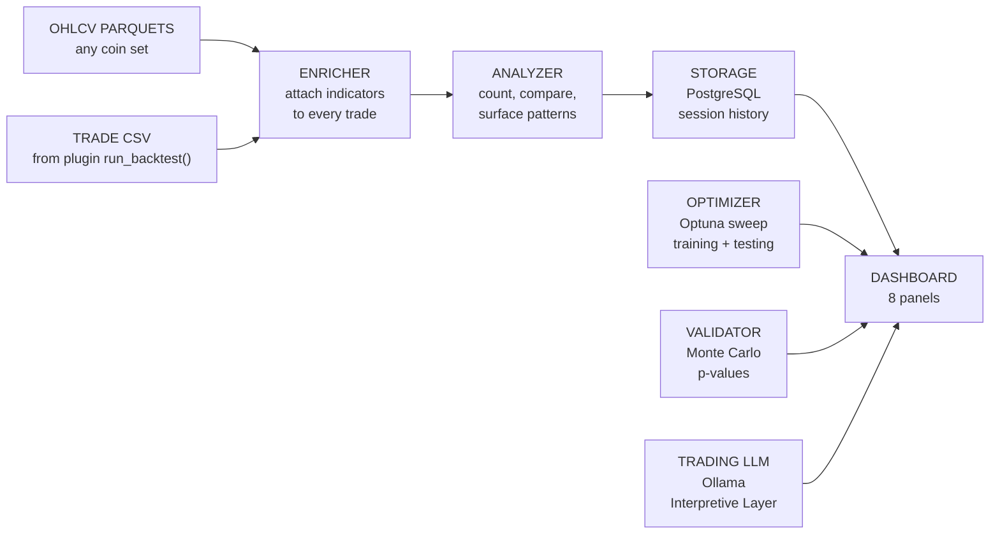
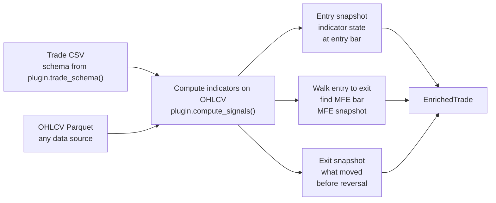
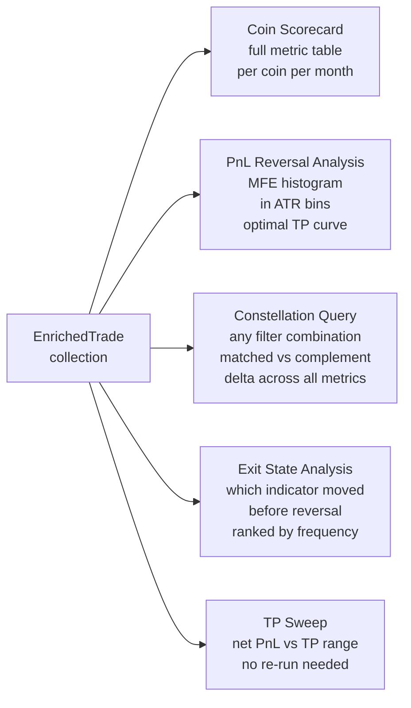
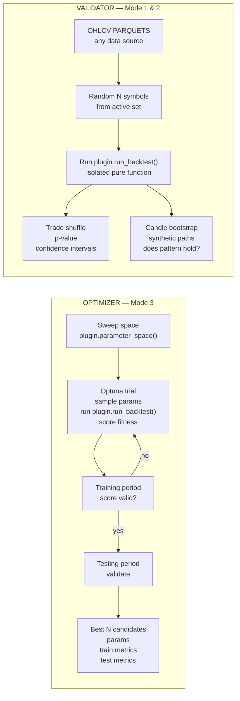
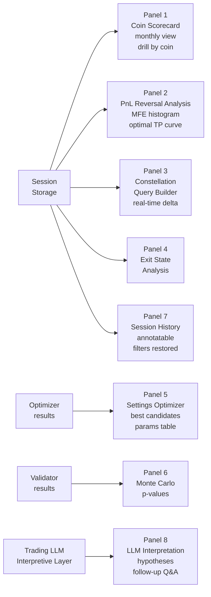

# Vince v2 — Trade Research Engine
**Status:** CONCEPT v2 — corrected, not yet approved for build
**Date:** 2026-02-23
**Supersedes:** VINCE-V2-CONCEPT.md (v1 — 14 known issues)

---

## What Changed from v1

14 issues corrected. See audit log: `06-CLAUDE-LOGS/2026-02-20-vince-scope.md`

Summary of changes:
1. Strategy coupling removed — indicator framework comes from plugin, not Vince core
2. Fixed Constants section removed — moves to plugin
3. Hardcoded sweep params removed — moves to plugin `parameter_space()`
4. Constellation Query Dimensions reframed — come from plugin at runtime, not Vince
5. K4 Regime Buckets generalized — macro signal buckets, K4 is Four Pillars example
6. Win rate dominance replaced — full metric table with profit factor, MFE, MAE, etc.
7. Autonomy statement clarified — optimizer is autonomous, user action required to apply
8. CSV coupling removed — any trade CSV with schema defined by plugin
9. Auto-discovery significance added — effect size + user-set minimum N threshold
10. Hardcoded "399 coins" and "data/cache/" replaced with generic labels
11. Editorial comment removed — "price action is for amateurs"
12. LSG renamed to PnL Reversal Analysis — LSG is Four Pillars plugin alias
13. What Already Exists separated — Vince core vs Four Pillars plugin (example)
14. dashboard_v391.py removed — not a Vince component

Two-layer architecture added: Quantitative (always available) + Interpretive LLM (Ollama, triggered after sweep).

---

## Perspective

Vince is a strategy-agnostic trade research engine. It connects to a strategy plugin, runs the backtester with different settings, counts how many times each indicator constellation appeared and how many times it resulted in a win, surfaces the patterns you have not seen, and surfaces what settings are worth investigating.

The strategy plugin defines the indicator framework, the sweepable parameters, and the trade schema. Vince provides the analysis infrastructure. Any strategy that implements the plugin interface works with Vince without modification.

---

## What Vince Answers

1. **Why does this coin keep losing?** — full metric breakdown, constellation at entry, what differs from profitable coins. Data answers this. Not a guess.
2. **What does the PnL Reversal anatomy look like?** — for trades that saw positive PnL before reversal: how much (in ATR), how long until reversal, when was the optimal exit. (In the Four Pillars plugin this is called LSG — Losers Seeing Green. The analysis is the same regardless of strategy.)
3. **What settings actually work?** — run the backtester with different parameter combinations, find what improves performance without destroying volume.

---

## What Vince Is NOT

- NOT a trade filter. Vince never reduces trade count. Volume = rebate. Rebate is non-negotiable.
- NOT a classifier (no TAKE/SKIP decisions — that is Vicky's job, separate persona).
- NOT coupled to any single strategy. Works on any trade CSV whose schema is defined by the active plugin.
- NOT a chart tool. No price candles. Indicator numbers only.
- NOT fully autonomous. The optimizer runs computations autonomously. Vince surfaces patterns. The user decides what to do with them. No setting changes are applied without user action.

---

## Plugin Interface

Every strategy that works with Vince must implement the plugin interface. The interface separates strategy logic from analysis infrastructure.

### Computational Interface

```python
class StrategyPlugin(ABC):

    def compute_signals(self, ohlcv_df: pd.DataFrame) -> pd.DataFrame:
        """Attach all indicator signals to OHLCV data. Returns enriched DataFrame."""
        ...

    def parameter_space(self) -> dict:
        """Return sweepable parameter names with bounds and types.

        Example return:
        {
            "tp_mult":          {"type": "float", "low": 0.5, "high": 5.0},
            "sl_mult":          {"type": "float", "low": 0.5, "high": 3.0},
            "cross_level":      {"type": "int",   "low": 20,  "high": 80},
            "allow_b":          {"type": "bool"},
            "allow_c":          {"type": "bool"},
        }
        """
        ...

    def trade_schema(self) -> dict:
        """Return column definitions for the trade CSV this plugin produces.

        Example return:
        {
            "entry_bar":    "int   — bar index of entry",
            "exit_bar":     "int   — bar index of exit",
            "pnl":          "float — gross PnL in USD",
            "commission":   "float — total commission in USD",
            "grade":        "str   — entry grade (A/B/C/D/R for Four Pillars)",
            "direction":    "str   — LONG or SHORT",
            ...
        }
        NOTE: Indicator snapshot columns (k1_at_entry, k2_at_entry, etc.) are NOT
        part of the trade CSV. They are attached by the Enricher using compute_signals().
        trade_schema() defines backtester output only.
        """
        ...

    def run_backtest(
        self, params: dict, start: str, end: str, symbols: list[str]
    ) -> Path:
        """Run backtest with given params. Return path to trade CSV."""
        ...

    @property
    def strategy_document(self) -> Path:
        """Path to strategy markdown document.
        Used by the Interpretive LLM layer to ground its analysis.
        Must be markdown. If not markdown, convert and confirm with user before accepting.
        """
        ...
```

---

## Two-Layer Architecture

```
Layer 1 — Quantitative
  Counts, compares, measures.
  Always available. No LLM required.
  Modes 1, 2, 3 all run on Layer 1.

Layer 2 — Interpretive (optional)
  Trading LLM via Ollama.
  Available after any analysis completes. Activated by user choice.
  Reads strategy document + quantitative results.
  Generates hypotheses grounded in strategy logic.
  User interacts: follow-up questions, drill-ins, research directions.
```

### Operating Modes

| Mode | LLM Required | Description |
|------|-------------|-------------|
| Quantitative-only | No | Full analysis, all three modes, no LLM loaded |
| Quantitative + Interpretive | Yes | Full analysis + strategy-grounded hypothesis layer |

### LLM Trigger Flow

```
1. Sweep or analysis runs and completes (Layer 1)
2. User activates Interpretive layer
3. LLM loads via Ollama, reads strategy document + quantitative results
4. LLM generates interpretation: patterns observed, hypotheses, suggested research directions
5. User reads interpretation
6. User interacts: follow-up questions, drill into specific patterns
```

### Trading LLM

- Fine-tuned trading domain expert. Not a general model with a prompt wrapper.
- Trained on: technical analysis, indicator mathematics, divergences, regression channels, market structure, backtesting concepts, strategy logic analysis.
- Does NOT need strategy-specific training — needs trading domain training. Reads any strategy document from first principles.
- Runs locally via Ollama. Candidate models: DeepSeek-R1 (reasoning chain visible), Qwen2.5.
- Chinese-origin models require explicit context — trading domain terminology defined in prompt, not assumed.
- Shared asset: serves Vince, Vicky, Andy, and all future personas.
- SEPARATE build track. SEPARATE scoping session needed before build.

---

## Three Operating Modes

```
Mode 1 — User Query
User sets a filter (any combination of indicator state, grade, direction, etc.)
Vince counts: how many trades matched, full metric table, what differs from complement
Shows the complement alongside: trades NOT matching, their metrics
Delta = the signal

Mode 2 — Auto-Discovery
Vince sweeps all constellation dimensions provided by the plugin
Finds combinations with the largest performance delta from baseline
Significance gate: permutation baseline — shuffle trade outcome labels, run the same sweep,
record the empirical null distribution of deltas. Only surface patterns where the real
delta exceeds the 95th percentile of the permuted distribution. Uses the same trade shuffle
infrastructure as the Monte Carlo validator. User-set effect size and minimum N thresholds
apply on top of this gate, not instead of it.
Surfaces top N patterns the user has not looked at
"When macro signal is 25-45 falling AND volatility below 25th pct at entry — you have not seen this yet"

Mode 3 — Settings Optimizer
Vince runs the backtester with different parameter combinations (Optuna)
Training period → score → testing period → validate
Best N candidates stored with params, training metrics, testing metrics
Session resumable — interrupted optimization continues from last trial
Vince surfaces results. User decides whether to apply changes.
Fitness function — Calmar ratio with rebate, trade count floor:

    if trade_count < baseline_trade_count * 0.95:
        return -inf  # hard rejection: volume floor non-negotiable

    net_pnl_with_rebate = gross_pnl - commissions + rebate_income
    score = net_pnl_with_rebate / max_drawdown_dollars

    # max_drawdown_dollars = peak-to-trough drawdown on the training period equity curve
    # baseline = default parameter run on the same training period, same symbols

Rationale: Calmar penalises drawdown naturally without requiring tuned weights. Rebate in
the numerator satisfies the rebate constraint. Trade count floor is a hard rejection before
scoring begins, not a soft penalty. Win rate is not in the formula.
```

---

## Performance Metrics

Every analysis surface in Vince shows this metric table. Win rate is one input, not the conclusion.

| Metric | Definition |
|--------|-----------|
| Win rate | % trades with gross PnL > 0 |
| Profit factor | gross profit / gross loss |
| Avg net PnL | mean(pnl - commission) per trade |
| Avg MFE (ATR) | mean maximum favorable excursion in ATR units |
| Avg MAE (ATR) | mean maximum adverse excursion in ATR units |
| PnL reversal rate | % of losing trades that reached positive gross PnL before final exit (plugin alias: LSG%) |
| MFE/MAE ratio | avg MFE / avg MAE — directional quality |
| Trade count | sample size — always shown, never hidden |

Delta = metric_matched - metric_complement. Shown for all metrics, not just win rate.

Effect size threshold and minimum N threshold are user-set. Auto-discovery only surfaces patterns where both thresholds are met.

---

## Process Flow

### Overview



---

### Stage 1 — Enricher

Takes a trade CSV (schema from plugin) + OHLCV parquets. For every trade, looks up what the indicators were doing at three moments: entry bar, MFE bar, exit bar.



---

### Stage 2 — Analyzer

Takes all enriched trades. Runs five types of analysis.



---

### Stage 3 — Optimizer and Validator

Two independent paths. Both feed into the dashboard.



---

### Stage 4 — Dashboard Panels



---

## Constellation Query Dimensions

These dimensions are EXAMPLES based on the Four Pillars plugin. The actual dimensions available at runtime come from two sources: `plugin.trade_schema()` (trade-level fields — grade, direction, outcome) and `plugin.compute_signals()` (indicator state at entry/MFE/exit bars). The Enricher is the join point — it matches trade records from trade_schema() with indicator snapshots from compute_signals() via bar index, making both available as query dimensions at analysis time. A different plugin provides different dimensions.

**Four Pillars plugin — example dimensions:**

### Static (values AT entry bar)
- K1 / K2 / K3 / K4 value range (slider 0–100)
- Cloud2 state: bull / bear / any
- Cloud3 state: bull / bear / any
- Price position vs C3: above / inside / below / any

### Dynamic (behavior AT entry bar)
- K1 / K2 / K3 / K4 direction: rising / falling / any (vs N bars prior)
- K1 speed: fast / slow / any (pts per bar)
- K2 + K3 both crossing 50: yes / no / any
- All 4 rising simultaneously: yes / no / any
- ATR state: expanding / contracting / any

### Volatility (BBW — signals/bbwp.py)
- BBW level at entry: custom slider
- BBW direction: expanding / contracting / any
- BBW over last hour: expanding / contracting

### Trade Filters
- Grade: A / B / C / D / R / any combination (Four Pillars plugin specific)
- Direction: LONG / SHORT / both
- Entry type: fresh / ADD / RE / any

### Outcome Filters
- All / TP wins / SL losses / saw positive PnL before loss
- MFE threshold: > 0.5 / > 1.0 / > 2.0 ATR

### Regime Filters (future scope — architecture must allow)
- Month, weekday, session (Asian / London / NY)
- Macro signal direction bucket (defined per plugin)

---

## Macro Signal Regime Buckets

The strategy plugin defines what the macro signal is. For the Four Pillars plugin, K4 (60-period stochastic) is the macro signal. Other plugins may use a different indicator.

**Four Pillars example (K4 buckets):**
- K4 < 25 — oversold zone
- K4 25–45 — recovering, direction not confirmed
- K4 45–55 — ranging, macro ambiguous
- K4 55–75 — in momentum
- K4 > 75 — extended, potential reversal risk

K4 direction within each bucket matters separately. K4=30 rising is a different context from K4=30 falling.

**These are hypotheses. The boundaries are intuited and must be validated from data before use.**

Pre-build step before regime features are frozen:
1. Plot win rate vs continuous macro signal value (rolling mean over sorted values) — natural
   inflection points will be visible
2. Fit a supervised decision tree (macro_signal_value → trade_outcome) to 3–4 splits
3. Use the empirical split points as the bucket boundaries
4. Replace intuited values (25/45/55/75 for K4) with data-derived ones
5. Document the derivation date and dataset used — bucket definitions are not universal and
   will shift if the coin universe or time window changes materially

Vince stores the bucket definition with the session so results are reproducible.

---

## What Already Exists

### Vince Core (reuse, do not recreate)

| File | Purpose |
|------|---------|
| `engine/backtester_v384.py` | Trade CSV generator — called via plugin.run_backtest() |
| `engine/position_v384.py` | Trade384 dataclass |
| `engine/commission.py` | Commission model |
| `signals/bbwp.py` | BBW percentile — Layer 1 complete, 67/67 tests |
| `strategies/base.py` | Strategy plugin ABC |
| `data/normalizer.py` | Universal OHLCV CSV-to-parquet |
| `utils/capital_model_v2.py` | Capital model — pool-based, daily rebate settlement (scope TBD: used inside plugin.run_backtest(); direct Vince access needed only if portfolio-level analysis is in scope) |

### Four Pillars Plugin (example strategy — not Vince core)

| File | Purpose |
|------|---------|
| `strategies/four_pillars.py` | FourPillarsPlugin — implements plugin interface |
| `signals/four_pillars_v383.py` | Signal pipeline — called by plugin.compute_signals() |
| `signals/stochastics.py` | Raw K computation |
| `signals/clouds.py` | EMA cloud computation |
| `signals/state_machine_v383.py` | Entry signal state machine |
| `engine/avwap.py` | AVWAP tracker |

---

## Monthly Coin Suitability

### What this answers

For each coin, for each calendar month in the dataset:
- Was this month suitable for the current strategy on this coin?
- What conditions were present in that month that made it suitable or not?
- Given the current observable state of a coin, how often have similar historical months been suitable?

### What "suitable" means

Not defined by Vince. Defined by data. Vince shows the monthly table — full metric table per coin per month. The user sees which months worked and which did not. Patterns emerge from the data, not from a preset threshold.

### Monthly Suitability Table

For each coin x each month in the dataset:

| Coin | Month | Trades | Win Rate | PnL Rev% | Profit Factor | Avg Net PnL | Suitable? |
|------|-------|--------|----------|----------|---------------|-------------|-----------|

"Suitable?" is a user annotation column — not computed by Vince. The user labels months based on reading the metric table. Vince does not define suitability.

Colored: green months, red months, visible at a glance.
Click a green month: see what the indicators looked like that month (macro signal avg, volatility avg, grade mix).
Click a red month: same. Compare them. The user sees what was different.

### Forward Probability (base rate — no model)

Given observable conditions at the start of a month — find all historical months across all symbols where those conditions were similar at the start. Count how many were "suitable." That ratio is the base rate.

Example output: "Of 34 historical months where macro signal was 25–45 falling and volatility was below 25th pct at month start, 9 were suitable months (26%). Current symbol conditions match this profile."

Every base rate is shown with its N. Small N = stated explicitly.

**Status:** Concept only. Not scoped for build. Flagged as potentially a stretch. Revisit after core constellation analysis is built and real data is visible.

---

## Constraints (non-negotiable)

- NEVER reduce trade count. Vince observes. Volume preserved for rebate.
- No hardcoded symbol names. Works on any backtester output.
- No hardcoded indicator parameters. All params come from the active plugin.
- No price charts. Indicator numbers only.
- Interactive dashboard — every filter change responds in real time. Every session state saved.
- Every claim Vince surfaces must include: sample size, date range, symbols, exact filter used.
- Nothing is shown without its full context. The user decides whether the sample is large enough to trust.
- Auto-discovery requires user-set effect size threshold AND minimum N threshold before surfacing any pattern.

---

## Open Questions (not decided)

1. Exact UX of the interactive exploration — what does the user click, how does the system respond in detail
2. Monthly suitability table and base rate forward estimate — belongs in v1 or later?
3. Whether rolling regime detection (30-day window, rolling characteristics) belongs in v1 or later
4. Module architecture formally scoped — pending (after concept v2 is approved)
5. Trading LLM scoping — separate session (fine-tuning dataset, training, evaluation methodology)
6. Panel 8 (LLM Interpretation) interaction design — follow-up Q&A UX not yet defined

---

## What This Is Not

This document is a concept. Numbers, panel designs, and architecture details are subject to change. No code is written. No build has started. Scoping is in progress.
