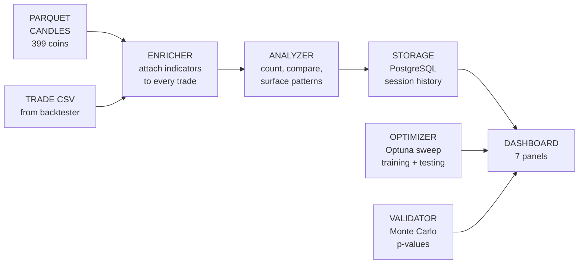
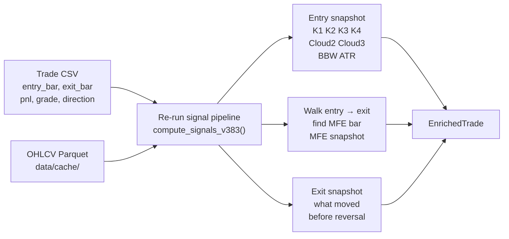
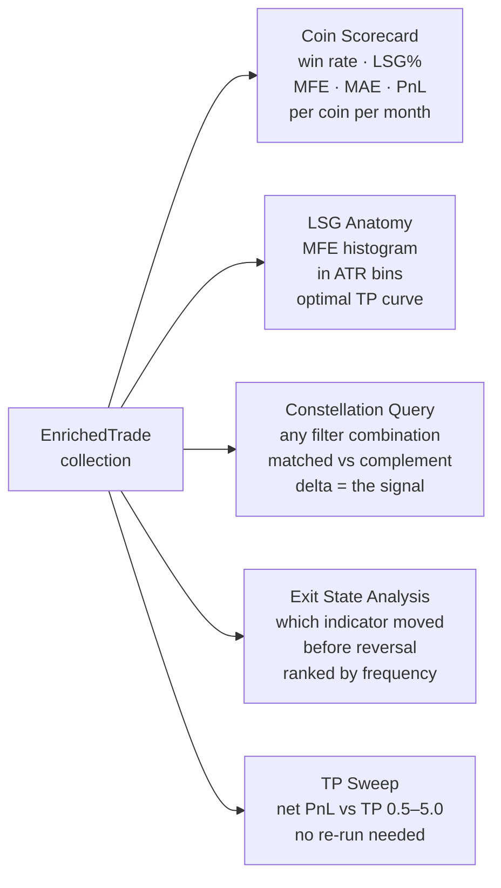
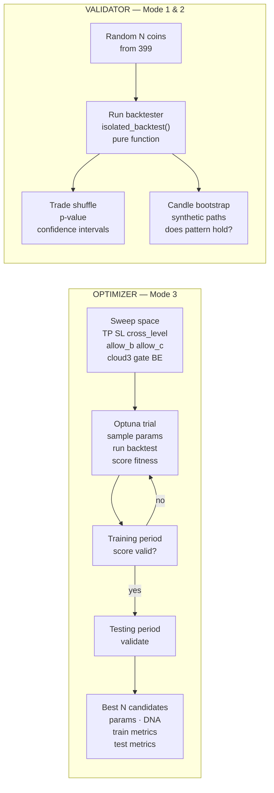
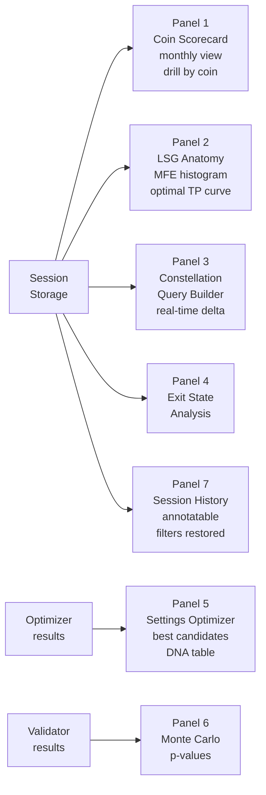

# Vince v2 — Trade Research Engine
**Status:** CONCEPT — not final, not approved for build
**Date:** 2026-02-19

---

## Perspective

Vince runs the backtester with different settings, counts how many times each indicator constellation appeared and how many times it resulted in a win, surfaces the patterns you have not seen, and tells you what settings to change.

The indicator framework is fixed — John Kurisko validated stochastics, Ripster clouds, price relationship. What Vince optimizes is the trading decisions made from those indicators.

---

## What Vince Answers

1. **Why does this coin keep losing?** — win rate, constellation at entry, what differs from profitable coins. Data answers this. Not a guess.
2. **What does the LSG anatomy look like?** — for the 86% of losers that saw green: how much green (in ATR), how long until reversal, when was the optimal exit.
3. **What settings actually work?** — run the backtester with different parameter combinations, find what improves win rate without destroying volume.

---

## What Vince Is NOT

- NOT a trade filter. Vince never reduces trade count. Volume = rebate. Rebate is non-negotiable.
- NOT a classifier (no TAKE/SKIP decisions — that is Vicky's job, separate persona).
- NOT hardcoded to any coin. Works on any CSV produced by the backtester.
- NOT a chart tool. No price candles. Indicator numbers only. Price action is for amateurs.
- NOT autonomous. Vince surfaces patterns. The user decides what to do with them.

---

## Fixed Constants — Vince Never Touches These

| Component | Values |
|-----------|--------|
| Stochastic periods | K1=9, K2=14, K3=40, K4=60 |
| Stochastic smoothing | Raw K (smooth=1) |
| Cloud EMAs | Cloud2: 5/12, Cloud3: 34/50, Cloud4: 72/89 |
| Price/stoch/cloud relationship | The validated measurement framework |

---

## What Vince Can Sweep

TP mult, SL mult, cross_level, zone_level, allow_b, allow_c, cloud3 gate for B/C, BE trigger, BE lock, checkpoint_interval, sigma_floor_atr.

---

## Three Operating Modes

```
Mode 1 — User Query
User sets a constellation filter (K1 range, K2 direction, BBW level, grade, etc.)
Vince counts: how many trades matched, win rate, avg MFE (ATR), avg MAE (ATR)
Shows the complement alongside: trades NOT matching, their win rate
Delta = the signal

Mode 2 — Auto-Discovery
Vince sweeps all constellation dimensions
Finds combinations with the largest win rate delta from baseline
Surfaces top N patterns the user has not looked at
"When K3 is 48–52 AND C2 flipped within 3 bars — you have not seen this yet"

Mode 3 — Settings Optimizer
Vince runs the backtester with different parameter combinations (Optuna)
Training period → score → testing period → validate
Best N candidates stored with DNA, training metrics, testing metrics
Session resumable — interrupted optimization continues from last trial
```

---

## Process Flow

### Overview



---

### Stage 1 — Enricher

Takes a trade CSV + OHLCV parquets. For every trade, looks up what the indicators were doing at three moments: entry bar, MFE bar, exit bar.



---

### Stage 2 — Analyzer

Takes all enriched trades. Runs five types of analysis.



---

### Stage 3 — Optimizer and Validator

Two independent paths. Both feed into the dashboard.



---

### Stage 4 — Dashboard Panels



---

## Constellation Query Dimensions

### Static (values AT entry bar)
- K1 / K2 / K3 / K4 value range (slider 0–100)
- Cloud2 state: bull / bear / any
- Cloud3 state: bull / bear / any
- Price position vs C3: above / inside / below / any

### Dynamic (behavior AT entry bar)
- K1 / K2 / K3 / K4 direction: rising / falling / any (vs N bars prior)
- K1 speed: fast / slow / any (pts per bar)
- K2 + K3 both crossing 50: yes / no / any
- All 4 rising simultaneously: yes / no / any
- ATR state: expanding / contracting / any

### Volatility (BBW — already built, signals/bbwp.py)
- BBW level at entry: custom slider
- BBW direction: expanding / contracting / any
- BBW over last hour: expanding / contracting (BBW[0] vs BBW[12] on 5m)

### Trade Filters
- Grade: A / B / C / D / R / any combination
- Direction: LONG / SHORT / both
- Entry type: fresh / ADD / RE / any

### Outcome Filters
- All / TP wins / SL losses / saw_green
- MFE threshold: > 0.5 / > 1.0 / > 2.0 ATR

### Regime Filters (future scope — architecture must allow)
- Month, weekday, session (Asian / London / NY)
- K4 macro direction bucket (oversold / recovering / ranging / trending / extended)

---

## K4 Regime Buckets (concept — not proven, data will show)

K4 is not binary (trending vs ranging). At minimum:
- K4 < 25 — oversold zone, spring-out signals may be false
- K4 25–45 — recovering, direction not confirmed
- K4 45–55 — ranging, macro ambiguous
- K4 55–75 — in momentum
- K4 > 75 — extended, potential reversal risk

K4 direction within each bucket matters separately. K4=30 rising is a different context from K4=30 falling.

**These are hypotheses. Vince tests them. The data decides.**

---

## What Already Exists (reuse, do not recreate)

| File | Purpose |
|------|---------|
| `engine/backtester_v384.py` | Trade CSV generator |
| `engine/position_v384.py` | Trade384 dataclass |
| `engine/avwap.py` | AVWAP tracker |
| `engine/commission.py` | Commission model |
| `signals/four_pillars_v383.py` | Signal pipeline |
| `signals/stochastics.py` | Raw K computation |
| `signals/clouds.py` | EMA cloud computation |
| `signals/bbwp.py` | BBW percentile — Layer 1 complete, 67/67 tests |
| `signals/state_machine_v383.py` | Entry signal state machine |
| `strategies/base.py` | Strategy plugin ABC |
| `strategies/four_pillars.py` | FourPillarsPlugin |
| `scripts/dashboard_v391.py` | Current stable dashboard |

---

## Constraints (non-negotiable)

- NEVER reduce trade count. Vince observes. Volume preserved for rebate.
- No hardcoded coin names. Works on any backtester output.
- No hardcoded parameters. All indicator params passed via strategy plugin.
- No price charts. Indicator numbers only.
- Interactive dashboard — every filter change responds in real time. Every session state saved.
- Every claim Vince surfaces must include: sample size, date range, coins, exact filter used.
- Nothing is shown without its full context. The user decides whether the sample is large enough to trust.

---

## Monthly Coin Suitability (added 2026-02-19)

### What this answers

For each coin, for each calendar month in the dataset:
- Was this month suitable for the current strategy on this coin?
- What conditions were present in that month that made it suitable or not?
- Given the current observable state of a coin, how often have similar historical months been suitable?

### What "suitable" means

Not defined by Vince. Defined by data. Vince shows the monthly table — win rate, trade count, LSG%, net PnL per coin per month. The user sees which months worked and which did not. Patterns emerge from the data, not from a preset threshold.

### Monthly Suitability Table (Panel concept)

For each coin × each month in the dataset:

| Coin | Month | Trades | Win Rate | LSG% | Avg MFE (ATR) | Net PnL | Suitable? |
|------|-------|--------|----------|------|----------------|---------|-----------|

Colored: green months, red months, visible at a glance.
Click a green month → see what the indicators looked like that month (K4 avg, BBW avg, grade mix).
Click a red month → same. Compare them. The user sees what was different.

### What conditions made the month suitable

This is the constellation query applied at the monthly level instead of the trade level.

For all trades in a "good month" across all coins: what was the dominant constellation at entry?
For all trades in a "bad month": what was the dominant constellation?

Vince counts. No claim is made about causation.

### Forward probability — the stretch

The user flagged this as potentially a stretch. Here is what is possible and what is not.

**What is possible (base rate, no model):**
Given observable conditions at the start of a month (K4 level, BBW level, K4 direction, recent win rate trend) — find all historical months across all coins where those conditions were similar at the start. Count how many of those months were "suitable." That ratio is the base rate.

Example output: "Of 34 historical months where K4 was between 25–45 falling and BBW was below 25 at month start, 9 were suitable months (26%). Current RIVER conditions match this profile."

**What makes this hard:**
- We have roughly 12 calendar months per coin × 399 coins = ~4,788 coin-months total
- But condition combinations are specific — any given condition profile may only appear in 10–40 historical months across all coins
- Small sample. The base rate number must always show the N it was computed from
- Coins are not interchangeable — RIVER in a given condition is not the same as BTCUSDT in the same condition

**What is NOT possible without more data:**
- A confident forward prediction
- A claim that past base rates will hold in future months
- Any statement about what will happen — only what has happened in similar situations

**Architecture note:**
This capability requires the monthly suitability table to be computed first. The base rate lookup is a query on top of that table. It does not require ML. It is a frequency count with a condition filter. The hard part is defining "similar conditions" — a distance metric or bucket system, not a model.

**Status:** Concept only. Not scoped for build. Flagged as potentially a stretch by the user. Revisit after the core constellation analysis is built and real data is visible.

---

## Open Questions (not decided)

1. Exact UX of the interactive exploration — what does the user click, how does the system respond in detail
2. Monthly suitability table and base rate forward estimate — belongs in v1 or later? (user flagged as possible stretch)
3. Whether rolling regime detection (30-day window, rolling characteristics) belongs in v1 or later
4. Module architecture formally approved by user — pending

---

## What This Is Not

This document is a concept. Numbers, panel designs, and architecture details are subject to change. No code is written. No build has started. Scoping is in progress.
