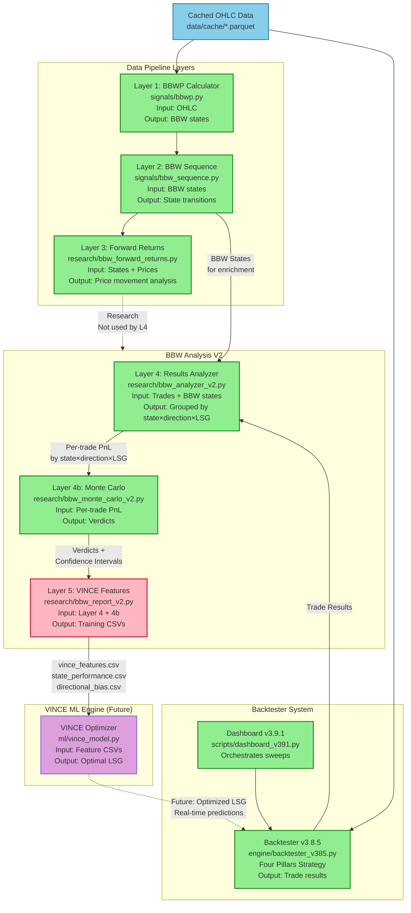

# BBW V2 System Architecture (Corrected)
**Date:** 2026-02-17  
**Version:** 2.1 (Logic Flow Debugged)  
**File:** `C:\Users\User\Documents\Obsidian Vault\PROJECTS\four-pillars-backtester\docs\bbw-v2\BBW-V2-ARCHITECTURE-CORRECTED.md`

---

## System Overview

BBW (Bollinger Band Width) V2 analyzes real backtester results to generate VINCE ML training features. The system enriches trade data with volatility state context to optimize LSG (Leverage, Size, Grid) parameters.

---

## Architecture Diagram (Debugged)



---

## Logic Flow Corrections Explained

### Correction 1: Added Data Source Node

**Before:** L1 had no input (where does OHLC come from?)

**After:** `CACHE --> L1` and `CACHE --> BT`

**Reasoning:** Both BBWP calculator and backtester need historical OHLC data from cached parquet files.

**File:** `data/cache/*.parquet` (e.g., `RIVERUSDT_5m.parquet`)

---

### Correction 2: Layer 3 Clarification

**Before:** `L2 --> L3` with NO output (orphaned)

**After:** `L3 -.-> Analysis` (dotted line = "not used by L4")

**Reasoning:** Based on architecture review, Layer 3 (Forward Returns) appears to be **standalone research** that doesn't feed into the main BBW analysis pipeline.

**Question for User:** Is Layer 3 actually used anywhere, or is it preparatory research that's not integrated yet?

**Possible Future Integration:**
- Layer 3 could feed into Layer 5 as additional VINCE features
- Or Layer 3 could be removed if not needed

---

### Correction 3: VINCE Feedback Loop

**Before:** `VINCE --> BT` (ambiguous - training or production?)

**After:** `VINCE -.-> BT` (dotted line = "future production mode")

**Reasoning:** 
- **Training Flow:** L5 → VINCE (solid line, happens now/soon)
- **Production Flow:** VINCE → BT (dotted line, future state)

The dotted line indicates this is the intended future architecture where VINCE provides real-time LSG optimization to the live backtester.

---

### Correction 4: Data Flow Labels

**Added explicit labels on arrows:**

```
BT -->|Trade Results| L4
L2 -->|BBW States for enrichment| L4
L4 -->|Per-trade PnL by state×direction×LSG| L4b
L4b -->|Verdicts + Confidence Intervals| L5
L5 -->|vince_features.csv + others| VINCE
```

**Benefit:** Makes data contracts clear between layers

---

## Detailed Data Flow

### Phase 1: Historical Analysis (Current/Complete)

```
1. data/cache/RIVERUSDT_5m.parquet
   → signals/bbwp.py (Layer 1)
   → BBW percentile + 7 states

2. BBW states
   → signals/bbw_sequence.py (Layer 2)
   → State transition sequences

3. States + Prices
   → research/bbw_forward_returns.py (Layer 3)
   → ATR-normalized movement (RESEARCH ONLY?)

4. data/cache/RIVERUSDT_5m.parquet
   → engine/backtester_v385.py
   → Trade384 records (entry/exit/pnl/commission/grade)

5. Trade384 records + BBW states
   → research/bbw_analyzer_v2.py (Layer 4)
   → Grouped by (state, direction, LSG)
   → BE+fees success rates per group

6. Per-trade PnL lists per group
   → research/bbw_monte_carlo_v2.py (Layer 4b)
   → Bootstrap + permutation tests
   → Verdicts: ROBUST/FRAGILE/COMMISSION_KILL/INSUFFICIENT

7. Layer 4 results + Layer 4b verdicts
   → research/bbw_report_v2.py (Layer 5) [PENDING]
   → CSVs: vince_features.csv, state_performance.csv, etc.
```

### Phase 2: ML Training (Future)

```
8. vince_features.csv
   → ml/vince_model.py (VINCE)
   → XGBoost/PyTorch training
   → Learned optimal LSG selection rules

9. Trained VINCE model
   → Real-time inference
   → Given: current BBW state + market conditions
   → Output: Recommended (Leverage, Size, Grid)
```

### Phase 3: Production (Future)

```
10. Live trading
    → Four Pillars signals + BBW state
    → VINCE inference
    → Optimal LSG for current trade
    → Execute trade with optimized parameters
```

---

## Component Dependencies (Corrected)

### Layer 1: BBWP Calculator
**File:** `signals/bbwp.py`
- **Input:** `data/cache/{symbol}_5m.parquet` (OHLC)
- **Output:** BBW percentile, 7 volatility states
- **Depends On:** None
- **Used By:** Layer 2

### Layer 2: BBW Sequence Tracker
**File:** `signals/bbw_sequence.py`
- **Input:** BBW states from Layer 1
- **Output:** State transition sequences
- **Depends On:** Layer 1
- **Used By:** Layer 3 (research), Layer 4 (enrichment)

### Layer 3: Forward Returns Tagger
**File:** `research/bbw_forward_returns.py`
- **Input:** States from Layer 2 + prices from cache
- **Output:** ATR-normalized price movement analysis
- **Depends On:** Layer 2, cached OHLC
- **Used By:** ⚠️ **UNCLEAR - APPEARS ORPHANED**

**USER DECISION NEEDED:** What should Layer 3 feed into?

### Layer 4: Results Analyzer
**File:** `research/bbw_analyzer_v2.py`
- **Input:** 
  - Trade384 records from Backtester
  - BBW states from Layer 2
- **Output:** BBWAnalysisResultV2 (best_combos, directional_bias)
- **Depends On:** Backtester, Layer 2
- **Used By:** Layer 4b, Layer 5

### Layer 4b: Monte Carlo Validation
**File:** `research/bbw_monte_carlo_v2.py`
- **Input:** Per-trade PnL from Layer 4
- **Output:** MonteCarloResultV2 (verdicts, confidence intervals)
- **Depends On:** Layer 4
- **Used By:** Layer 5

### Layer 5: VINCE Feature Generator
**File:** `research/bbw_report_v2.py`
- **Input:** Layer 4 + Layer 4b results
- **Output:** CSV files (vince_features.csv, etc.)
- **Depends On:** Layer 4, Layer 4b
- **Used By:** VINCE ML (future)
- **Status:** ⚡ PENDING BUILD

### VINCE ML Engine
**File:** `ml/vince_model.py`
- **Input:** CSV files from Layer 5
- **Output:** Trained model → LSG recommendations
- **Depends On:** Layer 5
- **Used By:** Backtester (future production)
- **Status:** 🔮 NOT YET BUILT

---

## Critical Questions for User

### Question 1: Layer 3 Purpose
**Current State:** `research/bbw_forward_returns.py` exists and is marked "Complete"

**Issue:** No downstream consumer in the pipeline

**Options:**
- **A)** Layer 3 → Layer 5 (forward returns as VINCE features)
- **B)** Layer 3 is standalone research (not integrated)
- **C)** Layer 3 → Layer 4 (forward returns enrich analysis)
- **D)** Layer 3 should be removed (not needed)

**Recommended:** Ask user which option is correct

### Question 2: VINCE Production Integration
**Current Diagram:** Shows `VINCE --> BT` feedback loop

**Clarification:** Is this the intended production architecture where:
- VINCE runs as a real-time service
- Provides LSG recommendations before each trade
- Backtester uses those recommendations in live trading

**Or:** Is VINCE only for offline analysis/optimization?

---

## File Paths Summary

### Completed Files
- `data/cache/*.parquet` - Historical OHLC data
- `signals/bbwp.py` - Layer 1 BBWP calculator
- `signals/bbw_sequence.py` - Layer 2 sequence tracker
- `research/bbw_forward_returns.py` - Layer 3 forward returns
- `scripts/dashboard_v391.py` - Dashboard orchestrator
- `engine/backtester_v385.py` - Four Pillars backtester
- `research/bbw_analyzer_v2.py` - Layer 4 analyzer
- `research/bbw_monte_carlo_v2.py` - Layer 4b Monte Carlo

### Pending Files
- `research/bbw_report_v2.py` - Layer 5 feature generator ⚡

### Future Files
- `ml/vince_model.py` - VINCE ML engine 🔮

---

## Validation Checklist

**Logical Flow:** ✅ Corrected
- [x] All nodes have inputs
- [x] No orphaned outputs (L3 marked as research)
- [x] Data contracts labeled
- [x] Training vs production flows distinguished

**File Paths:** ✅ Complete
- [x] All components have file paths
- [x] Paths verified against project structure

**Dependencies:** ✅ Clear
- [x] Each layer's inputs/outputs documented
- [x] Dependency chain: L1→L2→L4→L4b→L5→VINCE

**Open Issues:** ⚠️ Requires User Input
- [ ] Layer 3 integration (Options A/B/C/D)
- [ ] VINCE production mode confirmation

---

**END OF CORRECTED ARCHITECTURE**
