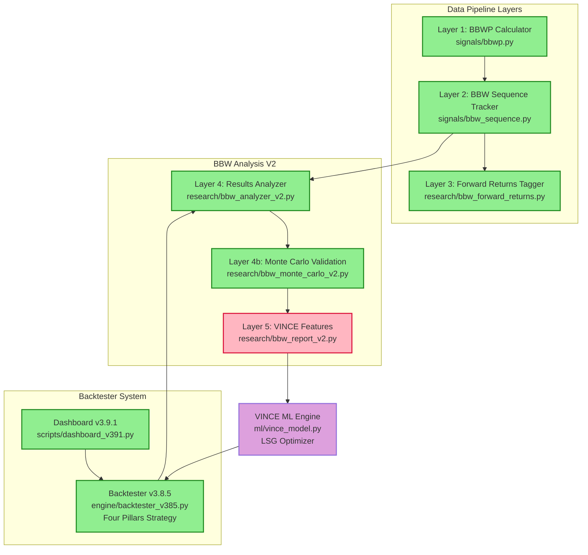

# BBW V2 System Architecture
**Date:** 2026-02-17  
**Version:** 2.0 (Simplified for PDF Export)

---

## System Overview

BBW (Bollinger Band Width) V2 analyzes real backtester results to generate VINCE ML training features. The system enriches trade data with volatility state context to optimize LSG (Leverage, Size, Grid) parameters.

---

## Architecture Diagram



---

## Component Details

### Data Pipeline Layers (Complete)

**Layer 1: BBWP Calculator**
- File: `signals/bbwp.py`
- Input: OHLC data
- Output: BBW percentile + 7 volatility states
- Status: ✅ Production-ready

**Layer 2: BBW Sequence Tracker**
- File: `signals/bbw_sequence.py`
- Input: BBWP values
- Output: State transition sequences
- Status: ✅ Complete

**Layer 3: Forward Returns Tagger**
- File: `research/bbw_forward_returns.py`
- Input: States + prices
- Output: ATR-normalized price movement
- Status: ✅ Complete

---

### Backtester System (Existing)

**Dashboard v3.9.1**
- File: `scripts/dashboard_v391.py`
- Executes sweeps across 400+ coins
- 1 year historical data
- Status: ✅ Production stable

**Backtester v3.8.5**
- File: `engine/backtester_v385.py`
- Four Pillars Strategy implementation
- Direction from: Ripster + AVWAP + Stochastics
- Status: ✅ 93% success rate validated

---

### BBW Analysis V2 (Rebuild)

**Layer 4: Results Analyzer**
- File: `research/bbw_analyzer_v2.py`
- Analyzes real backtester results (NOT simulation)
- Groups trades by (state, direction, LSG)
- Calculates BE+fees success rates
- Status: ✅ Complete

**Layer 4b: Monte Carlo Validation**
- File: `research/bbw_monte_carlo_v2.py`
- Bootstrap + permutation testing
- Verdicts: ROBUST / FRAGILE / COMMISSION_KILL / INSUFFICIENT
- Prevents overfitting
- Status: ✅ Complete

**Layer 5: VINCE Feature Generator**
- File: `research/bbw_report_v2.py`
- Transforms Layer 4 + 4b into ML training features
- Generates CSVs for VINCE
- Status: ⚡ **PENDING BUILD**

---

### VINCE ML Engine (Future)

**Purpose:** Real-time LSG optimization

**Input:** BBW Layer 5 CSV files

**Output:** Optimal (Leverage, Size, Grid) recommendations

**Status:** 🔮 Architecture defined, not yet built

**Dependencies:** BBW Layer 5 completion

---

## Key V2 Corrections

### What Changed from V1

**Role Clarification:**
- V1: BBW simulated trades (wrong)
- V2: BBW analyzes backtester results (correct)

**Direction Source:**
- V1: BBW determined trade direction (wrong)
- V2: Direction from Four Pillars strategy (correct)

**Layer Count:**
- V1: Had non-existent Layer 6 (wrong)
- V2: Only 5 layers, VINCE is separate (correct)

**Metric Focus:**
- V1: Win rate metric (wrong)
- V2: BE+fees rate metric (correct)

---

## Data Flow Summary

```
1. OHLC → BBWP Calculator → Volatility States
2. Volatility States → Sequence Tracker → Patterns
3. States + Prices → Forward Returns → Movement Analysis
4. Dashboard → Backtester → Trade Results
5. Trade Results + States → Analyzer → Grouped Performance
6. Grouped Performance → Monte Carlo → Validation Verdicts
7. Performance + Verdicts → Feature Generator → VINCE CSVs
8. VINCE CSVs → ML Training → Optimal LSG Parameters
9. LSG Parameters → Backtester → Improved Performance
```

---

## Status Summary

| Component | Status | Notes |
|-----------|--------|-------|
| Layer 1 (BBWP) | ✅ Complete | Production-ready |
| Layer 2 (Sequence) | ✅ Complete | Tested |
| Layer 3 (Forward Returns) | ✅ Complete | Tested |
| Layer 4 (Analyzer) | ✅ Complete | V2 corrections applied |
| Layer 4b (Monte Carlo) | ✅ Complete | 1000-iteration validation |
| Layer 5 (Features) | ⚡ Pending | Build spec ready |
| VINCE ML | 🔮 Future | Awaits Layer 5 |
| Dashboard Integration | 🔮 Future | Version 4 |

---

## Critical Path

**Blocker:** Layer 5 completion

**Next Milestone:** 400-coin sweep generates VINCE training dataset

**Timeline:** 4-6 weeks from Layer 5 completion to production

---

## Glossary

**BBW** - Bollinger Band Width  
**BBWP** - BBW Percentile  
**LSG** - Leverage, Size, Grid parameters  
**BE+fees** - Breakeven plus commission fees  
**VINCE** - Machine learning optimizer (separate from BBW)  
**Four Pillars** - Ripster + AVWAP + Stochastics + BBW  
**Monte Carlo** - Bootstrap/permutation validation method

---

**END OF ARCHITECTURE DOCUMENT**
