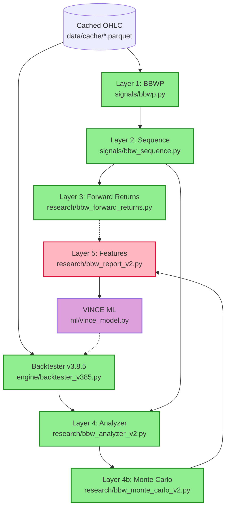
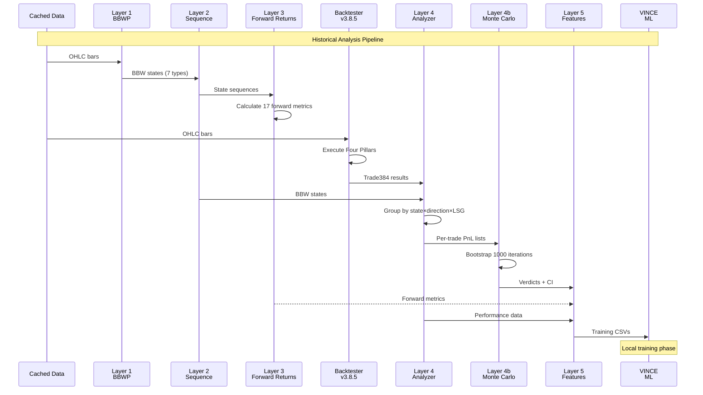
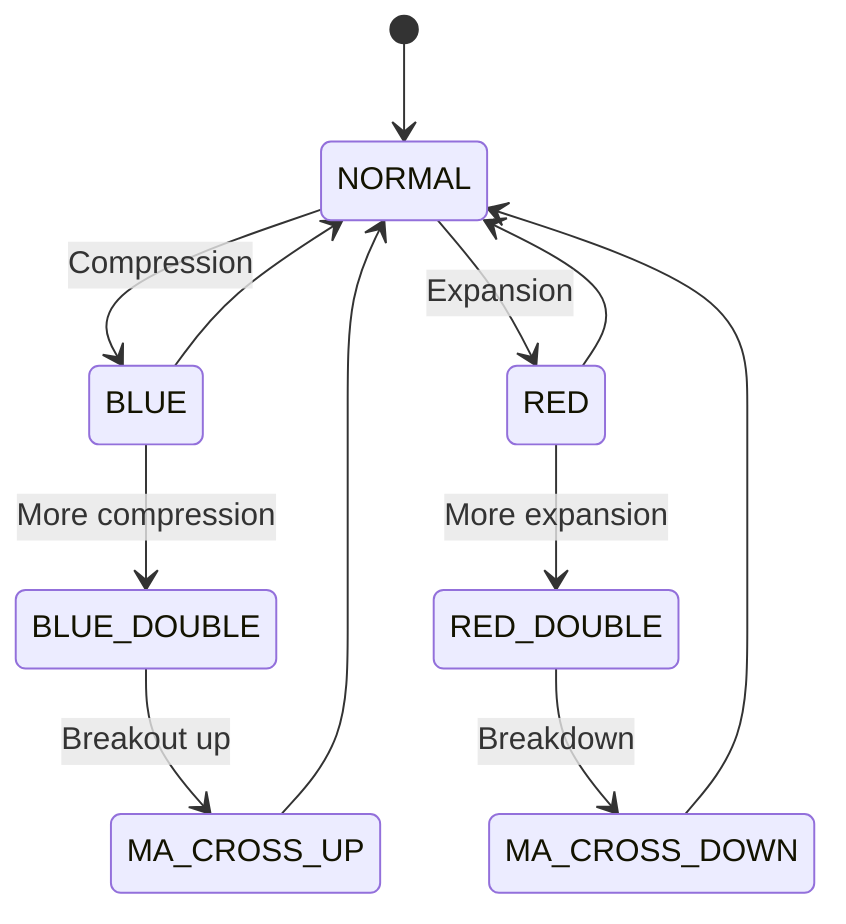
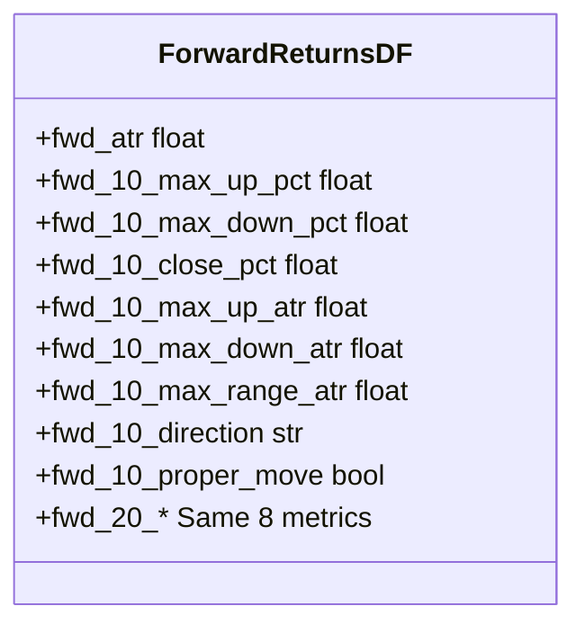
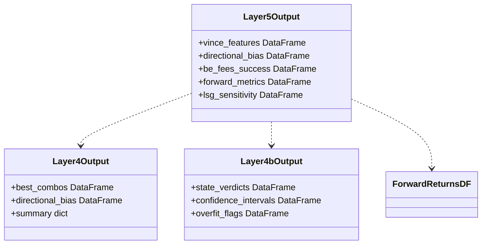
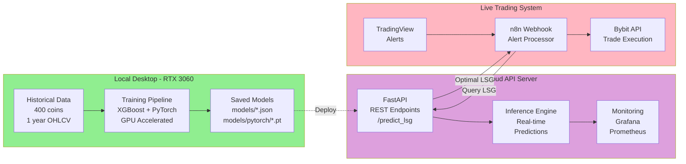
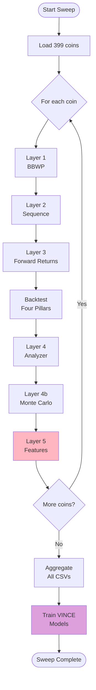
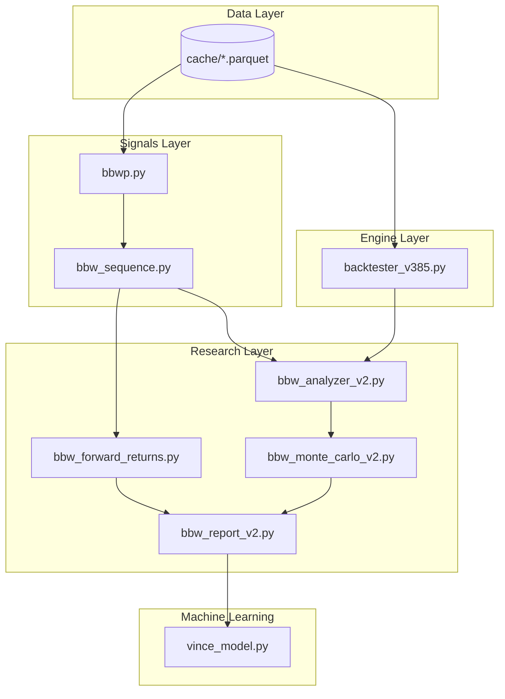

# BBW V2 - UML Diagrams (PDF Optimized)
**File:** `C:\Users\User\Documents\Obsidian Vault\PROJECTS\four-pillars-backtester\docs\bbw-v2\BBW-V2-UML-DIAGRAMS-PDF.md`  
**Date:** 2026-02-17  
**Version:** 2.3 - Optimized for PDF Export with Orientation Control

---

---

## Diagram 1: System Overview

### BBW V2 Complete Architecture

**Legend:**
- 🟢 Green = Complete
- 🔴 Pink = Pending Build
- 🟣 Purple = Future

---

<!-- LANDSCAPE PAGE -->

## Diagram 2: Data Flow Sequence (Landscape)

### Historical Analysis Pipeline

**Flow:** Cache → Layers 1-3 → Backtester → Layers 4-5 → VINCE

---

## Diagram 3: BBW State Transitions

### 7 Volatility States

**States:**
- BLUE = Low volatility (squeeze)
- RED = High volatility (trending)
- DOUBLE = Extreme levels
- MA_CROSS = Direction confirmed

---

## Diagram 4: Layer 3 Output

### Forward Returns Schema (17 Columns)

**Purpose:** Predicts what happens in next 10/20 bars

**Integration:** Feeds into Layer 5 as VINCE training features

---

## Diagram 5: Data Contracts

### Layer 4, 4b, 5 Outputs

**Layer 5** consumes outputs from **Layer 4**, **Layer 4b**, and **Layer 3**

---

<!-- LANDSCAPE PAGE -->

## Diagram 6: VINCE Deployment (Landscape)

### Local Training → Cloud Inference

**Phase 1:** Train locally (RTX 3060)  
**Phase 2:** Deploy to cloud  
**Phase 3:** Live trading integration

---

## Diagram 7: 400-Coin Sweep

### Training Data Generation Pipeline

**Duration:** ~6-8 hours for 400 coins

---

## Diagram 8: File Structure

### Component Organization

**Root:** `C:\Users\User\Documents\Obsidian Vault\PROJECTS\four-pillars-backtester\`

---

## Summary Tables

### Component Status

| Layer | File | Status | Purpose |
|:-----:|:-----|:------:|:--------|
| L1 | signals/bbwp.py | ✅ Complete | Calculate BBW states |
| L2 | signals/bbw_sequence.py | ✅ Complete | Track state transitions |
| L3 | research/bbw_forward_returns.py | ✅ Complete | Forward-looking metrics |
| - | engine/backtester_v385.py | ✅ Complete | Execute Four Pillars |
| L4 | research/bbw_analyzer_v2.py | ✅ Complete | Analyze trade results |
| L4b | research/bbw_monte_carlo_v2.py | ✅ Complete | Validate robustness |
| L5 | research/bbw_report_v2.py | ⚡ Pending | Generate VINCE features |
| - | ml/vince_model.py | 🔮 Future | ML optimization |

---

### Layer 3 Output Columns

| Column | Type | Description |
|:-------|:----:|:------------|
| fwd_atr | float | ATR normalization factor |
| fwd_10_max_up_pct | float | Max % up in 10 bars |
| fwd_10_max_down_pct | float | Max % down in 10 bars |
| fwd_10_close_pct | float | Close return in 10 bars |
| fwd_10_max_up_atr | float | Max up in ATR units |
| fwd_10_max_down_atr | float | Max down in ATR units |
| fwd_10_max_range_atr | float | Total range in ATR |
| fwd_10_direction | str | UP/DOWN/NEUTRAL |
| fwd_10_proper_move | bool | Move > 3 ATR? |
| fwd_20_* | - | Same 8 metrics for 20 bars |

---

### VINCE Deployment Phases

| Phase | Location | Purpose | Status |
|:-----:|:---------|:--------|:------:|
| 1 | Local Desktop | Train models on historical data | 🔮 Future |
| 2 | Cloud API | Real-time inference service | 🔮 Future |
| 3 | Live Trading | n8n webhook integration | 🔮 Future |

---

### V1 vs V2 Corrections

| Aspect | V1 (Wrong) | V2 (Correct) |
|:-------|:-----------|:-------------|
| BBW Role | Simulated trades | Analyzes backtester results |
| Direction | BBW decides | Four Pillars decides |
| Layers | 6 layers | 5 layers (VINCE separate) |
| Metric | Win rate | BE+fees rate |
| Layer 3 | Unclear | Forward metrics → Layer 5 |
| VINCE | Not specified | Local → Cloud deployment |

---

**END OF PDF-OPTIMIZED DIAGRAMS**

**Export Instructions:**
1. Open in Obsidian
2. Export to PDF
3. **Diagram 2 and 6 automatically landscape**
4. Other pages portrait with centered content
