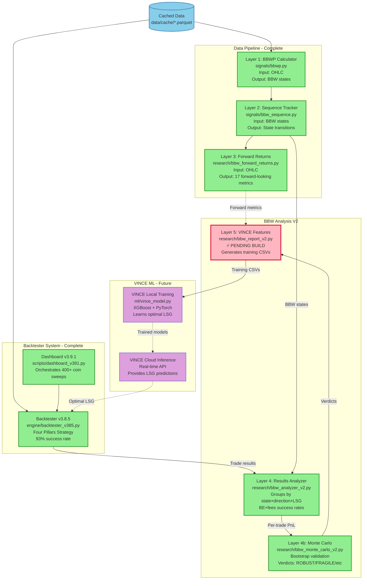
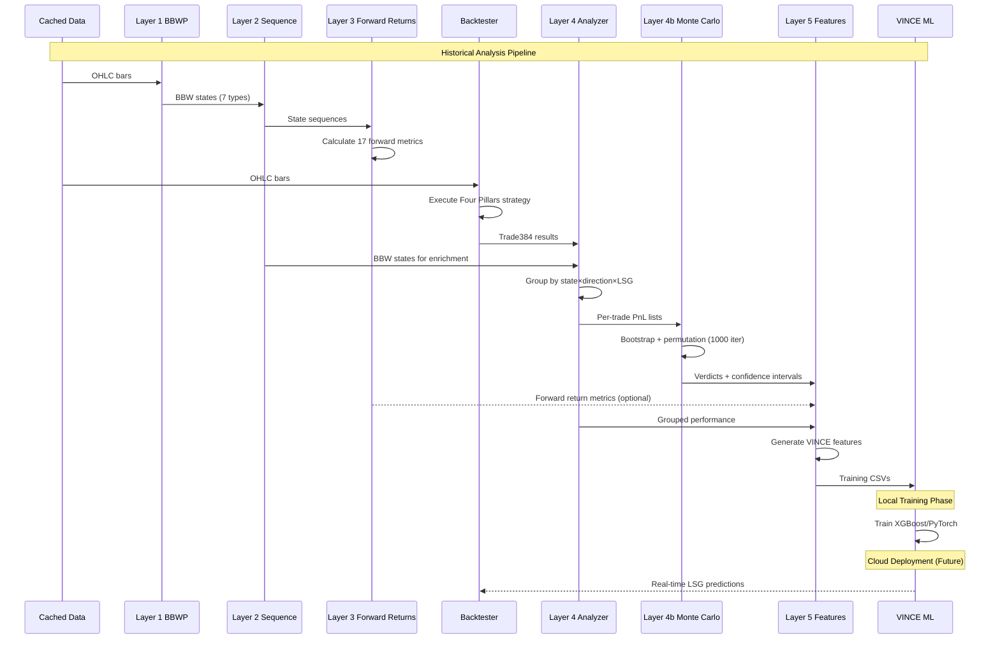
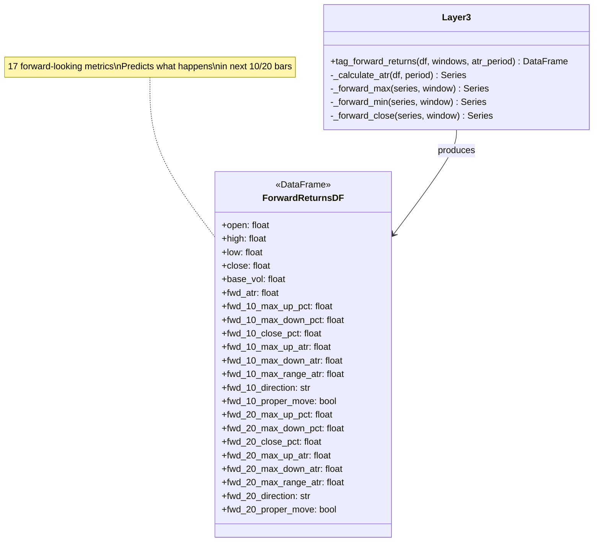
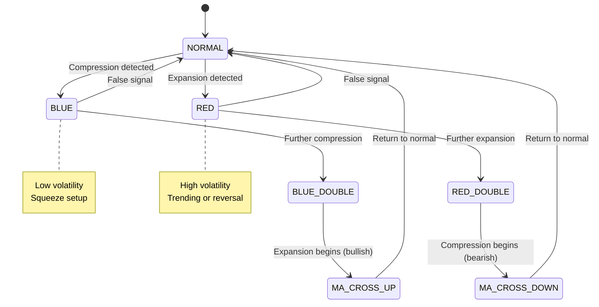
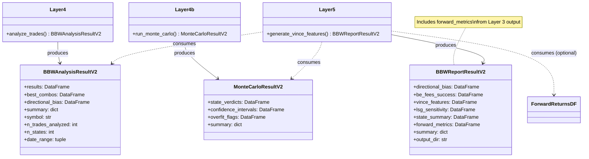
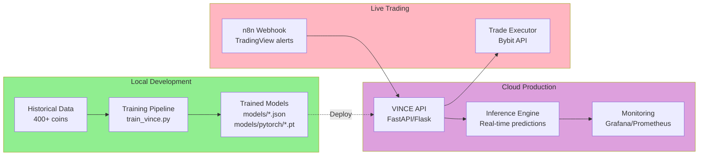
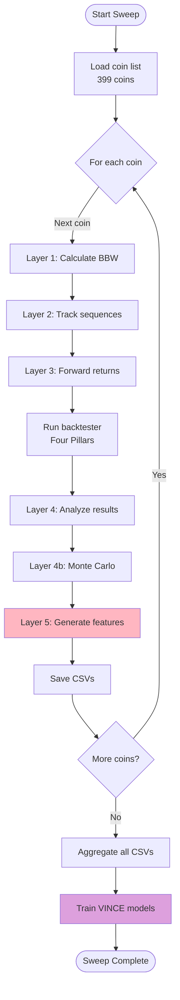
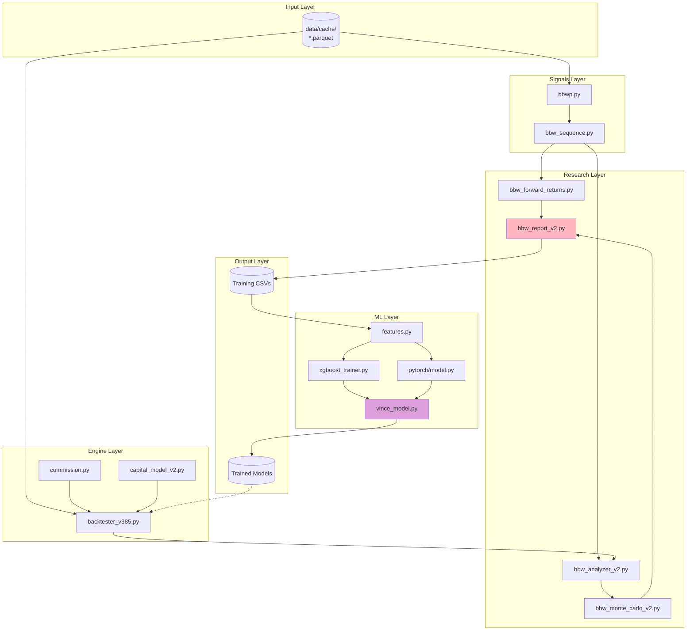

# BBW V2 - Complete UML Diagrams
**File:** `C:\Users\User\Documents\Obsidian Vault\PROJECTS\four-pillars-backtester\docs\bbw-v2\BBW-V2-UML-DIAGRAMS.md`  
**Date:** 2026-02-17  
**Version:** 2.1

---

## 1. Component Architecture Diagram

---

## 2. Data Flow Sequence Diagram

---

## 3. Layer 3 Output Schema

---

## 4. State Transition Diagram (BBW States)

---

## 5. Class Diagram - Layer 4/4b/5 Data Contracts

---

## 6. Deployment Diagram - VINCE Local → Cloud

---

## 7. Activity Diagram - 400-Coin Sweep

---

## 8. Component Interaction Diagram

---

## Key Corrections from V1 to V2

| Aspect | V1 (Wrong) | V2 (Correct) |
|--------|------------|--------------|
| **BBW Role** | Simulated trades | Analyzes real backtester results |
| **Direction Source** | BBW determined direction | Four Pillars strategy determines direction |
| **Layer Count** | Had Layer 6 | Only 5 layers (VINCE is separate) |
| **Metric** | Win rate | BE+fees rate |
| **Layer 3 Output** | Unclear | Feeds into Layer 5 as VINCE features |
| **VINCE Deployment** | Not specified | Local training → Cloud inference |

---

## Layer 3 Purpose (Clarified)

**File:** `C:\Users\User\Documents\Obsidian Vault\PROJECTS\four-pillars-backtester\research\bbw_forward_returns.py`

**What It Does:**
- Pure function, no dependencies on Layer 1/2
- Takes OHLC DataFrame as input
- Adds 17 forward-looking metrics (what happens in next 10/20 bars)
- Output: Same DataFrame + 17 new columns

**17 Columns Added:**
- `fwd_atr` (ATR for normalization)
- Per window (10, 20 bars):
  - `fwd_N_max_up_pct` - Max % upward move
  - `fwd_N_max_down_pct` - Max % downward move
  - `fwd_N_close_pct` - Close-to-close return
  - `fwd_N_max_up_atr` - Max upward move (ATR units)
  - `fwd_N_max_down_atr` - Max downward move (ATR units)
  - `fwd_N_max_range_atr` - Total range (ATR units)
  - `fwd_N_direction` - Direction label (UP/DOWN/NEUTRAL)
  - `fwd_N_proper_move` - Boolean (move > 3 ATR?)

**Integration:** Layer 3 → Layer 5 (forward metrics as VINCE features)

---

## VINCE Deployment Strategy

**Phase 1: Local Training**
- File: `C:\Users\User\Documents\Obsidian Vault\PROJECTS\four-pillars-backtester\ml\vince_model.py`
- Run on local machine with GPU
- Train XGBoost and PyTorch models
- Validate on held-out coins
- Save trained models

**Phase 2: Cloud Deployment**
- Deploy models to cloud API
- Real-time inference via FastAPI/Flask
- Monitoring with Grafana/Prometheus
- Auto-scaling based on request volume

**Phase 3: Live Integration**
- TradingView alerts → n8n webhook
- n8n queries VINCE cloud API
- VINCE returns optimal LSG
- Execute trade on Bybit with optimized parameters

---

## Status Summary

| Component | File | Status |
|-----------|------|--------|
| Layer 1 | signals/bbwp.py | ✅ Complete |
| Layer 2 | signals/bbw_sequence.py | ✅ Complete |
| Layer 3 | research/bbw_forward_returns.py | ✅ Complete |
| Dashboard | scripts/dashboard_v391.py | ✅ Complete |
| Backtester | engine/backtester_v385.py | ✅ Complete |
| Layer 4 | research/bbw_analyzer_v2.py | ✅ Complete |
| Layer 4b | research/bbw_monte_carlo_v2.py | ✅ Complete |
| Layer 5 | research/bbw_report_v2.py | ⚡ Pending |
| VINCE Local | ml/vince_model.py | 🔮 Future |
| VINCE Cloud | Cloud API | 🔮 Future |

---

**END OF UML DIAGRAMS**
