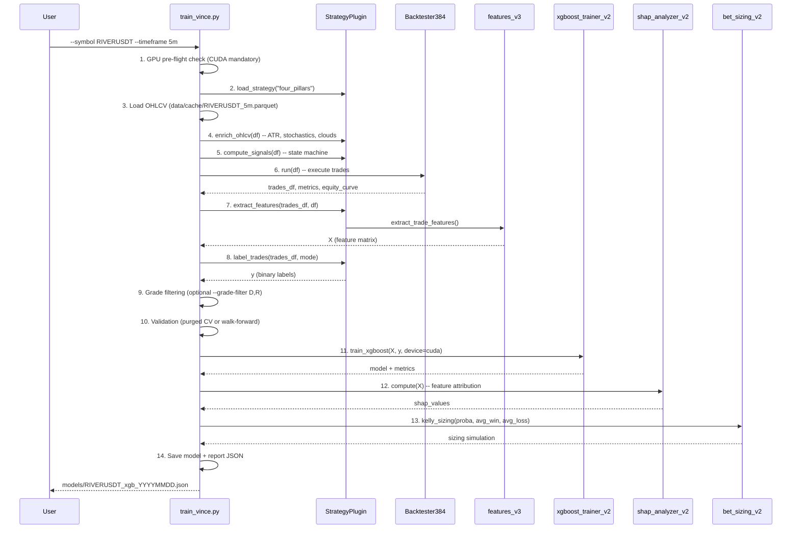
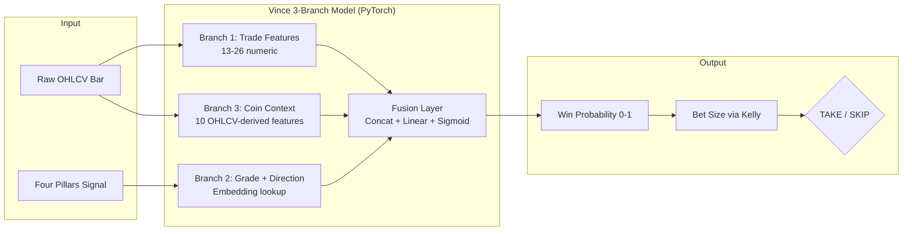
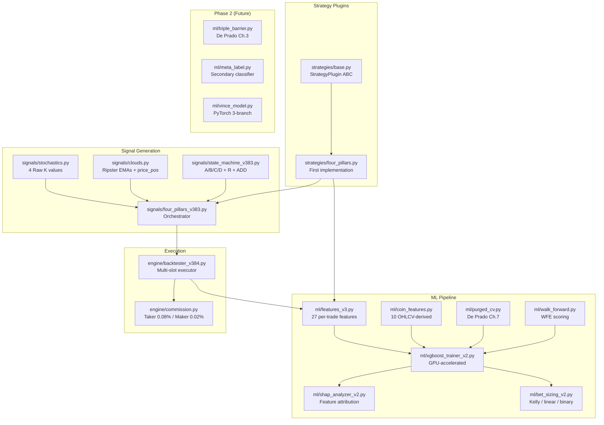
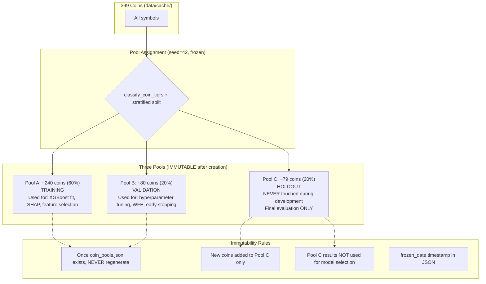

# VINCE ML Pipeline -- UML Diagrams
**Generated:** 2026-02-18 12:48:28
**Source:** scripts/build_docs_v1.py

---

## 1. Training Pipeline (12-step sequence)

---

## 2. Live Inference Flow (Phase 2 -- 3-branch fusion)

---

## 3. Component Architecture

---

## 4. Data Split Protection (Pool Immutability)

