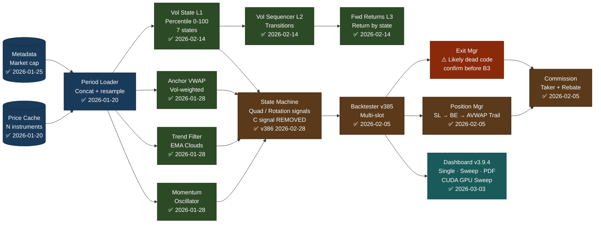
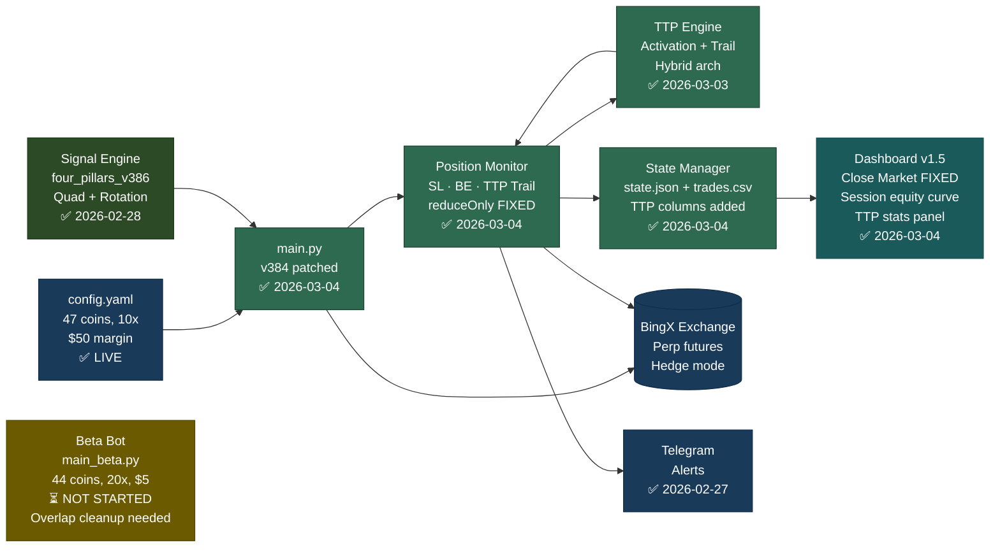
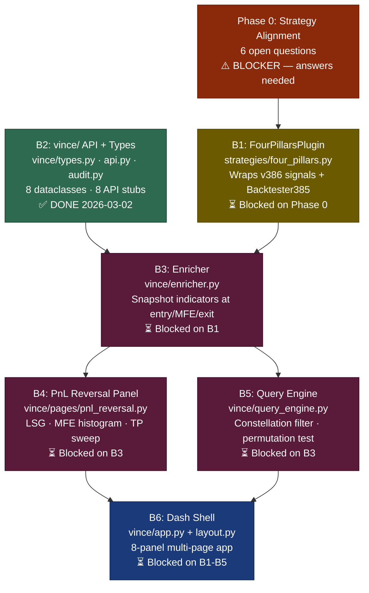
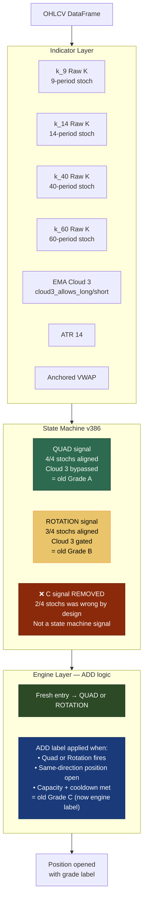

# Algorithmic Trading System — System Flow
**Version:** 2026-03-05 | **Print:** A4 Landscape, 100% zoom

---

## Page 1 — Built Components (Backtester)

---

## Page 1b — BingX Live Bot (Separate System)

---

## Page 2a — Analysis + ML Training

```mermaid
flowchart LR
    BT2[Backtester v385\noutput\n✅ 2026-02-05]
    BT2 --> VA4[Results\nAnalyzer L4\n✅ 2026-02-15]
    VA4 --> VA4b[Monte Carlo\nL4b · CI\n✅ 2026-02-15]
    VA4b --> VA5[Feature Gen\nL5 · CSV\n⚡ 2026-02-20]
    VA5 --> SPLIT[Data Split\n53/10/20%\n⏳ Pending Phase 0]
    SPLIT --> M1[Feature\nSelect\n⏳ Pending B1]
    M1 --> M2[Feature\nEng\n⏳ Pending B1]
    M2 --> M3[Param\nOptimizer\n⏳ Pending B1]

    style BT2  fill:#5a3a1a,color:#fff,stroke:#3a2010
    style VA4  fill:#3a2d5a,color:#fff,stroke:#2a1d4a
    style VA4b fill:#3a2d5a,color:#fff,stroke:#2a1d4a
    style VA5  fill:#c44a00,color:#fff,stroke:#a03800
    style SPLIT fill:#6b5a00,color:#fff,stroke:#504400
    style M1   fill:#5a1a3a,color:#fff,stroke:#3a0a2a
    style M2   fill:#5a1a3a,color:#fff,stroke:#3a0a2a
    style M3   fill:#5a1a3a,color:#fff,stroke:#3a0a2a
```

## Page 2b — Validation + Live

```mermaid
flowchart LR
    M3[Param\nOptimizer\n⏳ Pending B1]
    M3 --> M4[Trade\nFilter\n⏳ Pending B3]
    M4 --> M5[Position\nSizer\n⏳ Pending B3]
    M5 --> VAL[Validation\n10% held-out\n⏳ Pending B3]
    VAL --> TEST[Final Test\nFROZEN\n⏳ Pending VAL]
    TEST --> INF[Inference\nSub-50ms\n⏳ Pending TEST]
    INF --> WH[Webhook\n⏳ Pending INF]
    WH --> EXC[Exchange\nAPI\n⏳ Pending WH]
    EXC --> RET[Retrain\nDaily\n⏳ Pending EXC]
    RET -->|loop| INF
    M3 -.->|live model| INF

    style M3   fill:#5a1a3a,color:#fff,stroke:#3a0a2a
    style M4   fill:#5a1a3a,color:#fff,stroke:#3a0a2a
    style M5   fill:#5a1a3a,color:#fff,stroke:#3a0a2a
    style VAL  fill:#5a1a3a,color:#fff,stroke:#3a0a2a
    style TEST fill:#7a0a0a,color:#fff,stroke:#5a0000
    style INF  fill:#1a3a7a,color:#fff,stroke:#0d2a5a
    style WH   fill:#1a3a7a,color:#fff,stroke:#0d2a5a
    style EXC  fill:#1a3a7a,color:#fff,stroke:#0d2a5a
    style RET  fill:#1a5a27,color:#fff,stroke:#0d4a18
```

---

## Page 3 — Vince ML Build Chain

---

## Page 4 — Signal Architecture (Post-Rename)

---

| ✅ Built + Live | ⚡ Bottleneck | ⚠️ Bug / confirm needed | ⏳ Pending | 🔴 Blocked |
|---|---|---|---|---|

**Critical path (Vince):** Phase 0 answers → B1 → B3 → B4/B5 → B6
**Critical path (Bot):** Start beta bot (remove overlaps) → TP sweep at 0.5-0.7x ATR → v385 signal upgrade decision

---

## Change Log

| Date | Change |
|---|---|
| 2026-02-16 | Initial creation |
| 2026-03-05 | Signal rename: A→Quad, B→Rotation, C→ADD (engine label). C signal removed from state machine. BingX bot live system added (Page 1b). Vince build chain added (Page 3). Signal architecture post-rename added (Page 4). Dashboard updated to v3.9.4 CUDA. ExitManager flagged as likely dead code. Phase 0 blocker surfaced on Vince chain. |
