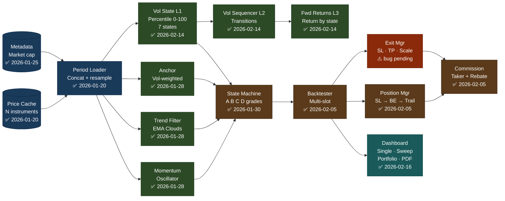

# Algorithmic Trading System — System Flow
**Version:** 2026-02-16 | **Print:** A4 Landscape, 100% zoom

---

## Page 1 — Built Components

---

## Page 2a — Analysis + ML Training

```mermaid
flowchart LR
    BT2[Backtester\noutput\n✅ 2026-02-05]
    BT2 --> VA4[Results\nAnalyzer L4\n✅ 2026-02-15]
    VA4 --> VA4b[Monte Carlo\nL4b · CI\n✅ 2026-02-15]
    VA4b --> VA5[Feature Gen\nL5 · CSV\n⚡ 2026-02-20]
    VA5 --> SPLIT[Data Split\n53/10/20%\n⏳ 2026-02-20]
    SPLIT --> M1[Feature\nSelect\n⏳ 2026-02-24]
    M1 --> M2[Feature\nEng\n⏳ 2026-02-24]
    M2 --> M3[Param\nOptimizer\n⚡ 2026-02-28]

    style BT2  fill:#5a3a1a,color:#fff,stroke:#3a2010
    style VA4  fill:#3a2d5a,color:#fff,stroke:#2a1d4a
    style VA4b fill:#3a2d5a,color:#fff,stroke:#2a1d4a
    style VA5  fill:#c44a00,color:#fff,stroke:#a03800
    style SPLIT fill:#6b5a00,color:#fff,stroke:#504400
    style M1   fill:#5a1a3a,color:#fff,stroke:#3a0a2a
    style M2   fill:#5a1a3a,color:#fff,stroke:#3a0a2a
    style M3   fill:#c44a00,color:#fff,stroke:#a03800
```

## Page 2b — Validation + Live

```mermaid
flowchart LR
    M3[Param\nOptimizer\n⚡ 2026-02-28]
    M3 --> M4[Trade\nFilter\n⏳ 2026-03-03]
    M4 --> M5[Position\nSizer\n⏳ 2026-03-03]
    M5 --> VAL[Validation\n10% held-out\n⏳ 2026-03-07]
    VAL --> TEST[Final Test\nFROZEN\n⏳ 2026-03-10]
    TEST --> INF[Inference\nSub-50ms\n⏳ 2026-03-14]
    INF --> WH[Webhook\n⏳ 2026-03-14]
    WH --> EXC[Exchange\nAPI\n⏳ 2026-03-17]
    EXC --> RET[Retrain\nDaily\n⏳ 2026-03-17]
    RET -->|loop| INF
    M3 -.->|live model| INF

    style M3   fill:#c44a00,color:#fff,stroke:#a03800
    style M4   fill:#5a1a3a,color:#fff,stroke:#3a0a2a
    style M5   fill:#5a1a3a,color:#fff,stroke:#3a0a2a
    style VAL  fill:#5a1a3a,color:#fff,stroke:#3a0a2a
    style TEST fill:#7a0a0a,color:#fff,stroke:#5a0000
    style INF  fill:#1a3a7a,color:#fff,stroke:#0d2a5a
    style WH   fill:#1a3a7a,color:#fff,stroke:#0d2a5a
    style EXC  fill:#1a3a7a,color:#fff,stroke:#0d2a5a
    style RET  fill:#1a5a27,color:#fff,stroke:#0d4a18
```

---

| ✅ Built | ⚡ Bottleneck | ⚠️ Bug pending | ⏳ Pending |
|---------|-------------|--------------|---------|

**Critical path:** L5 Feature Gen ⚡ → Data Split → Param Optimizer ⚡ → Validation → Final Test → Live
