# Algorithmic Trading System - Architecture & Flow Diagrams
**Date:** 2026-02-16
**Purpose:** Generic system architecture reference (sandbox / shareable version)
**Format:** Mermaid diagrams (render in Obsidian)

---

## Diagram 1: Trade Lifecycle State Machine

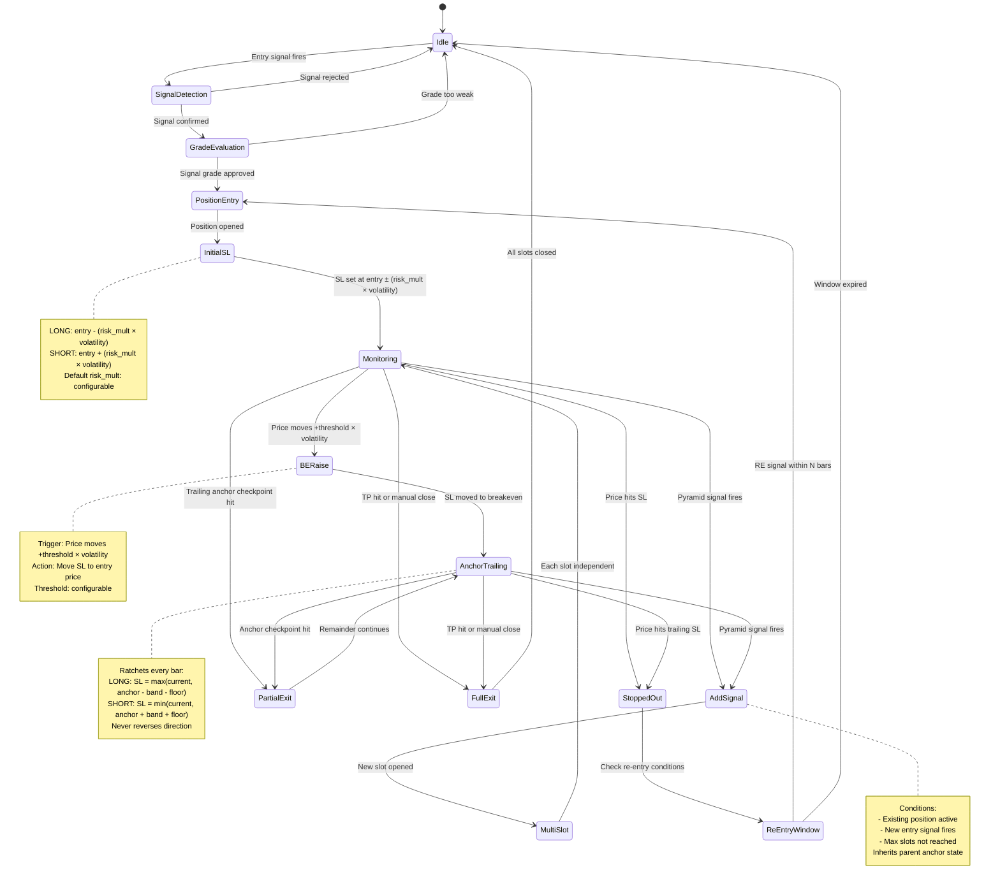

---

## Diagram 2: Entry Grade Decision Tree

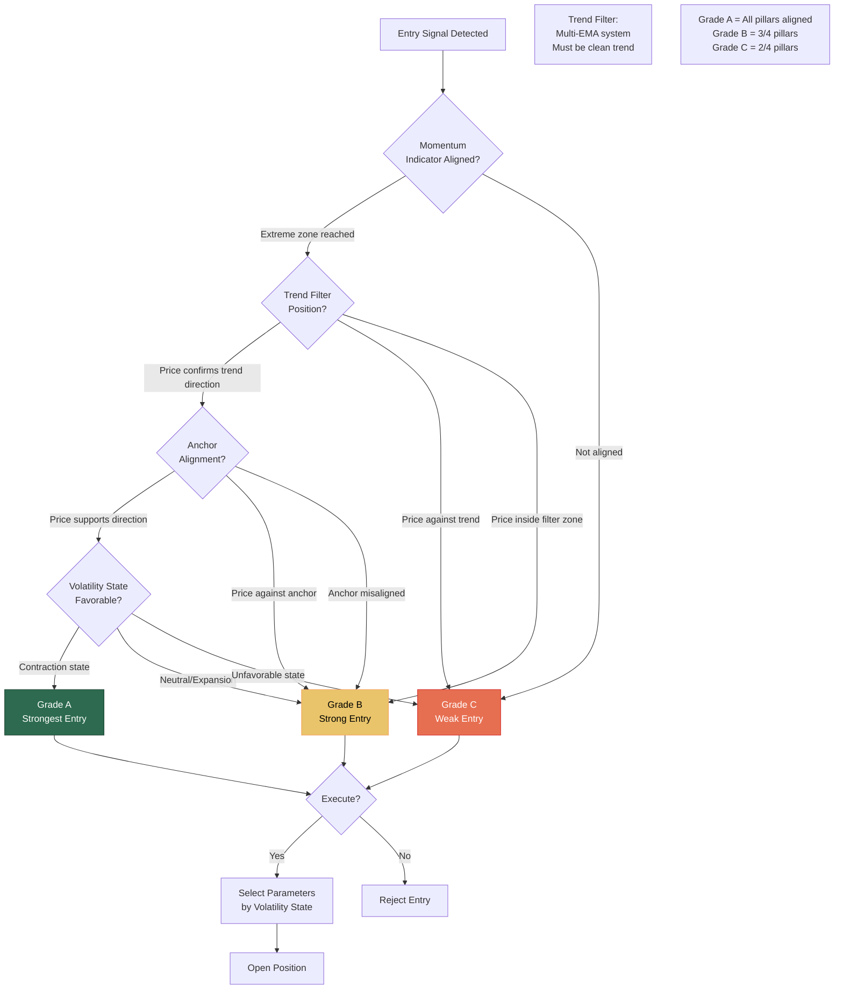

---

## Diagram 3: Stop Loss Lifecycle Flow

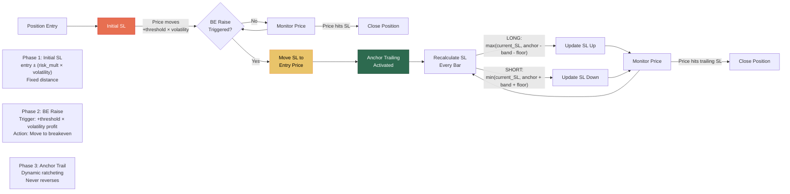

---

## Diagram 4: SL Movement Over Time

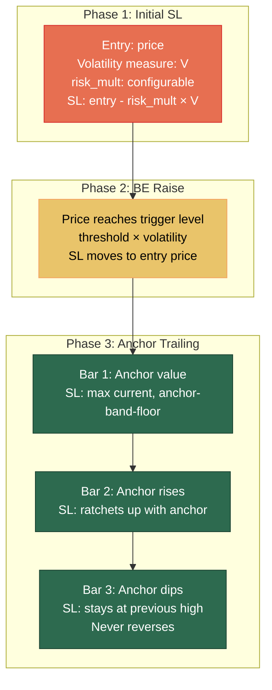

---

## Diagram 5: Pyramid (ADD) Signal Flow

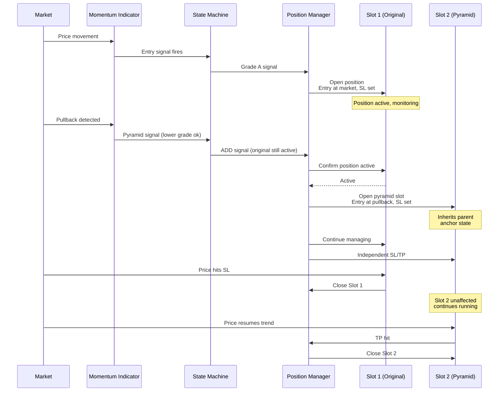

---

## Diagram 6: System Flow — Page 1 (Built Components)

**Print:** A4 Landscape, 100% zoom

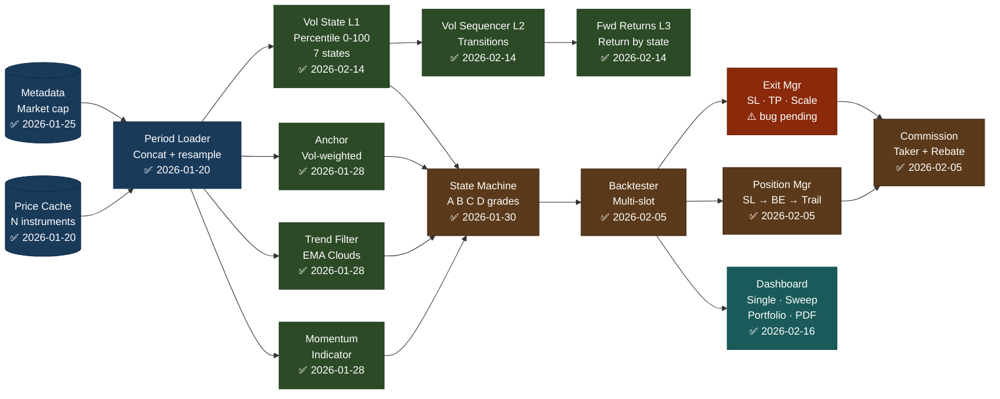

---

## Diagram 6b: System Flow — Page 2a (Analysis + ML Training)

```mermaid
flowchart LR
    BT2[Backtester\noutput\n✅ 2026-02-05]
    BT2 --> VA4[Results\nAnalyzer L4\n✅ 2026-02-15]
    VA4 --> VA4b[Monte Carlo\nL4b · CI\n✅ 2026-02-15]
    VA4b --> VA5[Feature Gen\nL5 · CSV\n⚡ 2026-02-20]
    VA5 --> SPLIT[Data Split\n53/10/20%\n⏳ 2026-02-20]
    SPLIT --> M1[Feature\nSelect\n⏳ 2026-02-24]
    M1 --> M2[Feature\nEng\n⏳ 2026-02-24]
    M2 --> M3[Param\nOptimizer\n⚡ 2026-02-28]

    style BT2  fill:#5a3a1a,color:#fff,stroke:#3a2010
    style VA4  fill:#3a2d5a,color:#fff,stroke:#2a1d4a
    style VA4b fill:#3a2d5a,color:#fff,stroke:#2a1d4a
    style VA5  fill:#c44a00,color:#fff,stroke:#a03800
    style SPLIT fill:#6b5a00,color:#fff,stroke:#504400
    style M1   fill:#5a1a3a,color:#fff,stroke:#3a0a2a
    style M2   fill:#5a1a3a,color:#fff,stroke:#3a0a2a
    style M3   fill:#c44a00,color:#fff,stroke:#a03800
```

## Diagram 6c: System Flow — Page 2b (Validation + Live)

```mermaid
flowchart LR
    M3[Param\nOptimizer\n⚡ 2026-02-28]
    M3 --> M4[Trade\nFilter\n⏳ 2026-03-03]
    M4 --> M5[Position\nSizer\n⏳ 2026-03-03]
    M5 --> VAL[Validation\n10% held-out\n⏳ 2026-03-07]
    VAL --> TEST[Final Test\nFROZEN\n⏳ 2026-03-10]
    TEST --> INF[Inference\nSub-50ms\n⏳ 2026-03-14]
    INF --> WH[Webhook\n⏳ 2026-03-14]
    WH --> EXC[Exchange\nAPI\n⏳ 2026-03-17]
    EXC --> RET[Retrain\nDaily\n⏳ 2026-03-17]
    RET -->|loop| INF
    M3 -.->|live model| INF

    style M3   fill:#c44a00,color:#fff,stroke:#a03800
    style M4   fill:#5a1a3a,color:#fff,stroke:#3a0a2a
    style M5   fill:#5a1a3a,color:#fff,stroke:#3a0a2a
    style VAL  fill:#5a1a3a,color:#fff,stroke:#3a0a2a
    style TEST fill:#7a0a0a,color:#fff,stroke:#5a0000
    style INF  fill:#1a3a7a,color:#fff,stroke:#0d2a5a
    style WH   fill:#1a3a7a,color:#fff,stroke:#0d2a5a
    style EXC  fill:#1a3a7a,color:#fff,stroke:#0d2a5a
    style RET  fill:#1a5a27,color:#fff,stroke:#0d4a18
```

| ✅ Built | ⚡ Bottleneck | ⚠️ Bug pending | ⏳ Pending |
|---------|-------------|--------------|---------|

**Critical path:** Feature Gen ⚡ → Data Split → Param Optimizer ⚡ → Validation → Final Test → Live

---

## Diagram 7: Critical Path Timeline

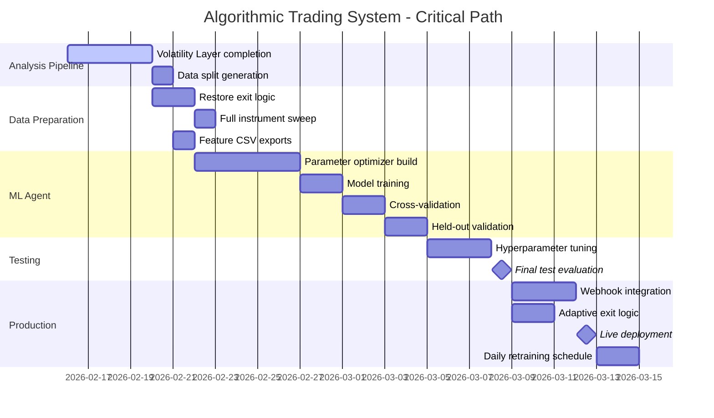

---

## Diagram 8: Commission & Rebate Flow

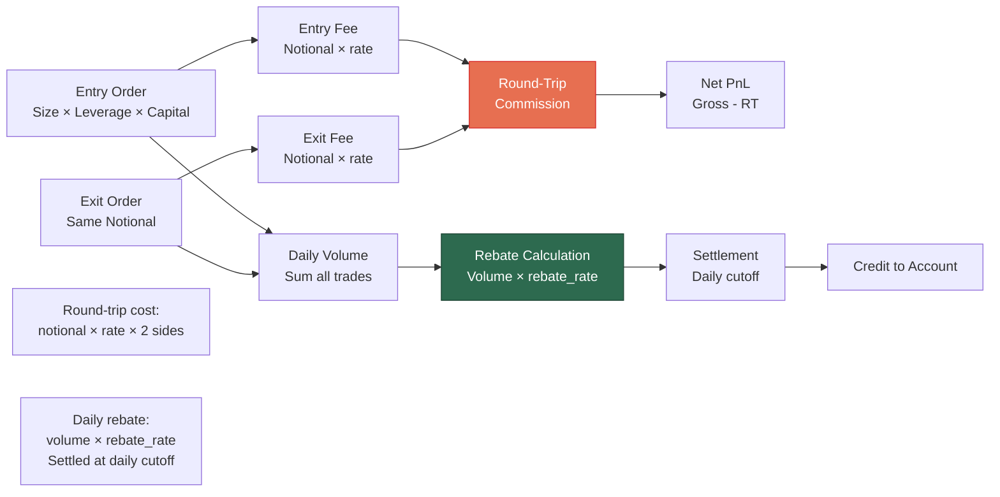

---

## Diagram 9: Data Split Strategy

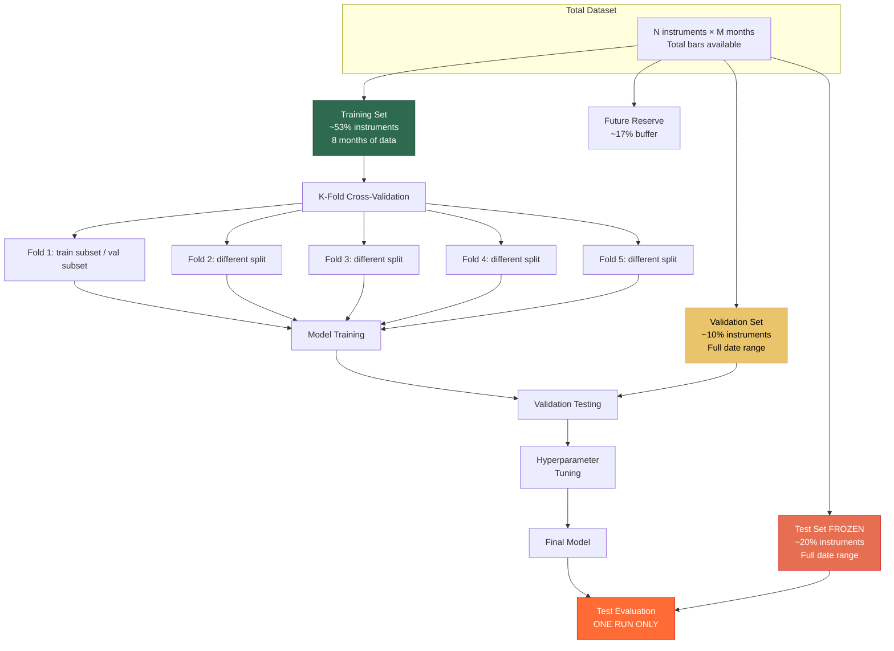

---

## Diagram 10: Multi-Slot Position Management

```mermaid
sequenceDiagram
    participant Market
    participant SM as State Machine
    participant PM as Position Manager
    participant S1 as Slot 1
    participant S2 as Slot 2
    participant S3 as Slot 3
    participant S4 as Slot 4

    Market->>SM: Entry signal (Grade A)
    SM->>PM: Open position
    PM->>S1: Open Slot 1<br/>Entry at market, SL set

    Note over S1: Active, monitoring

    Market->>SM: Pyramid signal
    SM->>PM: Check capacity
    PM->>PM: Slots: 1/N used
    PM->>S2: Open Slot 2<br/>Entry at pullback, SL set

    Note over S1,S2: Both active,<br/>independent SL/TP

    Market->>S1: Price hits SL
    S1->>PM: Close Slot 1
    PM->>S1: Position closed

    Note over S1: Closed (stopped out)
    Note over S2: Still active

    Market->>SM: Re-entry signal<br/>(within lookback window)
    SM->>PM: Open re-entry
    PM->>S3: Open Slot 3<br/>Entry on re-entry, SL set

    Note over S2,S3: Both active

    Market->>SM: Another pyramid signal
    SM->>PM: Check capacity
    PM->>PM: Slots: 2/N used
    PM->>S4: Open Slot 4<br/>Entry at next pullback

    Note over S2,S3,S4: 3 active slots<br/>Max: N total

    Market->>S2: TP hit
    S2->>PM: Close Slot 2

    Market->>S3: Trailing anchor exits
    S3->>PM: Close Slot 3

    Market->>S4: Still running

    Note over S4: Only Slot 4 active<br/>Can open more slots
```

---

## Appendix: Terminology Mapping

| Sandbox Term | System-Specific Term |
|---|---|
| Momentum Indicator | Quad Rotation Stochastic (9/14/40/60 Raw K) |
| Trend Filter | Ripster EMA Cloud 3 (EMA 34/50) |
| Anchor Indicator | Anchored VWAP (AVWAP) |
| Volatility State | BBWP State (7 states) |
| Volatility Layer | BBW Pipeline (5 layers) |
| Parameter Optimizer | LSG Optimizer (Leverage/Size/Grid) |
| ML Agent | VINCE |
| Trade Filter | Meta-Labeling module |
| Position Sizer | Kelly Criterion bet sizing |
| Anchor Trailing | AVWAP Ratchet SL |
| Grade A/B/C/D | Four Pillars signal grades |
| risk_mult | sl_mult (ATR multiplier) |
| volatility measure | ATR14 |
| threshold | be_trigger_atr |
| Daily cutoff | 17:00 UTC rebate settlement |

---

**END OF DIAGRAMS**

Sandbox version -- all proprietary terminology replaced with generic equivalents.
Terminology mapping in appendix for internal reference.
